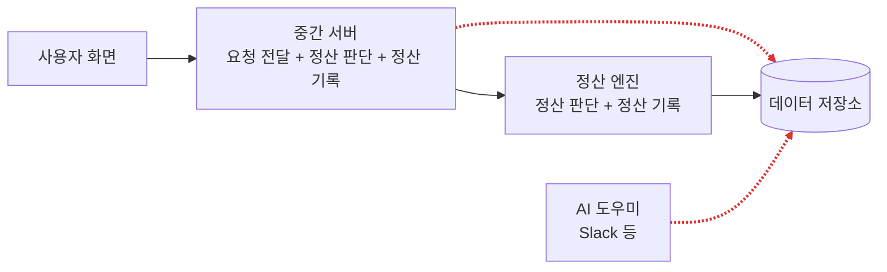
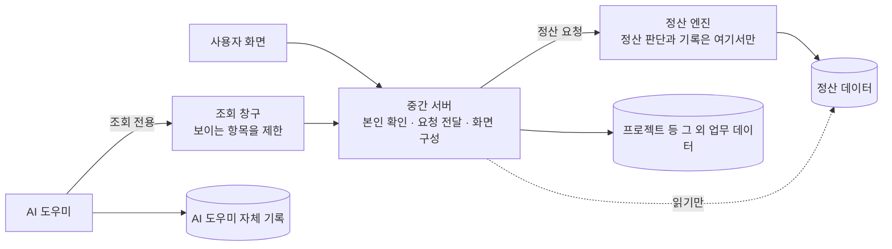
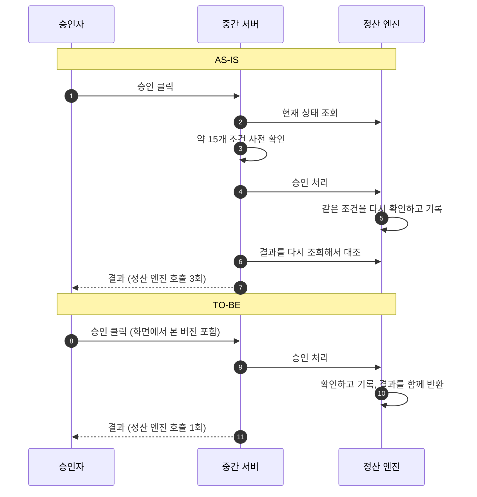
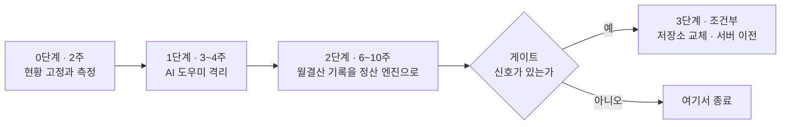

# 정산 시스템 구조 정비 — 의사결정 요청

**2026-09-30 · 임원 보고용 · 상세 계획서:** `2026-09-30-backend-boundary-refactoring-plan.md`

## 결론

> **월결산·회수처럼 돈과 마감이 걸린 처리의 판단과 기록을 "정산 엔진" 한 곳으로 모으고, AI 도우미의 데이터 접근을 좁히는 정비를 제안합니다.**
> 화면이 빨라지는 작업이 아닙니다. **같은 오류를 두 번 고치는 구조를 없애고, 보안 위험을 줄이는 작업**입니다.
> **프로젝트 등록·수정의 오류는 이 정비로 해결되지 않습니다.** 별도 진단이 필요합니다.

**오늘 요청드리는 결정**

1. 0~2단계 착수 승인 (약 11~16주, 백엔드 2명 전담 가정)
2. 진행 중 정산 신규 기능은 긴급 수정만 허용하는 기간 수용
3. AI 도우미의 데이터 전체 권한 회수 승인 (가장 먼저 착수)
4. 프로젝트 등록·수정 오류 반복의 원인 진단 착수 (2주, 별도 건)

---

## 지금 무슨 일이 벌어지고 있나

**같은 판단을 두 곳이 각자 하고, 같은 데이터를 두 곳이 각자 기록**하는 흐름에서 "양쪽을 맞추는" 수정이 반복됩니다.
업무 흐름별로 보면 차이가 분명합니다.

| 업무 흐름 | 최근 60일 관련 변경 | 그중 오류 수정 | 현재 상태 |
|---|---|---|---|
| **월결산** (요청 → 승인 → 마감 → 재오픈) | 43건 | 26건 (60%) | 판단·기록이 **두 곳** |
| **주결산** (완료 요청 → 확정) | 10건 | 5건 (50%) | 기록은 **정산 엔진 한 곳** |
| **프로젝트 등록·수정·승인** | 66건 | 48건 (73%) | 정산 엔진과 무관. **다른 문제** |

* 근거: 2026-08-01~09-30 코드 변경 이력의 제목 키워드 분류입니다. 어림이며 실제 장애 건수나 영향 범위는 별도 집계가 필요합니다.
* 특히 **정산 연결부 파일 하나에 86건이 몰렸고 그중 59건(69%)이 오류 수정**입니다. 하루 10건이 들어간 날도 있습니다(8/9).

**별도 선행 과제:** 월결산이 쓰지 않는 시트 영역(입금 예정 5~9행) 때문에 결산이 막히는 문제는 영향 범위를 조사했습니다. 8개 경로에 걸쳐 있어 운영 데이터 확인과 계약 개정 후 단계적으로 고칩니다. (조사 문서 별도)

**용어:** 중간 서버 = 화면과 정산 엔진 사이에서 요청을 전달하는 서버 · 정산 엔진 = 정산 규칙과 마감을 처리하는 서버 · 데이터 저장소 = Firestore · AI 도우미 = Slack 등에서 질문에 답하는 자동화

---

## AS-IS — 지금 구조

**빨간 선이 문제입니다.**

* **월결산 데이터를 중간 서버와 정산 엔진이 각자 기록합니다.** 저장소 컬렉션 93개 중 5개가 그렇고, 전부 월결산 관련입니다.
* 중간 서버가 정산 엔진의 결정을 앞뒤로 **다시 심사하는 코드가 약 570줄** 있습니다.
* **AI 도우미가 저장소를 직접 읽는 곳이 10곳**입니다. 오늘 진행된 분리 배포 작업은 웹사이트와 같은 **관리자급 열쇠를 AI 도우미에 복사**하도록 되어 있습니다. (코드 확인, 운영 반영 여부는 미확인)

---

## TO-BE — 정비 후 구조

**원칙은 하나입니다: 정산 데이터는 정산 엔진만 기록합니다.** 다른 곳은 읽기만 합니다.

| | AS-IS | TO-BE |
|---|---|---|
| 정산 판단 | 두 곳 | **정산 엔진 한 곳** |
| 정산 데이터 기록 | 두 곳이 같은 문서를 기록 | **정산 엔진만** |
| AI 도우미 | 저장소 직접 접근, 관리자급 열쇠 | **조회 전용 창구**, 자체 기록만 직접 접근 |
| "맞추는" 수정 | 계속 발생 | 정산 쪽은 원리상 사라짐 |
| 코드량 | 두 달간 계속 증가 | 중간 서버의 판단 코드 제거로 **감소** |

---

## 실제 업무 흐름으로 보면

| 흐름 | 지금 | 정비 후 | 사용자가 느끼는 변화 | 영향 |
|---|---|---|---|---|
| **주결산** 완료 요청 → 확정 | 정산 엔진이 기록. 중간 서버는 화면 대신 현재 버전을 읽어 넘겨 줌 | 화면이 본 버전을 그대로 전달 | **거의 없음** | 작음 |
| **회수 (주결산)** 완료 요청 뒤 취소 | 사유·승인 없이 회수. 정산 엔진이 처리 | 동일 | 없음 | 작음 |
| **회수 (월결산)** 승인 대기 요청 철회 | 요청자만 가능. 중간 서버가 앞뒤로 재확인(약 150줄) | 정산 엔진 한 곳에서 판단 | "이미 처리됨" 류 충돌 메시지 감소 기대 [추정] | **큼** |
| **월결산** 요청 → 승인 → 마감 | 요청 접수 때 기록을 중간 서버가 직접 작성, 승인·반려마다 재확인 | 접수 기록도 정산 엔진이 작성, 승인은 한 번의 호출 | 화면 동일. 승인 직후 상태 반영이 한 번에 | **큼** |
| **월결산 재오픈** 마감 취소 요청·결정 | 재확인 약 180줄. 재시도 때 이전 값을 역산하는 코드 | 화면이 본 버전 기준으로 정산 엔진이 판단 | 동일 | **큼** |
| **프로젝트 등록·수정·승인** | 중간 서버가 기록. 정산 엔진과 무관 | **변경 없음** (아래 접점 3개만) | 없음 | 직접 대상 아님 |

**프로젝트 등록·수정과의 접점 3개**

1. **월결산 승인자 지정:** 지금은 중간 서버가 프로젝트 정보에 승인자를 쓰고 정산 감사 기록도 남깁니다. 정산 엔진으로 옮깁니다.
2. **편집 잠금(30분 동시 편집 방지):** 책임 소유자를 확정합니다. 정산 엔진도 종료 처리에 관여합니다.
3. **AI 도우미의 프로젝트 조회:** 조회 전용 창구로 바뀝니다.

**별도 안건:** 프로젝트 쪽도 최근 60일 변경 66건 중 오류 수정이 48건(73%)이고, "저장·제출·승인을 맞춘다" 성격이 15건입니다. **증상은 같아 보이지만 정산 엔진이 관여하지 않으므로 이 정비로 해결되지 않습니다.** 원인은 임시저장·제출·승인 정책의 일관성일 것으로 [추정]하며, 진단이 필요합니다.

---

## 월결산 승인 한 건이 지나가는 길

같은 조건을 **두 번 확인하던 것이 한 번**이 되고, 결과를 다시 대조하던 왕복이 사라집니다.

---

## 좋아지는 것, 그대로인 것, 나빠지는 것

| | 내용 |
|---|---|
| **좋아지는 것** | 월결산·회수 쪽 "맞추는" 수정이 줄어듭니다. AI 도우미가 뚫려도 정산 데이터에 닿지 못합니다. 새 자동화를 붙일 때 방화벽 규칙을 매번 손대지 않아도 됩니다(최근 한 달 같은 원인의 차단 사고 3번) |
| **그대로인 것** | 월 마감 화면 8.6초는 별도 작업(8/18 계약)이 다룹니다. 사용자 화면과 업무 흐름은 바뀌지 않습니다. 주결산은 거의 그대로입니다 |
| **나빠지는 것** | 정산 신규 기능이 늦어집니다. 옮기는 동안 옛 경로와 새 경로가 함께 있는 기간의 검증 비용이 듭니다 |

| 리스크 | 안전장치 |
|---|---|
| 돈과 마감 처리가 옮기는 중에 잘못될 수 있음 | 기능별 스위치(하루 안에 원복), 새 경로와 옛 경로 결과 비교 후 전환, 소수 프로젝트부터 |
| 옛 형식의 운영 데이터가 남아 있을 수 있음 | **0단계에서 개수부터 확인.** 0건이 아니면 옛 경로를 지우지 않음 |
| 진행 중 새 위반이 생김 | 자동 검사를 이미 만들었고, 새 위반은 막고 기존 15건은 목록으로 관리 |

**하지 않는 것:** 서비스를 잘게 쪼개는 재설계 · 데이터 저장소 전체 교체 · 화면 개편 · 정산 계산 규칙 변경

---

## 단계, 일정, 결정 요청

* **0~2단계 합계 약 11~16주 (백엔드 2명 전담 가정).** 0단계 결과로 다시 산정합니다. 추가 인프라 비용은 거의 없을 것으로 봅니다. [추정]
* **저장소 교체·서버 이전은 지금 결정하지 않습니다.** 다음 중 하나가 실제로 나타날 때만 별도 승인을 받습니다: 정산 저장이 한 번에 쓸 수 있는 한도(500건)에 닿아 우회 코드가 늘어남 · 집계·정합성 보고서를 손으로 반복해서 뽑음 · 서버 실행 시간 한도에 닿는 작업(대량 재계산 등)이 생김.

| # | 결정 | 제안 |
|---|---|---|
| 1 | **0~2단계 착수** (약 11~16주) | 승인 |
| 2 | **정산 신규 기능 보류 범위** | 진행 중에는 긴급 수정만 허용 |
| 3 | **AI 도우미 권한 회수** (관리자급 열쇠 대신 별도 열쇠 + 조회 전용 창구) | 승인. 가장 먼저 착수 |
| 4 | **프로젝트 등록·수정 오류 진단** (별도 2주) | 착수 |
| 5 | 저장소 교체·서버 이전 | **지금은 결정하지 않음.** 신호 발생 시 별도 승인 |

**승인 시 첫 2주:** 자동 검사 연결 · 현재 성능 수치 측정 · 옛 형식 운영 데이터 개수 확인 · 데이터 책임자 확정 · AI 도우미 접근 현황 정리

**확인하지 못한 것:** 운영 데이터와 실제 성능·비용 수치는 조회하지 않았습니다. 일정과 인력은 어림이며 0단계에서 확정합니다.
