# 백엔드 경계 리팩토링 계획안

**날짜:** 2026-09-30
**상태:** 제안 · 검토 전 (승인 전에는 어떤 단계도 시작하지 않는다)
**작성 관점:** 플랫폼 총괄(CTO)이 팀에 "무엇을, 왜, 어떤 순서로, 어디서 멈출지"를 요청하는 문서
**선행 문서:**
[읽기 경로 계약](./contracts/2026-08-18-cashflow-read-path-contract.md) ·
[기간 권한 계약](./contracts/2026-08-14-cashflow-period-authority.md) ·
[Cloudflare/Vercel Production Gates](../security-control-plane/cloudflare-production-gates.md) ·
[Cloudflare 앞단 WAF Runbook](../security-control-plane/cloudflare-vercel-edge-runbook.md) ·
[Cloudflare 자동화 클라이언트 차단](../security/cloudflare-automation-client-block-2026-06-22.md) ·
[배포805 전수 재조사](../qa/2026-09-21-release805-full-audit.md)
**임원용 요약(슬라이드형):** [의사결정 요청](./2026-09-30-backend-boundary-decision-brief.md)
**동반 산출물:** `policies/firestore-ownership.json`, `policies/firestore-ownership.baseline.json`, `scripts/verify-firestore-ownership.mjs`

## 0. 이 문서를 읽는 법

### 검증 상태 표기

| 표기 | 뜻 |
|---|---|
| **[확인]** | 이 저장소의 코드·문서·git 이력에서 직접 확인했다 |
| **[추정]** | 코드 구조에서 추론했다. 실행이나 운영 조회로 확정하지 않았다 |
| **[미확인]** | 조사하지 못했다. 결정 전에 확인해야 한다 |

### 근거의 범위

- 코드 근거는 이 워크트리(`HEAD 9886219b`, #842)와 git 이력이다. 오늘 자 #845(에이전트 서비스 분리)는 다른 브랜치의 커밋을 `git show`로 읽었다.
- **운영 데이터와 런타임 지표는 조회하지 않았다.** 지연시간, 오류율, 비용, Firestore 문서 분포는 전부 [미확인]이다. 그래서 이 계획의 임계값은 "측정 후 확정"으로 남겨 두고, 측정하는 작업을 0단계에 넣었다.
- 분량과 일정은 **엔지니어링 규모의 어림**이다. 팀 규모를 모르기 때문에 크기 등급(S/M/L/XL)과 "백엔드 2명 전담" 가정으로 표기했고, 0단계가 끝나면 다시 산정한다.

### 크기 등급

| 등급 | 어림 (엔지니어 1명 기준) |
|---|---|
| S | 3일 이하 |
| M | 2주 이하 |
| L | 6주 이하 |
| XL | 한 분기 |

---

## 1. 결론

### 1.1 구조 면에서 이득이 있는가

**있다. 다만 성능 이득이 아니라 결함이 생기는 구조를 없애는 이득이다.** 이득은 세 종류이고, 각각 근거가 다르다.

| 이득 | 내용 | 근거 |
|---|---|---|
| **결함 발생 구조 제거** | 같은 정산 상태를 BFF와 JVM이 각자 판정하고 각자 쓰는 구조 때문에 "양쪽을 맞추는 수정"이 반복된다. 판정 주체를 하나로 줄이면 이 종류의 수정이 사라진다 | 2026-08-01 이후 BFF 프록시 파일 커밋 86건 중 fix가 59건(69%), 제목에 align·unify·parity·단일화 계열 단어가 든 것이 20건(23%) [확인] |
| **삭제 가능성** | BFF가 JVM의 판단을 사전·사후로 다시 심사하는 코드(약 570줄)와 JVM의 죽은 레거시 경로를 지울 수 있다. 읽기 경로 계약의 "성공의 척도는 늘어난 줄이 아니라 사라진 줄"과 같은 방향이다 | 함수별 줄 수 실측, 호출자 조사 [확인] |
| **선택지 확보** | 쓰기 주체가 하나가 되면 저장소(Firestore→Postgres)와 실행 환경(Vercel→Cloud Run)을 도메인 로직을 건드리지 않고 바꿀 수 있다. 지금은 겹치는 쓰기 때문에 어느 쪽도 못 옮긴다 | 소유권 스캔: 쓰기 겹침 5건이 월 마감 계열 한 곳에 몰림 [확인] |

### 1.2 이득이 없는 것

- **응답 속도.** 월 마감 화면 8.6초는 이중 조립 때문이고, 그건 2026-08-18 읽기 경로 계약이 이미 다룬다. 이 계획은 그 계약과 겹치지 않고 그 계약이 끝나도록 돕는다.
- **단기 개발 속도.** 2단계 동안에는 정산 기능 추가가 느려진다. 그 대가를 받아들일 수 있는지가 첫 번째 결정 사항이다.
- **"Spring으로 전부 독립" 자체.** 그것만으로는 아무 이득이 없다. 아래 전략은 서비스를 합치거나 쪼개는 것이 아니라 **쓰기 주체를 하나로 만드는 것**이다.

### 1.3 권고

다섯 단계로 나누고, 앞의 세 단계만 승인을 요청한다.

| 단계 | 이름 | 크기(가정: 백엔드 2명) | 승인 |
|---|---|---|---|
| 0 | 고정과 측정 | 2주 | 요청 |
| 1 | 에이전트 격리와 M2M 경로 정리 | 3~4주 | 요청 |
| 2 | 정산 쓰기 단일화 | 6~10주 | 요청 |
| 3 | 정산 저장소 이전 | 분기 단위 | **게이트 조건부** |
| 4 | 실행 환경 이전 | 분기 단위 | **게이트 조건부** |

### 1.4 결정 요청

| # | 결정 | 기본 제안 |
|---|---|---|
| D-1 | 2단계 동안 정산 신규 기능을 어느 정도까지 늦출 수 있는가 | 긴급 수정만 허용하고 기능 추가는 2A 종료까지 보류 |
| D-2 | 읽기 경계: BFF가 JVM이 쓴 Firestore 문서를 직접 읽는 현재 계약(2026-08-18)을 유지하는가 | 유지. 3단계에서 저장소를 옮길 때는 프로젝션 문서로 같은 계약을 지킨다 |
| D-3 | 미결 컬렉션 소유자 확정 (`editLeases`, `cashflow_sheet_*`, `members`, `projects`, `persons`) | 0단계 워크숍에서 확정 |
| D-4 | 에이전트에 Firestore 관리자 자격증명을 계속 줄 것인가 | 주지 않는다. 별도 서비스 계정과 가능하면 별도 데이터베이스 |
| D-5 | 3, 4단계 착수 신호(§7.4, §7.5)를 이 문서의 것으로 채택하는가 | 채택. 임계값은 0단계 측정 후 확정 |
| D-6 | 프로젝트 등록·수정 오류 반복의 원인 진단을 별도 트랙으로 착수하는가 (§1.5, P0-10) | 착수. 이 계획의 범위 밖이지만 같은 증상이 있다 |

### 1.5 업무 흐름별로 보면

이 계획은 기술 계층의 정비지만, 사용자가 겪는 것은 업무 흐름이다. 흐름마다 영향이 다르다.

| 흐름 | 최근 60일 관련 변경 | 그중 fix | 지금 | 정비 영향 | 작업 |
|---|---|---|---|---|---|
| **주결산** 완료 요청 → 회수 → 확정 | 10 | 5 (50%) | 기록은 JVM 한 곳. BFF가 현재 리비전을 읽어 JVM 낙관적 잠금에 채워 넘김 | **작음** | P2A-5 (토큰을 화면이 보내는 방식) |
| **회수 · 주결산** 완료 요청 뒤 취소 | (위에 포함) | | 사유·승인 없이 회수, 확정 뒤 재오픈은 사유 필요·조직장/관리자만(JVM 검사) [확인] | 작음 | – |
| **회수 · 월결산** 승인 대기 요청 철회 | 회수·철회 제목 8건(프로젝트 포함) | | 요청자만 가능. BFF `transition…` 152줄이 전후 재심사 | **큼** | P2B-1 |
| **월결산** 요청 → 승인·반려 → 마감 | 43 | 26 (60%) | 접수 때 요청·단계·샤드 문서를 BFF가 직접 씀, 승인·제출마다 BFF 재심사 | **큼** | P2B-2/3, P2D |
| **월결산 재오픈** 요청 → 결정 | (위에 포함) | | BFF 176줄, 재시도 때 리비전 역산 | **큼** | P2A-2/5, P2C |
| **프로젝트 등록·수정·승인** 임시저장 → 제출 → 승인 | 66 | 48 (73%) | BFF 소유. 정산 엔진과 무관 | **직접 대상 아님** | P0-10 진단, 접점 3개 |

*수치는 2026-08-01 이후 non-merge 커밋의 제목 키워드 분류이며 어림이다. 프로젝트는 `projects`·`approvals` 스코프 기준. [확인: 분류 방식, 미확인: 분류 정확도]*

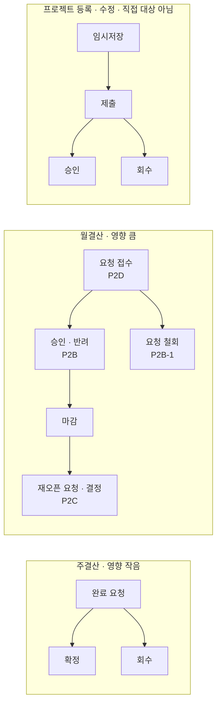

**프로젝트 등록·수정과의 접점 3개**

| 접점 | 지금 | 작업 |
|---|---|---|
| 월결산 승인자 지정 | BFF가 `projects` 문서에 승인자를 쓰고 정산 감사 문서(`approver-updated`)도 남김 (`jvm-weekly-api.mjs` 6,170행 부근) [확인] | P2D-2 |
| 편집 잠금(30분) | BFF 소유. JVM이 종료 처리에 관여(`finalizeLease`) [추정: 실제 쓰기 여부 미확인] | P0-2 소유자 확정 |
| AI 도우미의 프로젝트 조회 | `server/mcp` 4개 파일이 `projects`를 직접 읽음 | P1-1, P1-3 |

**별도 트랙:** 프로젝트 쪽도 fix 비율이 가장 높고, 제목에 "저장·제출·승인을 맞춘다·보존한다" 성격이 15건이다. 정산 엔진이 관여하지 않으므로 **이 계획으로 해결되지 않는다.** 원인은 임시저장·제출·승인 정책의 일관성과 화면·BFF 사이의 계약일 것으로 추정하며 [추정], P0-10에서 진단한다.

---

## 2. 왜 지금인가 — 증거

### 2.1 정산 계열 코드가 커지기만 한다

2026-08-01부터 2026-09-30까지 60일 동안의 변경이다. [확인]

| 대상 | 커밋 | fix 비율 | 추가 줄 | 삭제 줄 | 순증 |
|---|---|---|---|---|---|
| `server/bff/routes/jvm-weekly-api.mjs` | 86 | 59건 (69%) | 5,995 | 3,561 | +2,434 |
| `server/jvm-weekly-api/src/main` | 87 | 53건 (61%) | 11,565 | 2,113 | +9,452 |

하루 평균 1.4건이 이 프록시 파일 하나를 건드렸고, 하루에 10건이 들어간 날도 있다(2026-08-09). 삭제보다 추가가 많은 상태가 두 달 계속됐다.

### 2.2 "양쪽을 맞춘다"는 수정이 반복된다

같은 종류의 제목이 계속 나온다. [확인]

- `align close status and management scope`, `align settlement submission and approval states`, `align cumulative month close revisions`
- `unify month approval timeline status`, `preserve JVM month status in overview`
- `pin the close-evidence hash with a BFF-JVM parity table`
- `trust month approval result`, `validate reopen against latest close run`

이 수정들은 개별로는 타당하다. 문제는 **양쪽에서 판정하는 한 이런 수정이 끝나지 않는다**는 점이다. 판정 주체가 하나라면 "맞춘다"는 작업 자체가 없다.

### 2.3 저장소 한계에 부딪힌 흔적이 코드에 있다

- JVM에 `FIRESTORE_ATOMIC_WRITE_LIMIT`와 `assertAtomicWriteBudget`이 있다 (원자 쓰기 한도 방어). [확인]
- 월 마감 요청이 단계(stage)와 샤드(shard) 문서로 쪼개져 있다. 한 문서나 한 트랜잭션에 다 못 담는다는 뜻이다. [추정]
- 트랜잭션, 해시 검증, 멱등성, 코디네이터 리비전을 Firestore 위에서 직접 구현한 클래스가 8,703줄(`FirestoreInheritedWeeklyExpensePersistence`)이다. [확인]
- 반면 JPA와 Flyway 마이그레이션 4개(`V1`~`V4`)는 주간 지출 권한, 감사 내보내기, 통장 가져오기, 멱등 키에만 쓰인다. [확인]

### 2.4 엣지와 자동화 클라이언트가 계속 부딪힌다

| 날짜 | 사건 | 원인 |
|---|---|---|
| 2026-06-22 | Cloudflare에 자동화 클라이언트 차단 규칙 추가 (빈 UA, curl, python-requests, Playwright, MCP 클라이언트 등) | 스캐너 프로브가 오리진까지 도달 |
| 2026-09-21 | 배포805 전수 조사에서 운영 도메인 접근이 Cloudflare 403 | 감사 자동화가 UA 규칙에 걸림 |
| 2026-09-28 | AXR 워크벤치의 운영 API 호출이 전부 엣지 403 (`b369ec54`) | Node가 기본 UA를 보내지 않아 "빈 UA" 규칙에 걸림. UA를 채워서 해결 |
| 2026-09-30 | 에이전트 서비스를 웹사이트 엣지 라우팅에서 분리 (#845) | Slack 콜백 등 M2M이 웹 엣지와 맞지 않음 |

**같은 원인의 사건이 한 달 안에 세 번**이다. 브라우저용 방어(UA 기반 WAF)와 서버 간 호출(M2M)이 같은 입구를 쓰는 구조가 원인이다. §8에서 다룬다.

### 2.5 운영 데이터에 옛 형태가 남아 있다

배포805 재조사(2026-09-21)는 운영 저장본에서 구형 프로젝트 26개의 누락 안내, 옛 요청 1건의 의미 충돌, 구형 초안 이력 등을 확인했다. [확인] 정산 사이클은 2026-09-04에 컷오버(`complete atomic settlement cycle cutover`)했고 JVM에는 레거시 분기가 남아 있다. 컷오버 이전 형태 문서가 몇 건 남았는지는 [미확인]이다. **레거시 제거의 게이트는 그 개수다.**

### 2.6 흐름별 변경 집중도

§1.5 표의 근거다. 2026-08-01 이후 non-merge 커밋 494건 중 제목 키워드로 분류했다.

| 분류 | 건수 | fix | 비고 |
|---|---|---|---|
| 월결산 (month close, 월 결산, cumulative close, settlement cycle, monthly close) | 43 | 26 | 60% |
| 주결산 (weekly settlement/update/complete/confirm, 주정산, 주간 정산) | 10 | 5 | 50% |
| 프로젝트 (`projects`, `approvals` 스코프) | 66 | 48 | 73%. 그중 align·정합·preserve·unify 성격 15건 |
| 회수·철회 (withdraw, 회수, 철회) | 8 | – | 주결산 회수 신설(8/19), 월결산 요청 철회 신설(8/9), 프로젝트 등록 검토 대기 건 회수(#689) 포함 |

키워드가 겹치거나 빠질 수 있다. 정확한 집계가 필요하면 P0-4에서 PR 라벨 기준으로 다시 센다.

---

## 3. 원칙

1. **삭제가 척도다.** 성공은 줄이 늘었는지가 아니라 **판정 주체와 코드 경로가 줄었는지**로 잰다. (읽기 경로 계약과 같은 원칙)
2. **집합(aggregate)마다 쓰기 주체는 하나다.** 읽기는 넓게 허용하고, 쓰기는 소유자만 한다.
3. **문서 스키마와 명령 API가 서비스 간 계약이다.** 코드 공유나 DB 직접 조작이 아니다.
4. **도메인 변경과 인프라 이전을 같은 변경에 섞지 않는다.** 저장소나 실행 환경을 옮기는 PR은 동작을 바꾸지 않는다.
5. **모든 단계에 되돌리는 길이 있다.** 지우는 것은 마지막에, 되돌릴 수 없는 지점은 별도 승인으로 표시한다.
6. **측정이 먼저다.** 임계값 없이 "느릴 것 같다"로 이전하지 않는다. 지표가 없으면 지표를 만드는 것이 첫 작업이다.
7. **에이전트는 신뢰 경계 밖에 있다.** 프롬프트 인젝션을 전제로, 읽기 전용의 좁은 도구와 최소 권한 자격증명으로만 데이터에 닿는다.
8. **엣지 통제는 인가를 대신하지 않는다.** (기존 문서의 원칙 유지) 애플리케이션 인가, 테넌트 검사, 감사는 어떤 단계에서도 약해지지 않는다.
9. **동결 영역은 건드리지 않는다.** 캐시플로우 좌표 계약(`cashflow-coordinates.mjs`), Sheet Lab 단방향 파이프라인과 짝 테스트, Rust 정산 커널과 TS 미러의 패리티, `AGENTS.md`의 운영 정책.

---

## 4. 현재 아키텍처 진단

### 4.1 시스템 컨텍스트

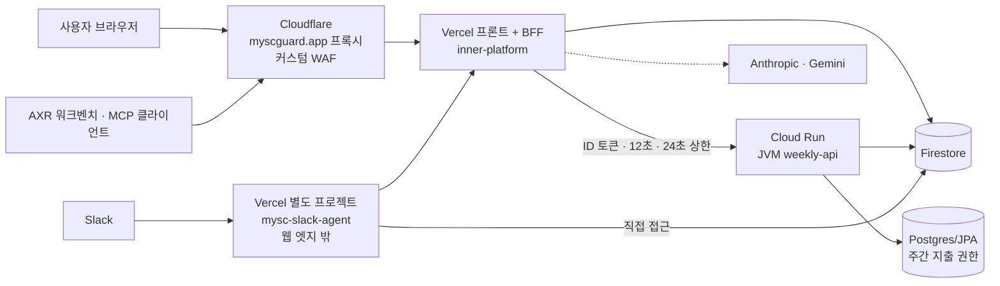

| 구성 | 위치 | 상태 |
|---|---|---|
| 프론트 + BFF | Vercel (`inner-platform`), 워커 4개는 Vercel 크론 | [확인] |
| JVM weekly-api | **Cloud Run**, `min-instances 1`, CPU 상시, ingress all, 서비스 계정 실행. 이미지 저장소는 asia-northeast3 | [확인] |
| 엣지 | Cloudflare Pro POC, `myscguard.app`, 커스텀 WAF만 활성 (managed WAF·rate limit은 예산상 꺼둠) | [확인] |
| 에이전트 | `server/mcp` + 2026-09-30부터 별도 Vercel 프로젝트(`mysc-slack-agent`)로 분리 중 (#845) | [확인] |
| 저장소 | Firestore(정산 도메인 대부분), Postgres/JPA(주간 지출 권한) | [확인] |
| 계산 코어 | Rust (`rust/spreadsheet-calculation-core`), TS 미러와 패리티 테스트 | [확인] |

### 4.2 진단

**D1. 이중 권위.** 정산 사이클의 상태 전이는 JVM `CashflowSettlementCycleWorkflow`에 있는데, BFF가 그 앞뒤에서 같은 조건을 다시 검사한다.

| BFF 함수 | 줄 수 | 하는 일 |
|---|---|---|
| `prepareCashflowMonthClose` | 199 | 사전 검증과 대시보드·마감 본문 조립 |
| `stageCumulativeMonthCloseRequest` | 233 | 요청·단계·샤드 문서를 Firestore 트랜잭션으로 **직접 씀** |
| `requireCanonicalCashflowSettlementCycleStage` | 44 | 기록한 단계 문서 재검증 |
| `submitStagedCashflowSettlementCycle` | 60 | 제출 후 영수증 검증 |
| `approveCanonicalCashflowSettlementCycle` | 115 | 승인 전후 상태·리비전·권한 재심사 |
| `mutateCanonicalCashflowMonthReopen` | 176 | 재오픈 전후 재심사 (약 55줄은 사후 재조회) |
| `transitionCanonicalCashflowSettlementCycle` | 152 | 철회·반려 전후 재심사 |

이 중 승인·재오픈·철회·제출의 사전·사후 조건은 JVM이 트랜잭션 안에서 이미 판정하는 값이다(요청 문서 상태, `evidenceRevision`, `manifestHash`, `workflowRevision`, 코디네이터 상태, 월 상태, 승인자 권한). [확인] BFF의 사전 검사는 트랜잭션 밖에서 미리 읽어 한 번 더 보는 것이라 동시성 경합에서는 JVM이 최종 결정한다.

**D2. BFF 프록시 파일의 성격.** `jvm-weekly-api.mjs`는 6,615줄이다. mount 앞 헬퍼가 3,886줄(59%), mount 안 핸들러 37개가 2,729줄(41%)이다. 순수 프록시는 핸들러 줄 수의 약 2%뿐이다. [확인] 이름은 프록시인데 실제로는 JVM 앞의 두 번째 도메인 계층이다.

**D3. 쓰기 겹침.** 소유권 스캔 결과 BFF가 JVM 소유 컬렉션에 쓰는 곳이 5건이다. [확인]

| 컬렉션 | BFF 쓰기 위치 |
|---|---|
| `cashflow_month_close_requests` | `jvm-weekly-api.mjs` (단계·요청) |
| `cashflow_month_close_request_months` | 같은 파일 (샤드) |
| `cashflow_month_close_request_audits` | 같은 파일 (승인자 변경 감사) |
| `cashflow_cumulative_close_heads` | `cashflow-cumulative-close-head-recovery.mjs` (생성·덮어쓰기·삭제) |
| `monthly_closes` | 같은 파일 (삭제) |

**D4. 레거시 경로 잔존.** JVM에 `decideLegacy`, 사이클 필드 없는 저장 분기, 레거시 멱등 해시가 남아 있다. 프로덕션 호출자는 BFF 한 곳뿐이고 프론트는 항상 `settlementCycle: true`를 보내므로 라이브 요청은 이 분기에 닿지 않는다. 테스트만 참조한다. [확인] 컷오버 이전 형태의 운영 문서가 남았는지는 [미확인].

**D5. 멱등 해시가 파생 필드를 포함한다.** JVM은 요청 전체(`expectedWorkflowRevision` 포함)를 해시하고, BFF는 재시도 때 `workflowRevision - 1`로 과거 값을 역산해 같은 해시를 재현한다. 재오픈 함수가 176줄이 된 큰 이유다. 재오픈에서는 `evidenceRevision`, `manifestHash`, `expectedWorkflowRevision`을 클라이언트가 아니라 BFF가 방금 읽은 상태에서 채우기 때문에, 클라이언트가 보내는 낙관적 잠금 토큰은 `ledgerRevision` 하나뿐이다. [확인]

**D6. 에이전트 경계 부재.** [확인]
- `server/mcp`의 Slack 에이전트 계열이 도메인 컬렉션(`members`, `projects`, `client_error_events`)을 Firestore에서 직접 읽는 곳이 10곳이다. `orgs/mysc`가 코드에 고정된 곳도 있다.
- 오늘 분리된 에이전트 서비스 배포(#845)는 웹사이트 프로젝트의 `FIREBASE_`, `BFF_`, `JVM_` 등 환경변수(Firebase 서비스 계정 자격증명 포함)를 에이전트 프로젝트로 **복사**한다. 서비스 경계는 라우트 허용 목록(`slack-service-boundary.mjs`)이지 **데이터 경계가 아니다**. 에이전트가 침해되면 Firestore 관리자 권한을 얻는다.
- `BFF_ALLOWED_ORIGINS`에 `https://mysc-slack-agent.vercel.app`이 들어간다. 기존 게이트 문서는 직접 `*.vercel.app` 접근을 승인된 운영 경로로 보지 않는다. Slack 콜백이 Cloudflare UA 규칙과 맞지 않아 분리한 것으로 보이며 [추정], 보상통제(서명 검증, 라우트 허용 목록)가 필요하다.

**D7. 엣지와 M2M 충돌.** §2.4의 세 사건. UA 문자열은 스푸핑이 쉬워서 방어로도 약하고, 정상 클라이언트의 장애 원인으로는 강하다. [확인]

**D8. 검증 사각.** [확인]
- CI는 Playwright와 Rust 테스트를 돌리지 않는다.
- 엣지 스모크(`security:edge-smoke:strict`)는 `main` push에서만 돈다.
- 소유권 가드는 아직 CI에 연결하지 않았고, JVM 쓰기 감지는 영속 계층의 자체 래퍼 때문에 불완전하다.
- 소유권 가드 테스트는 `npm test` 범위 밖이다(vitest 범위가 `src`, `server`뿐).

---

## 5. 목표 아키텍처

### 5.1 논리 구조

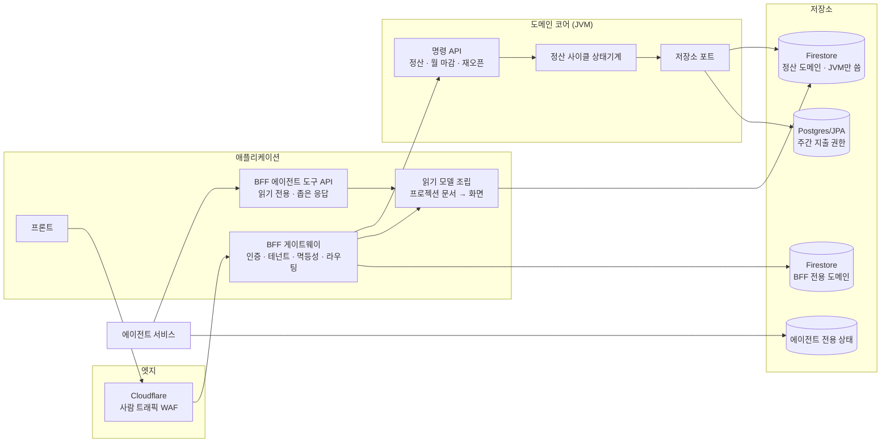

### 5.2 서비스 간 계약

| 계약 | 방향 | 내용 |
|---|---|---|
| **명령 API** | BFF → JVM | 상태를 바꾸는 유일한 경로. 멱등 키, 클라이언트가 보낸 낙관적 잠금 토큰, 응답에 **사후 상태와 영수증** |
| **문서 스키마** | JVM이 쓰고 BFF가 읽음 | 2026-08-18 읽기 경로 계약 유지. 화면 모델은 문서에서 단일 조립. 계산하지 않음 |
| **에이전트 도구 API** | 에이전트 → BFF | 읽기 전용. 필드 화이트리스트, 테넌트 강제, 요청별 감사 |
| **M2M 인증** | 서버 → 서버 | 서명된 서비스 토큰(또는 Cloud Run ID 토큰). UA 문자열에 의존하지 않음 |

### 5.3 컬렉션 소유권 (요약)

전체 목록은 `policies/firestore-ownership.json`이다. [확인]

| 소유자 | 컬렉션 수 | 성격 |
|---|---|---|
| JVM | 21 | 정산 사이클, 월 마감, 주간 정산, 감사, 멱등성 |
| BFF | 59 | 프로젝트·멤버 마스터, Sheet Lab, 편집 잠금, outbox, 가이드 등 |
| 에이전트 | 13 | `settlement_agent_*`, `merryhere_*` |

### 5.4 정산 사이클 상태기계 — 한 곳에만 있어야 하는 것

JVM `CashflowSettlementCycleWorkflow`의 전이다. [확인] 이 기계는 BFF에 복제되지 않고, BFF는 결과를 읽기만 한다.

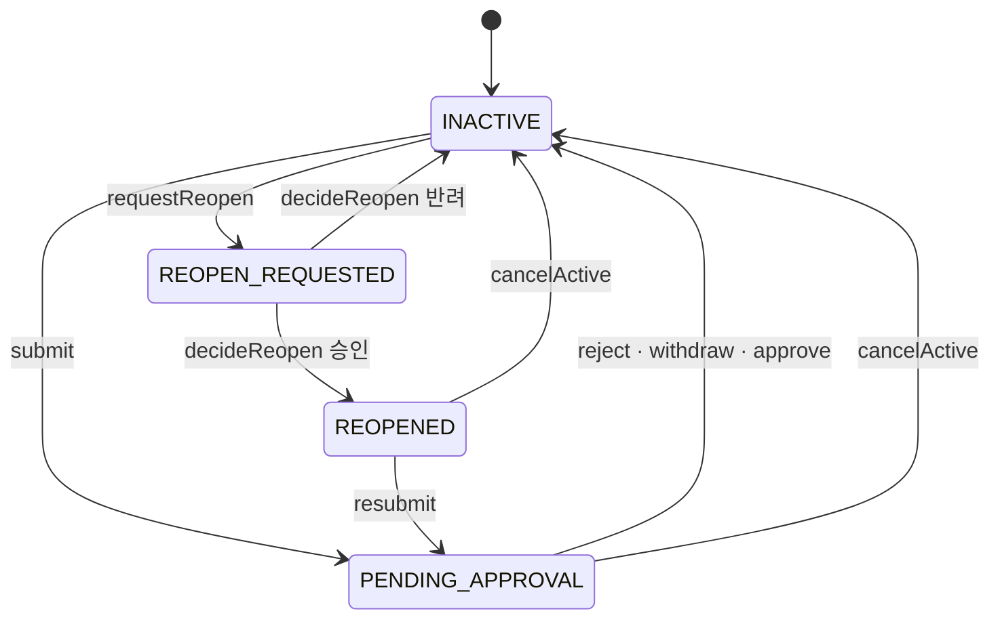

승인이 `finishReview`를 타는지는 [추정]이다(철회·반려는 확인). 각 전이는 `workflowRevision`을 1 올리고, 모든 명령은 기대 리비전이 다르면 `REVISION_CHANGED`로 거절된다.

### 5.5 명령 API 규약

| 항목 | 현재 | 목표 |
|---|---|---|
| 낙관적 잠금 토큰 | 재오픈은 `ledgerRevision`만 클라이언트가 보내고 나머지는 BFF가 읽어서 채움 | 클라이언트가 화면에서 본 `evidenceRevision`, `manifestHash`, `workflowRevision`을 그대로 보낸다. 화면과 다르면 거절 |
| 멱등 해시 | 요청 전체 + 행위자 | 도메인 입력(대상, 사유, 기대 토큰)만. 서버가 파생하는 값은 제외 |
| 응답 | 영수증, BFF가 다시 읽어 대조 | **사후 상태를 응답에 포함**. BFF 재조회 제거 |
| 오류 | 메시지 문자열 중심, BFF가 재해석 | 위반 사유 enum(`REVISION_CHANGED`, `REQUEST_CHANGED`, `STATE_CHANGED`, `ACTIVE_CYCLE_EXISTS`, `NOT_CURRENT_APPROVER` 등)을 HTTP 코드와 함께 JVM이 정의. BFF는 매핑만 |
| 레거시 | 사이클 필드 없는 요청 허용 | 거절. 호환 창(compat window)은 §7.3 게이트 이후 종료 |

승인 흐름의 전후 비교다.

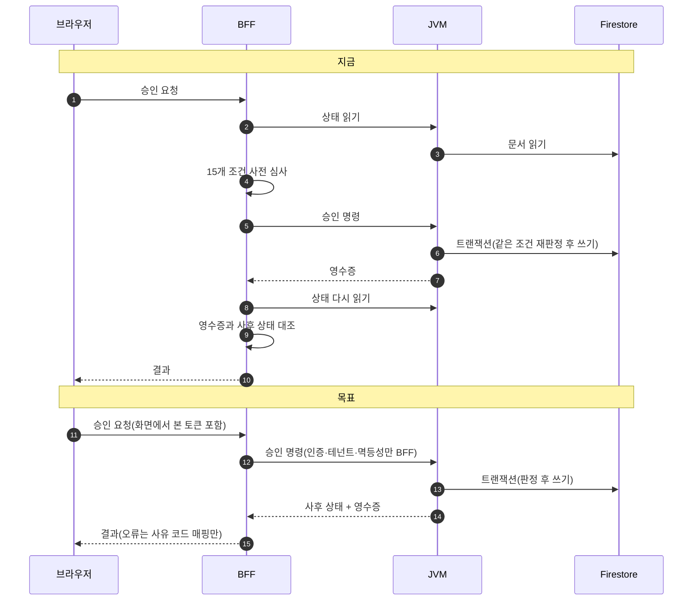

### 5.6 에이전트 경계

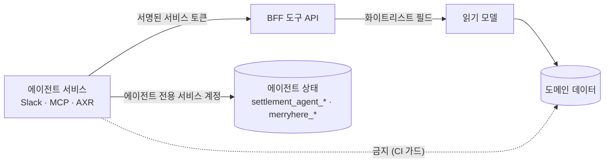

규칙은 다음과 같다.
- 도구는 조회 단위로 좁게 만든다. 범용 쿼리 엔드포인트를 열지 않는다. (열면 DB 직접 접근과 같다)
- 쓰기 도구는 BFF의 멱등성과 감사 체인을 타고, 사람의 확인 단계를 둔다.
- 에이전트 서비스의 자격증명은 별도 서비스 계정이고, 도메인 데이터에는 IAM으로 닿지 못하게 한다. Firestore는 데이터베이스 단위 IAM이 자연스러우므로, 에이전트 상태를 **별도 Firestore 데이터베이스**로 분리하는 방안을 1단계에서 검토한다. [미확인: 현재 프로젝트 설정에서 가능한지]
- 테넌트는 코드에 고정하지 않고 요청 컨텍스트에서만 받는다.

### 5.7 엣지와 네트워크 토폴로지

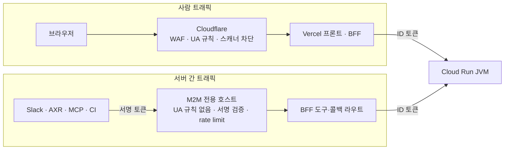

핵심은 **사람 입구와 M2M 입구를 분리**하는 것이다. UA 규칙은 사람 입구에만 두고, M2M 입구는 UA가 아니라 서명 토큰으로 신뢰한다. 이러면 "새 클라이언트가 만들어질 때마다 UA를 채우는" 수정이 사라진다.

---

## 6. 이전 방법론

### 6.1 표준 절차 (명령 하나 또는 컬렉션 하나 기준)

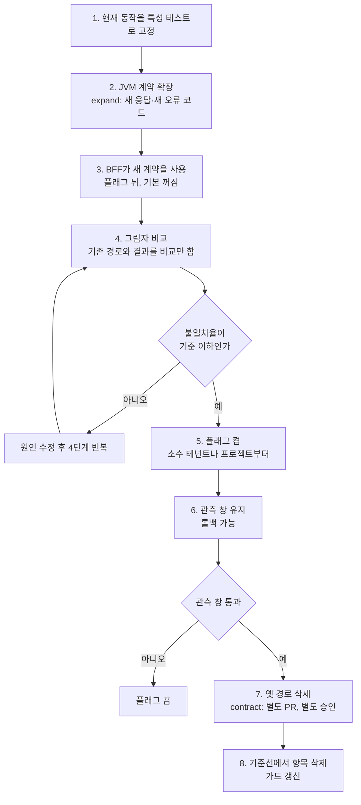

원칙:
- **삭제는 별도 PR**이다. 동작 변경 PR과 삭제 PR을 섞지 않는다.
- 3단계 이후 플래그는 **하루 안에 되돌릴 수 있어야** 한다.
- 각 PR은 줄 수 순증감을 본문에 적는다. 삭제가 늘어야 다음 단계로 간다.

### 6.2 특성 테스트

이미 있는 자산을 활용한다. [확인]
- `server/bff/cashflow/settlement-cycle/jvm-anti-corruption-adapter.test.mjs` (701줄)
- `cashflow-sheet-lab.test.mjs` (짝 테이블 원칙, 동결 영역)
- BFF-JVM 마감 근거 해시 패리티 테이블
- JVM `WeeklyExpenseLegacyIdempotencyCompatibilityTest`, `CashflowMonthReopenPolicyTest`
- `scripts/audit-cashflow-settlement-cycle-rollout.mjs`, `audit-cashflow-month-close-state.mjs`, `audit-cashflow-close-horizons.mjs`, `audit-cashflow-stray-weekly-docs.mjs` (출력과 용도는 [미확인], 0단계에서 확인)

---

## 7. 단계별 실행 계획

### 7.0 로드맵

크기를 시각화한 것이며 일정 약속이 아니다. 시작일은 가정이다.

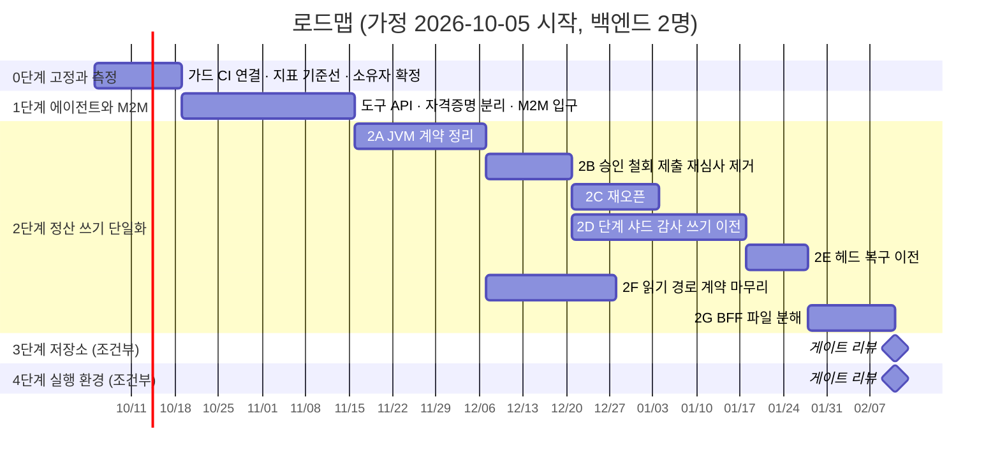

### 7.0.1 선행 항목 — QW-1: 월결산과 시트 5~9행(입금 예정 영역)

별도 조사 문서: [월결산과 시트 5~9행 영향 범위 조사](./2026-09-30-month-close-deposit-rows-impact.md)
실행 계획: [주정산·월결산 검사 범위 격리 계획](./2026-09-30-settlement-validation-scope-plan.md) — 오류가 있어도 루프 전체가 멈추지 않고 살펴보는 범위만 검사한다.

- 5~9행은 월결산 판정에 **8개 경로**로 닿는다(차단 4, 요청 실패 2, 경고 2). 7/28 계약이 9행 합계를 검산 대상으로 정했고, 미러 `sourceRevision`이 이 값을 해시한다.
- 처음 시도한 수정(차단 함수 하나에서 제외)은 1개 경로만 다뤄서 **되돌렸다.**
- 순서: 운영 증거 수집(읽기 전용) → 계약 개정 → 판정 경로 분리(BFF) → 화면 요청 입력 → 리비전 영향 판단 → JVM 비누적 경로 정리(P2A-1과 연동).
- 이 항목의 판정 경로 분리(C)는 2단계 "BFF 재심사 제거"와 같은 파일을 건드리므로, 2단계 착수 전에 끝내거나 같은 PR 흐름에 묶는다.

### 7.1 0단계 — 고정과 측정 (2주)

**목적:** 더 나빠지지 않게 막고, 이후 판단에 쓸 숫자를 만든다.

| ID | 작업 | 산출물 | 크기 |
|---|---|---|---|
| P0-1 | 소유권 가드를 `policy:verify` 체인과 CI에 연결. `manual` 기준선 2건 유지 | CI 통과, 새 위반 차단 | S |
| P0-2 | 소유자 확정 워크숍 (D-3). `editLeases`, `cashflow_sheet_*`, `members`, `projects`, `persons`, `weekly_submission_status` | ADR-2, 매니페스트 갱신 | S |
| P0-3 | 지표 기준선 수집: 월 마감 GET p95 (`Server-Timing` 이미 있음), 명령별 성공률·409·502 비율, BFF→JVM 왕복 수, 워커 실행 시간 | 대시보드 또는 표 | M |
| P0-4 | 코드 기준선: 프록시 파일 줄 수, 커밋·fix 비율, 판정 함수 줄 수(§4.2 D1) | 월별 기록 | S |
| P0-5 | 특성 테스트 보강: 승인, 철회·반려, 제출, 재오픈, 재시도(replay) 경로 | 테스트가 현재 동작을 고정 | M |
| P0-6 | **운영 레거시 형태 문서 개수 확인** (읽기 전용 쿼리, 운영 권한 담당자가 실행): `evidenceRevision` 또는 `workflowRevision`이 없는 활성 요청, `REOPEN_REQUESTED` 잔존 | 개수 표. 0이면 §7.3 게이트 통과 | S |
| P0-7 | 경로 헬퍼 중복 통합 (`cashflowMonthCloseRequestPath`가 두 곳에 정의) | 한 곳으로 | S |
| P0-8 | M2M 클라이언트 인벤토리: AXR, MCP, Slack 에이전트, GitHub Actions, Hermes, QA 감사 자동화. 각각 어떤 호스트·경로·UA로 들어오는지 | 표 | S |
| P0-9 | 보안 기준선 점검: Cloudflare Global API Key 로테이션 여부, 최근 `edge-smoke` 결과, `BFF_ALLOWED_ORIGINS`에 든 직접 `*.vercel.app` 출처, 일일 리포트의 "보안 액션 없이 통과한 suspicious path" | 점검표 | S |
| P0-10 | **프로젝트 등록·수정 진단 (별도 트랙)**: 최근 60일 프로젝트 관련 fix 48건을 원인별로 분류(저장 정책, 제출 필수값, 승인 조건, 버전·이력, 첨부, 화면 표시). 정산 엔진과 무관한 원인인지 확인 | 원인 분류표, 권고 | M |

**종료 조건:** P0-1 통과, P0-6 결과 확보, 지표 기준선 1주 이상 수집, D-1~D-6 결정.
**롤백:** 해당 없음(코드 변경이 거의 없다).

### 7.2 1단계 — 에이전트 격리와 M2M 경로 정리 (3~4주)

**목적:** 에이전트가 데이터에 닿는 길을 하나로 줄이고, 침해 시 피해 범위를 자격증명 수준에서 줄인다.

| ID | 작업 | 산출물 | 크기 |
|---|---|---|---|
| P1-1 | 도구 API 설계: 현재 에이전트 모듈의 직접 접근 10곳을 도구로 변환. 아래 대응표 | 도구 명세 | M |
| P1-2 | BFF에 읽기 전용 도구 구현 (필드 화이트리스트, 테넌트 컨텍스트 강제, 응답 상한, 감사) | 도구 엔드포인트, 테스트 | L |
| P1-3 | 에이전트 모듈을 도구 클라이언트로 전환하고 Firestore 직접 접근 제거 | 가드 `agent-isolation` 기준선 10 → 0 | M |
| P1-4 | 에이전트 서비스 자격증명 분리: 웹사이트 프로젝트의 서비스 계정 JSON 복사 중단, 별도 서비스 계정, 에이전트 상태용 별도 DB 검토 | 배포 스크립트 변경, IAM 표 | M |
| P1-5 | M2M 입구: 서명 토큰 검증 미들웨어, 전용 호스트 또는 경로, 스코프별 rate limit. UA 의존 제거 | 설계 ADR, 구현 | L |
| P1-6 | 에이전트 서비스 `BFF_ALLOWED_ORIGINS`의 직접 `*.vercel.app` 출처 제거 계획, Slack 서명 검증과 라우트 허용 목록을 보상통제로 문서화 | 보안 점검표 | S |
| P1-7 | 프롬프트 인젝션 대비: 도구 출력에서 지시문 무력화, 쓰기 도구 승인 단계, 도구 호출 감사 | 정책 문서, 테스트 | M |

**직접 접근 → 도구 대응 (초안)**

| 현재 접근 | 컬렉션 | 도구 후보 |
|---|---|---|
| `settlement-status-report.mjs` | `members`, `projects` | `projects.list` (필드 제한), `members.me` |
| `slack-runtime.mjs` | `members`, `projects` | 위와 동일 |
| `accounting-report.mjs` | `members`, `projects` | `projects.list`, 정산 현황 조회 (기존 `cashflow_status` 재사용) |
| `grounded-answer.mjs` | `projects` | `projects.get` (요약 필드) |
| `merryhere-connection.mjs`, `merryhere-local-relay.mjs` | `members` | `members.me` |
| `support-read.mjs` | `client_error_events` | `support.errors.list` (관리자 권한, 페이지 상한) |

**종료 조건:** 가드 기준선 `agent-isolation` 0건, 에이전트 배포에 도메인 서비스 계정이 없음, M2M 인벤토리의 모든 클라이언트가 새 입구 또는 사람 입구 중 명시된 곳으로 들어감, 새 M2M 클라이언트 추가 절차가 문서화됨.
**롤백:** 도구 사용 플래그를 끄면 옛 직접 접근으로 돌아간다(삭제 PR 전까지). 자격증명 분리는 이전 값으로 되돌릴 수 있게 롤백 절차를 사전에 적어 둔다.

### 7.3 2단계 — 정산 쓰기 단일화 (6~10주)

**목적:** 정산 도메인의 판정과 쓰기를 JVM으로 모으고, BFF를 게이트웨이와 읽기 조립으로 줄인다.

#### 2A — JVM 계약 정리 (3주)

| ID | 작업 | 게이트/조건 | 크기 |
|---|---|---|---|
| P2A-1 | 레거시 경로 제거: `decideLegacy`, 사이클 필드 없는 저장 분기, 사이클 필드 빈 문자열 허용, 레거시 멱등 해시 | **P0-6 결과 0건**. 레거시 멱등 해시는 멱등 레코드 사용 기록 확인 후 별도 판단 | M |
| P2A-2 | 멱등 해시에서 서버 파생 필드 제외. 호환 창 동안 두 해시를 모두 인정 | 호환 창 종료일을 ADR에 기록 | M |
| P2A-3 | 명령 응답에 사후 상태 포함 (승인, 재오픈, 철회·반려, 제출) | 응답 스키마 계약 테스트 | M |
| P2A-4 | 위반 사유 enum과 HTTP 코드 매핑을 JVM이 정의 | BFF가 매핑만 하도록 표 공유 | S |
| P2A-5 | 재오픈 요청을 클라이언트가 보낸 토큰 기준으로 변경 (D5) | 프론트 협업 필요 | M |

#### 2B — 승인·철회·제출의 BFF 재심사 제거 (2주)

순서: 철회·반려 → 제출 → 승인. 각각 §6.1 절차를 따른다.

| ID | 작업 | 제거 대상 | 크기 |
|---|---|---|---|
| P2B-1 | 철회·반려 | `transitionCanonicalCashflowSettlementCycle` 152줄의 사전·사후 심사 | M |
| P2B-2 | 제출 | `submitStagedCashflowSettlementCycle` 60줄, 영수증 재검증 | S |
| P2B-3 | 승인 | `approveCanonicalCashflowSettlementCycle` 115줄의 조건 15개와 replay 판정 | M |

BFF에 남기는 것: 인증, 테넌트 검사, 멱등 키 전달, 사유 코드 → HTTP 코드 매핑, Slack 알림.

#### 2C — 재오픈 (2주, 2A-5 이후)

`mutateCanonicalCashflowMonthReopen` 176줄 → 입력 전달과 오류 매핑으로 축소. 사후 재조회 약 55줄 제거.

#### 2D — 단계·샤드·감사 쓰기 이전 (4주)

| ID | 작업 | 비고 |
|---|---|---|
| P2D-1 | 누적 월 스냅샷 생성 책임을 JVM으로 이전: JVM이 스냅샷·샤드·단계 문서를 만든다. `stageCumulativeMonthCloseRequest` 233줄의 목적 | 가장 큰 설계 결정. 결산 근거/표시값 경계(읽기 경로 계약 §2)를 JVM 테스트로 고정 |
| P2D-2 | 승인자 변경과 철회 감사 문서를 JVM 명령이 남기게 함 | `approver-updated` 감사 |
| P2D-3 | 제출 명령이 단계 준비를 포함하도록 통합 여부 결정 (별도 `stage` 명령 vs `submit` 통합) | ADR |

#### 2E — 누적 마감 헤드 복구 이전 (2주)

`cashflow-cumulative-close-head-recovery.mjs`는 `cashflow_cumulative_close_heads`, `monthly_closes`를 BFF에서 쓰고 지운다. JVM 관리 명령으로 옮기거나, 일회성 복구라면 JVM 저장소 포트를 쓰는 운영 스크립트로 분리한다. 이전 후 `manual` 기준선 2건이 사라진다.

#### 2F — 읽기 경로 계약 마무리 (3주, 2A와 병행 가능)

2026-08-18 계약의 남은 항목이다. `dashboard-source`는 BFF에서 아직 3곳 참조된다. [확인] 진행 정도는 [미확인].
- `dashboard-source` 호출 제거, `jvm_dashboard`·`jvm_compliance` 왕복 제거
- `composeCashflowMonthDashboard` 433줄을 단일 원천 조립으로 재작성 (목표: 절반 이하)
- `closedSnapshot ? snapshot : mirror` 분기 제거
- 죽은 라우트(`/cashflow-sheet-lab/years`) 제거

**이 계획의 D-2 결정(문서 직접 읽기 유지)과 같은 방향이다.** 이 계약을 뒤집지 않는다.

#### 2G — BFF 파일 분해 (2주)

`jvm-weekly-api.mjs`(6,615줄)를 책임별로 나눈다. 이동만 하고 동작을 바꾸지 않는다.

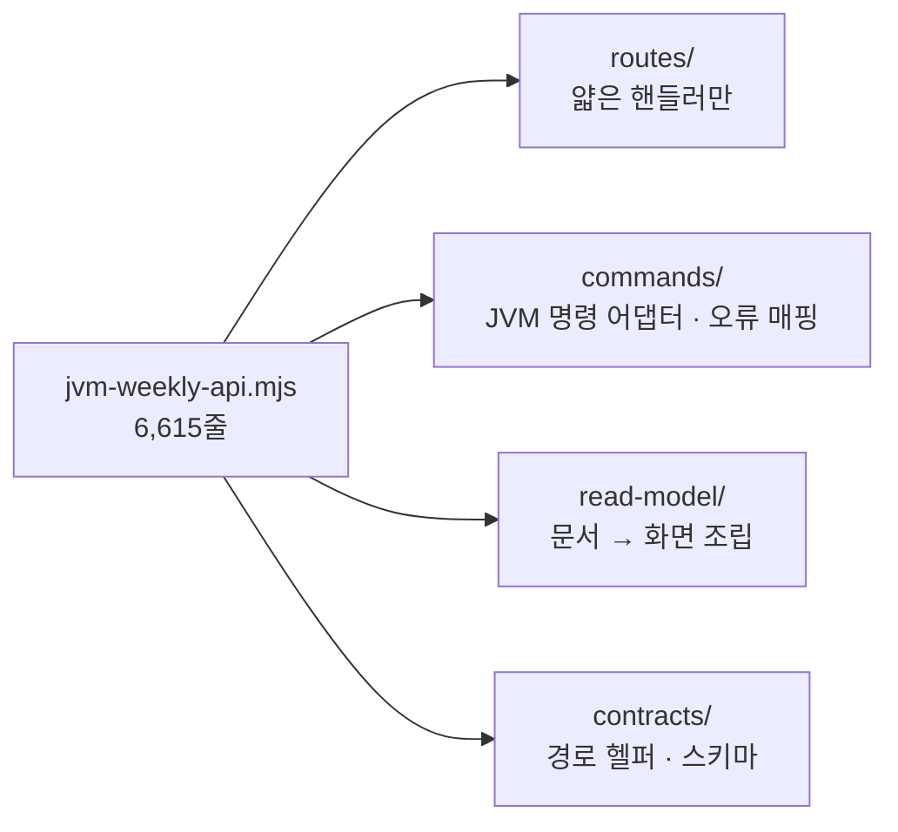

**초기 목표 (재산정 대상):** 프록시 파일 3,000줄 이하, 핸들러당 40줄 이하, 판정 함수 0.

**2단계 종료 조건:**
- 소유권 가드 `single-writer` 기준선 0건 (`manual` 포함)
- BFF의 승인·재오픈·철회·제출 판정 코드 0줄
- 레거시 경로 제거 완료 (또는 P0-6 이유로 연기가 명시됨)
- P0-3 지표 대비 월 마감 화면 p95가 악화되지 않음
- 순증감이 음수 (2단계 전체 PR 합계)

**롤백:** 명령별 플래그로 옛 BFF 경로 복귀. 옛 경로는 2단계 종료 후 별도 PR로 삭제.

### 7.4 3단계 — 정산 저장소 이전 (게이트 조건부, 분기 단위)

#### 착수 게이트 (하나 이상 관측되고, 2단계가 끝난 뒤)

| 신호 | 측정 방법 |
|---|---|
| 원자 쓰기 한도(500)에 근접해 샤딩이 더 늘어남 | 명령별 쓰기 개수 분포. `assertAtomicWriteBudget` 발동 횟수 |
| 프로젝트×월×계정 같은 임의 집계·정합성 리포트 요청이 반복됨 | 스크립트로 리포트를 뽑은 횟수 |
| 문서 1MB 한도를 피하는 우회 코드가 또 생김 | 코드 리뷰 기록 |
| 감사·정합성 검증을 SQL 없이 하는 비용이 커짐 | 운영 이슈 기록 |

신호가 없으면 3단계는 하지 않는다. **저장소 이전은 도메인 버그를 고치지 않는다.**

#### 설계 방향

- **정산 도메인만** Postgres로 옮긴다. Firestore 전체를 옮기지 않는다. (실시간 협업, 편집 잠금, 에이전트 상태는 Firestore가 맞는다)
- JVM에 이미 있는 포트(`CashflowMonthReopenPort`, `CashflowReadPort`)를 경계로 삼아 **같은 포트 뒤에 Postgres 구현을 추가**한다. 도메인 정책 클래스(`CashflowSettlementCycleWorkflow`, `CashflowMonthReopenPolicy`)는 이미 순수하므로 건드리지 않는다. [확인: 정책 클래스가 순수하다는 것은 코드 구조에서의 관찰]
- 영속 기술: 원장, 해시 체인, 감사처럼 **추가만 하는 데이터는 명시적 SQL(jOOQ 또는 JDBC)**로 작성한다. 엔티티 상태 추적이 필요 없고, 해시 체인과 대량 처리에는 JPA의 변경 감지·지연 로딩이 이득이 없다. 단순 CRUD 집합은 JPA를 유지한다.
- Flyway는 `V5` 이후로 이어간다.

#### 데이터 흐름 — 쓰기 모델과 읽기 모델의 분리

BFF가 JVM이 쓴 문서를 직접 읽는다는 2026-08-18 계약을 깨지 않도록, Postgres는 쓰기 모델로 두고 **Firestore에 읽기 모델 프로젝션 문서를 발행**한다.

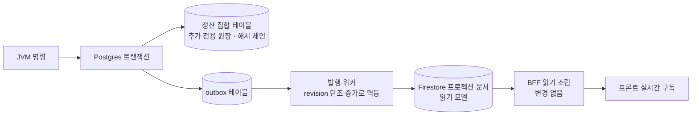

이 구조는 8.6초 문제(읽기 시 조립)를 저장 시 조립으로 옮기는 효과도 있다. 읽기 시점에 조립하지 않으므로 계약의 "계산하지 않는다"와도 맞는다.

#### 단계

| ID | 작업 | 산출물 | 크기 |
|---|---|---|---|
| P3-1 | ADR-3: 스키마 설계(사이클 코디네이터, 요청, 단계, 스냅샷, 원장, 감사, 멱등, outbox). 해시 정규화(canonical JSON)를 언어 간 동일하게 유지하는 방법 | ADR, ERD | L |
| P3-2 | 해시 패리티 코퍼스: 운영 스냅샷에서 뽑은 입력과 기대 `manifestHash`를 테스트 자산으로 고정 | 테스트 | M |
| P3-3 | Postgres 포트 구현 + 통합 테스트 (H2가 아니라 Postgres 컨테이너) | 구현 | XL |
| P3-4 | **그림자 쓰기**: 새 쓰기를 Firestore와 Postgres에 모두 기록하고 비교 잡이 매일 불일치를 보고 | 비교 리포트 | L |
| P3-5 | 백필: 기존 Firestore 데이터를 Postgres로 멱등하게 적재, 해시 체인 연속성 검증 | 스크립트, 검증 리포트 | L |
| P3-6 | 읽기 전환: 집합 단위(월 마감 → 주간 정산 → 나머지). 프로젝션 발행으로 BFF는 변경 없음 | 플래그별 전환 | L |
| P3-7 | Firestore 쓰기 제거와 동결 (읽기 전용으로 일정 기간 보존) | 별도 승인 | M |
| P3-8 | 옛 Firestore 정산 컬렉션 폐기 (되돌릴 수 없는 지점) | **별도 승인, 백업 확인** | S |

**종료 조건:** 그림자 비교 불일치 0이 N일 연속(N은 ADR에서 정함), 해시 패리티 코퍼스 통과, 프로젝션 신선도 SLO 충족, 롤백 리허설 1회 수행.
**롤백:** P3-6까지는 읽기 플래그로 즉시. P3-7 이후에도 동결된 Firestore에서 재적재 가능해야 한다. P3-8 이후는 백업에서만 복구한다.

### 7.5 4단계 — 실행 환경 이전 (게이트 조건부, 분기 단위)

**현재 사실:** JVM은 이미 Cloud Run에 있고, BFF와 프론트가 Vercel에 있다. 그래서 4단계는 "JVM을 옮기는 것"이 아니라 **BFF(와 워커)를 JVM이 있는 GCP로 옮기는 것**이다. Vercel은 프론트 정적 배포로 남긴다. [확인]

#### 착수 게이트 (하나 이상 관측)

| 신호 | 측정 방법 |
|---|---|
| 함수 실행 시간 한도에 닿는 작업이 생김 (시트 수집, 대량 재계산, LLM 스트리밍) | Vercel 함수 로그, BFF 타임아웃 오류율 |
| 크론 주기로는 워커 처리량이 모자람 | outbox 지연(lag), 큐 깊이 |
| 서버리스와 Postgres를 함께 쓰며 연결 수 문제가 생김 (3단계 이후) | DB 연결 수, 풀 고갈 |
| JVM이 `ingress all`로 열려 있어야 하는 이유가 Vercel 때문임을 없애고 싶음 (보안 요구) | 보안 리뷰 |
| 비용이 상시 컨테이너보다 커짐 | 월 청구서 |

#### 작업

| ID | 작업 | 비고 | 크기 |
|---|---|---|---|
| P4-1 | BFF 컨테이너화. Dockerfile은 이미 있음(`BFF_WORKERS_ENABLED=false`, `BFF_SCHEDULER_OWNER=disabled` 기본). 런타임 안전 규칙(`runtime-safety.mjs`)이 허용하는 소유자 조합을 새 환경에 맞게 갱신 | | L |
| P4-2 | 워커 4개(outbox, work-queue, payroll, client-errors)를 Cloud Scheduler + Cloud Run Jobs(또는 Cloud Tasks)로 교체 | Vercel 크론 제거 | L |
| P4-3 | BFF → JVM을 내부 호출로: Cloud Run ingress를 `internal`로 좁히고 IAM invoker + ID 토큰 유지 | 지금은 `ingress all` | M |
| P4-4 | 에이전트 서비스를 Cloud Run 비공개 서비스로 이전. Slack 콜백만 서명 검증된 공개 경로로 노출 | | L |
| P4-5 | 관측성 통합: Cloudflare Ray ID → BFF 요청 ID → JVM 추적 ID를 한 추적으로 연결(OpenTelemetry). Cloudflare 이벤트를 `securityEvents`로 적재하는 설계(기존 draft)를 이때 구현 | | L |
| P4-6 | 프론트를 Vercel 정적 + Cloudflare로 유지, 원하면 정적 호스팅을 이전 | 선택 | M |
| P4-7 | Vercel 축소: 프론트 외 프로젝트와 크론 제거, 직접 `*.vercel.app` 출처 완전 제거 | 되돌리기 어려움, 별도 승인 | M |

**종료 조건:** 워커가 새 환경에서 N일 안정, BFF→JVM이 공개 인그레스를 쓰지 않음, Cloudflare 이벤트→BFF→JVM 추적이 연결됨, 비용 비교표 작성.
**롤백:** 프론트 DNS와 BFF 라우팅을 Vercel로 되돌리는 절차를 컷오버 티켓에 명시(기존 Production Gates의 "rollback owner, rollback command, cutover window" 규칙 적용).

---

## 8. 보안·엣지 워크스트림

이 리팩토링은 엣지와 인증 구조를 바꾸므로 기존 Cloudflare/보안 문서와 함께 봐야 한다. 아래는 그 문서들의 요약과 이 계획과의 접점이다.

### 8.1 현재 상태 (문서 기준)

| 항목 | 상태 | 출처 |
|---|---|---|
| 도메인 | 보안/DevOps 전용 `myscguard.app` POC. `mysc.co.kr`는 건드리지 않음 | Production Gates |
| 엣지 | 7개 호스트가 Cloudflare 프록시 뒤. SSL은 Full (strict). Flexible 금지 | Edge Runbook |
| 예산 | Cloudflare Pro 약 USD 20/월. Vercel Advanced Deployment Protection과 Enterprise 제외 | POC Budget |
| WAF | **커스텀 WAF만 활성.** managed WAF와 Terraform 관리 rate limit은 Pro POC에서 꺼져 있음 | Production Gates |
| 자동화 차단 | UA 기반 규칙: 빈 UA, curl, wget, python-requests, httpx, aiohttp, Go client, Playwright, Puppeteer, HeadlessChrome, Selenium, Cypress, MCP 클라이언트 등. 스캐너 프로브 경로(`.env`, `.git`, `.terraform` 등) 차단 | 자동화 클라이언트 차단 |
| 직접 오리진 | `*.vercel.app`은 프로젝트 라우트로 `307` 리다이렉트하는 보상통제. 라우트 게시 후 생기는 route-version alias는 같은 변경 창에서 삭제 | Edge Runbook |
| 검증 | 엄격 스모크 16개 체크. CI에서는 `main` push에서만. 러너 대상 403은 허용 | Rollout Report |
| 관측 | 일일 보안 리포트(09:00 KST, Slack). Logpush와 `securityEvents` 적재는 설계 draft | Daily Report, Observability |
| 남은 백로그 | Cloudflare Global API Key 로테이션, 전이 의존성 moderate 취약점, 직접 오리진 격리는 Enterprise 수준이 아님 | Rollout Report |

### 8.2 이 계획과의 접점

| 접점 | 문제 | 반영 위치 |
|---|---|---|
| UA 규칙 vs M2M | 한 달 안에 3번 충돌(§2.4). UA는 스푸핑이 쉬운데 정상 클라이언트는 쉽게 막는다 | P0-8, P1-5, §5.7 |
| 에이전트 서비스의 직접 오리진 | `mysc-slack-agent.vercel.app`이 BFF 허용 출처에 들어가고 웹 엣지 밖에서 동작. 게이트 문서의 원칙과 충돌 | P1-6 |
| 자격증명 복사 | 에이전트 프로젝트로 Firebase 서비스 계정을 복사. 침해 시 관리자 권한 | P1-4 |
| 명령 엔드포인트 보호 | managed rate limit이 꺼져 있어 정산 명령에는 엣지 단위 속도 제한이 없다 | BFF 명령 라우트의 요청 제한 추가(P2B에 포함), 플랜 상향 시 엣지 제한 |
| 상관 추적 | Cloudflare Ray ID와 BFF 요청 ID가 연결되지 않아 사건 분석이 수동 | P4-5 |
| 엣지 스모크가 main 전용 | 엣지 관련 변경이 머지 후에야 검증됨 | 승인된 절차 변경으로 논의(현재 CI 구조 유지) |
| 감사 자동화 접근 | 전수 조사 같은 검증이 운영 도메인에서 엣지에 막힘 | P1-5의 M2M 입구에 "승인된 감사 클라이언트" 등록 절차 |
| JVM 인그레스 | `ingress all`인 이유는 Vercel BFF가 GCP 밖에 있기 때문 | P4-3 |

### 8.3 위협 모델 (리팩토링 후 구조)

| 위협 | 경로 | 완화 | 잔여 위험 |
|---|---|---|---|
| 에이전트 프롬프트 인젝션으로 데이터 유출 | 도구 API 응답 → LLM | 읽기 전용, 필드 화이트리스트, 응답 상한, 쓰기는 사람 확인, 호출 감사 | 허용 필드 안의 민감 정보는 여전히 노출 가능. 필드 분류 필요 |
| 에이전트 서비스 침해로 DB 접근 | 서비스 자격증명 | 에이전트 전용 서비스 계정, 도메인 데이터 IAM 차단, 가능하면 별도 DB | IAM 조건 지원 범위는 [미확인] |
| 직접 오리진 우회로 WAF 회피 | `*.vercel.app` | 프로젝트 라우트 리다이렉트, 허용 출처 제한, 4단계에서 공개 호스트 제거 | Pro POC에서는 완전 차단이 아님(문서에 이미 수용됨) |
| M2M 위조 | 서명 토큰 탈취 | 짧은 수명, 스코프 제한, 로테이션, 사용 로그 | 토큰 저장소 보안에 의존 |
| 테넌트 경계 침해 | 하드코딩된 `orgs/mysc` 등 | 테넌트를 요청 컨텍스트에서만, 매니페스트 가드로 직접 접근 금지 | BFF 내부 경로는 코드 리뷰 의존 |
| 이중 판정 차이로 승인 우회 | BFF와 JVM 조건 불일치 | 판정을 JVM 하나로 | 이전 기간 중 두 경로 공존 |
| 이전 중 데이터 불일치 | 그림자 쓰기 실패 | 비교 잡, 불일치 0 게이트, 롤백 | 백필 오류는 검증 리포트에 의존 |

### 8.4 보안 게이트 (모든 단계 종료 조건에 포함)

- 새 허용 출처(`BFF_ALLOWED_ORIGINS`)나 새 공개 호스트는 ADR 없이 추가하지 않는다.
- `npm run policy:verify`와 (main에서) 엄격 엣지 스모크가 통과한다.
- 자격증명을 다른 프로젝트로 복사하는 배포 스크립트는 만들지 않는다.
- 엣지 통제를 이유로 애플리케이션 인가나 감사를 약화하지 않는다.
- 운영 Firestore와 운영 배포에 대한 변경은 기존 `AGENTS.md`와 `DEPLOYMENT-SAFETY.md`의 절차를 따른다. 로컬 `vercel --prod`는 하지 않는다.

---

## 9. 검증 전략

| 층 | 무엇을 | 도구 |
|---|---|---|
| 단위 | 정책·상태기계, 도구 필드 화이트리스트 | vitest, JUnit |
| 특성(characterization) | 이전 전 동작 고정 | 기존 어댑터 테스트 확장 |
| 계약 | BFF↔JVM 응답 스키마, 오류 코드 표 | 계약 테스트(양쪽에서 같은 표 사용) |
| 패리티 | 마감 근거 해시, Rust↔TS 커널 | 기존 패리티 테이블, 3단계 코퍼스 |
| 통합 | Firestore 에뮬레이터, Postgres 컨테이너 | `bff:test:integration`, `mvn test`, `test:settlement:integration` |
| 그림자 | 기존 경로와 새 경로 결과 비교 | 비교 잡, 불일치 리포트 |
| 엣지 | Cloudflare 스모크, 스캐너 경로, 리다이렉트 | `security:edge-smoke:strict` |
| E2E | 핵심 사용자 흐름 | Playwright (CI 미포함이므로 릴리스 전 로컬 게이트로 명시) |
| 게임 데이 | 롤백 리허설 | 단계마다 1회 |

### 9.1 업무 시나리오 검증표

기술 테스트와 별개로, 단계 종료 때마다 **업무 흐름 그대로** 확인한다. 현재 각 시나리오를 덮는 자동 테스트가 있는지는 [미확인]이며, P0-5에서 표를 채운다.

| 흐름 | 시나리오 | 기대 결과 | 관련 단계 |
|---|---|---|---|
| 월결산 | 담당자가 월 결산을 요청 | 승인 대기가 되고 지정 승인자에게 알림 | 2D |
| 월결산 | 지정 승인자가 승인 | 해당 월 마감(잠금), 화면 상태가 한 번에 반영 | 2B-3 |
| 월결산 | 승인자가 아닌 사람이 승인 시도 | 거절, 사유 표시 | 2B-3 |
| 월결산 | 같은 승인 버튼을 두 번 누름·재시도 | 한 번만 처리, 같은 결과 반환 | 2A-2 |
| 월결산 | 두 승인자가 동시에 처리 | 하나만 성공, 나머지는 "이미 처리됨" | 2B-3 |
| 월결산 | 승인자가 반려 | 요청 종료, 사유 기록 | 2B-1 |
| 회수 · 월결산 | 요청자가 승인 대기 중 철회 / 타인이 철회 시도 | 요청자만 성공 / 타인은 거절 | 2B-1 |
| 월결산 재오픈 | 마감 월의 재오픈 요청 → 승인 / 반려 | 승인: 월 다시 열림, 반려: 마감 유지 | 2C |
| 월결산 | 결산 승인자 변경 | 프로젝트 정보와 감사 기록이 함께 갱신 | 2D-2 |
| 주결산 | 완료 요청 → 회수(사유 없음) → 다시 완료 요청 | 회수 뒤 완료로 보고되지 않음 | 회귀 확인 |
| 주결산 | 완료 요청 → 확정 | 확정 표시, 기한 내/지연 라벨 정확 | 2A-5 회귀 확인 |
| 주결산 | 확정 뒤 재오픈 | 사유 필요, 조직장·관리자만 | 회귀 확인 |
| 프로젝트 | 임시저장 → 제출 → 승인 / 등록 검토 대기 건 회수 | 이전과 동일 | P0-10, 접점 확인 |
| 프로젝트 | 두 사람이 동시에 편집 | 편집 잠금 동작 동일 | P0-2 |
| AI 도우미 | Slack에서 프로젝트·정산 현황 질문 | 이전과 같은 답, 도구 API 경유, 허용 필드만 | 1단계 |

이 표의 각 줄은 **옛 경로/새 경로 그림자 비교(§6.1)의 비교 단위**이기도 하다.

CI에 없는 것(Playwright, Rust 테스트)은 2단계와 3단계 종료 조건에 **로컬 게이트로 포함**한다. 없는 채로 두면 이 리팩토링의 회귀가 초록불로 나간다.

---

## 10. 관측성과 지표

| 지표 | 정의 | 기준선 | 목표 |
|---|---|---|---|
| 월 마감 GET p95 | `Server-Timing` 기반 | 8,654ms (2026-08-18 실측) → 현재 0단계에서 재측정 | 읽기 경로 계약이 정한 목표 |
| 화면당 BFF→JVM 왕복 | 요청 트레이스 | 2 (계약 문서 기준) | 0 |
| 명령 실패 분류 | 409 / 403 / 502 비율 | 0단계 측정 | 502(재조회 실패) 0 |
| BFF 판정 코드 줄 수 | §4.2 D1 함수 합 | 약 570줄(재심사) + 233줄(스테이징) | 0 |
| 프록시 파일 줄 수 | `jvm-weekly-api.mjs` | 6,615 | ≤ 3,000 (재산정) |
| 소유권 위반 | 가드 기준선 | 15 (쓰기 5, 에이전트 10) | 0 |
| fix 비율 | 프록시 파일 월별 | 69% | 하락 추세 |
| align·unify·parity 커밋 | 프록시 파일 월별 | 60일간 20건 | 0에 수렴 |
| outbox 지연 (3단계) | 발행 대기 시간 | 측정 | ADR에서 SLO |
| 프로젝션 신선도 (3단계) | 쓰기→읽기 반영 지연 | 측정 | ADR에서 SLO |
| 그림자 불일치율 (3단계) | 비교 잡 | 해당 없음 | 0 |
| 엣지 403 중 정상 클라이언트 비율 | Cloudflare 이벤트 | 0단계 측정 | 0 |

지표가 나빠지면 그 단계를 멈춘다. 종료 조건과 별개로, 각 단계 시작 시 "이 단계가 어떤 지표를 움직이는가"를 적는다.

---

## 11. 리스크 레지스터

| # | 리스크 | 가능성 | 영향 | 완화 | 조기 신호 |
|---|---|---|---|---|---|
| R1 | 돈·마감 상태 전이를 옮기다 회귀 | 중 | 높음 | 특성 테스트, 플래그, 그림자 비교, 소수 프로젝트부터 | 그림자 불일치, 409 급증 |
| R2 | 컷오버 이전 형태 운영 문서 때문에 레거시 제거가 깨짐 | 중 | 높음 | P0-6 개수 확인이 게이트 | 카운트 > 0 |
| R3 | 두 경로 공존 기간의 이중 판정 불일치 | 중 | 중 | 공존 기간 최소화, 명령별 순차 전환 | 승인 결과 차이 |
| R4 | 정산 기능 추가와 리팩토링이 같은 파일에서 충돌 | 높음 | 중 | D-1로 기능 동결 범위 합의, 분해(2G)는 마지막 | 머지 충돌 빈도 |
| R5 | 해시 정규화 차이로 마감 근거 해시가 달라짐 (3단계) | 낮음 | 높음 | 패리티 코퍼스, 이전 전 일치 확인 | 코퍼스 실패 |
| R6 | 소유권 가드의 오탐·미탐으로 신뢰 저하 | 중 | 중 | 기준선 `manual`, JVM 쓰기 감지 개선(래퍼 이름 규약), ArchUnit 검토 | 오탐 신고 |
| R7 | 에이전트 도구가 사실상 범용 조회가 됨 | 중 | 높음 | 도구 명세 리뷰, 필드 화이트리스트, 응답 상한 | 도구 수 급증 |
| R8 | M2M 입구가 새 공격면이 됨 | 중 | 중 | 서명 토큰, 스코프, rate limit, 로테이션 | 인증 실패 로그 |
| R9 | 4단계에서 워커 이중 실행 (Vercel 크론과 새 스케줄러) | 중 | 중 | `BFF_SCHEDULER_OWNER` 규칙 유지, 컷오버 순서 문서화 | 중복 처리 |
| R10 | 3단계가 신호 없이 시작됨 (기술 선호에 의한 이전) | 중 | 중 | 게이트 신호 표 | 게이트 없는 티켓 |
| R11 | Playwright·Rust가 CI 밖이라 회귀가 통과 | 높음 | 중 | 종료 조건의 로컬 게이트, CI 편입 검토 | 릴리스 후 회귀 |
| R12 | 담당자 이동·부재 (문맥이 특정 사람에게 있음) | 중 | 중 | ADR과 계약 문서, 페어 진행 | 리뷰어 부족 |

---

## 12. 롤백과 안전장치

| 장치 | 내용 |
|---|---|
| 명령별 플래그 | 각 이전 명령은 독립 플래그. 하루 안에 옛 경로로 복귀 |
| 삭제 분리 | 옛 경로 삭제는 별도 PR과 별도 승인. 관측 창 통과 후 |
| 킬 스위치 | 에이전트 도구 전체, M2M 입구 전체, 프로젝션 발행을 각각 끌 수 있음 |
| 데이터 호환 | 3단계 전까지 저장소는 바뀌지 않음. 이후에도 동결 Firestore에서 재적재 가능 |
| 되돌릴 수 없는 지점 | P2A-1(레거시 삭제), P3-8(옛 컬렉션 폐기), P4-7(Vercel 축소). 각각 별도 승인과 사전 백업 확인 |
| 컷오버 티켓 | 승인자, 롤백 담당, 롤백 명령, 컷오버 창을 명시 (기존 Production Gates 규칙) |
| 운영 조회 | 운영 Firestore 조회는 읽기 전용이며 운영 권한 담당자가 실행 |

---

## 13. 조직과 운영

역할 기준으로 적는다. 실제 담당은 0단계에서 정한다.

| 역할 | 책임 |
|---|---|
| 플랫폼 오너 | 우선순위, 게이트 승인, D-1~D-6 결정 |
| 정산 도메인 리드 (JVM) | 명령 계약, 상태기계, 저장소 포트 |
| 게이트웨이 리드 (BFF) | 명령 어댑터, 읽기 조립, 도구 API |
| 보안·엣지 오너 | M2M 입구, Cloudflare, 자격증명, 위협 모델 |
| QA 리드 | 특성 테스트, 그림자 비교 검토, 로컬 게이트 |
| 운영 권한자 | 운영 읽기 쿼리, 컷오버 실행 |

**운영 규칙**
- 격주 게이트 리뷰: 단계 종료 조건과 지표를 본다.
- 계약 문서는 기존 방식(`docs/architecture/contracts/`의 날짜 문서)을 따르고, 결정은 ADR로 남긴다.
- PR 본문에 "삭제 줄 / 추가 줄 / 순증감"을 적는다. 순증가가 나는 PR은 이유를 적는다.
- 소유권 매니페스트 변경은 코드 오너 리뷰를 거친다.

---

## 14. 결정이 필요한 것 (ADR 후보)

| ADR | 질문 | 시점 | 기본 제안 |
|---|---|---|---|
| ADR-1 | 읽기 경계: BFF가 JVM이 쓴 문서를 직접 읽는 계약 유지 | 0단계 | 유지 (2026-08-18 계약) |
| ADR-2 | 미결 컬렉션 소유자 | 0단계 | 워크숍에서 확정 |
| ADR-3 | 정산 저장소와 스키마, 영속 기술(JPA/jOOQ/JDBC), 해시 정규화 | 3단계 게이트 통과 시 | Postgres, 추가 전용은 명시적 SQL |
| ADR-4 | BFF 실행 환경 | 4단계 게이트 통과 시 | Cloud Run (JVM과 같은 GCP) |
| ADR-5 | 레거시 멱등 해시 제거 시점과 호환 창 | 2A | P0-6과 멱등 레코드 사용 기록 확인 후 |
| ADR-6 | M2M 인증 방식 (자체 서명 토큰 vs 플랫폼 ID 토큰) | 1단계 | 4단계 이전에는 서명 토큰, 이후 ID 토큰과 병행 |
| ADR-7 | 에이전트 상태 저장소 분리 (별도 DB 여부) | 1단계 | 가능하면 별도 Firestore 데이터베이스 |
| ADR-8 | 단계·샤드 문서 생성을 `submit`에 통합할지 | 2D | 통합 우선 검토 |

---

## 15. 하지 않는 것

- **집합마다 서비스를 쪼개는 마이크로서비스.** 운영 비용이 이득보다 크다. 필요하면 JVM 안에서 Spring Modulith 같은 모듈 경계로 먼저 나눈다.
- **Kafka와 전면 이벤트 소싱.** outbox와 Pub/Sub(또는 Cloud Tasks)이면 충분하다.
- **Firestore 전체 이전.** 실시간 협업, 편집 잠금, 에이전트 상태는 계속 Firestore다.
- **신호 없는 Vercel·Firestore 이탈.** 소유권을 정리하지 않은 채 옮기면 겹침이 새 환경으로 그대로 따라간다.
- **동결 영역 변경.** 캐시플로우 좌표 계약, Sheet Lab 파이프라인, Rust 커널 패리티, `AGENTS.md` 정책.
- **프론트 대개편.** 이 계획은 프론트가 보내는 낙관적 잠금 토큰 정도만 건드린다.
- **엣지 규칙으로 인가를 대신하기.**
- **Cloudflare 플랜·예산 결정.** 별도 결정 사항이다. 이 문서는 "managed rate limit이 꺼져 있다"는 사실과 대안만 적는다.

---

## 16. 성공 기준

단계별 종료 조건과 별개로, 이 계획 전체의 성공은 다음으로 판단한다.

1. 소유권 가드 기준선이 0이다.
2. BFF에 정산 판정 코드가 없다. `jvm-weekly-api.mjs`가 프록시와 읽기 조립으로 줄었다.
3. 프록시 파일의 fix 비율과 "양쪽을 맞춘다" 계열 커밋이 눈에 띄게 줄었다.
4. 에이전트가 데이터에 닿는 경로가 도구 API 하나이고, 에이전트에 도메인 자격증명이 없다.
5. 새 M2M 클라이언트를 추가할 때 엣지 규칙을 손대지 않는다.
6. 3, 4단계는 신호가 있을 때만 수행됐고, 신호가 없으면 하지 않았다는 기록이 남아 있다.
7. 전체 순증감이 음수다.

---

## 부록 A. 증거 목록

| 주장 | 위치 |
|---|---|
| 프록시 파일 6,615줄, 헬퍼 3,886줄, 핸들러 37개 | `server/bff/routes/jvm-weekly-api.mjs` (mount 시작 3,886행) |
| 재심사 함수 줄 수 | 같은 파일 5,050~6,048행 (`prepare…` 5,050, `stage…` 5,249, `require…Stage` 5,482, `readCanonical…` 5,526, `submitStaged…` 5,546, `approve…` 5,606, `mutate…MonthReopen` 5,721, `transition…` 5,897) |
| BFF의 재오픈·승인이 JVM 호출 뒤 재조회 | 같은 파일 `mutateCanonicalCashflowMonthReopen`, `approveCanonicalCashflowSettlementCycle` |
| JVM 상태기계 | `server/jvm-weekly-api/.../domain/CashflowSettlementCycleWorkflow.java` |
| JVM 재오픈 검증 | `.../storage/FirestoreInheritedWeeklyExpensePersistence.java` (`requireSettlementCycleReopenState`, 4,387행 부근) |
| 레거시 경로 | `.../service/WeeklyExpenseCommandService.java` (`decideLegacy` 호출 2,331행, 레거시 해시 4,800행대) |
| 프론트의 `settlementCycle: true` | `src/app/lib/platform-bff-client.ts` 4,325행, 4,347행 |
| 게이트 | `server/bff/routes/jvm-weekly-api.mjs` `requireSettlementCycleMutation` (88행) |
| 컷오버 | git 이력 2026-09-04 `fix(cashflow): complete atomic settlement cycle cutover` |
| JVM Cloud Run 배포 | `.github/workflows/jvm-production-deploy.yml` (`--ingress all`, `--min-instances 1`, `--no-cpu-throttling`, 서비스 계정) |
| BFF 워커·스케줄러 규칙 | `server/bff/runtime-safety.mjs`, `vercel.json` 크론 |
| 소유권 스캔 결과 | `policies/firestore-ownership.json`, `policies/firestore-ownership.baseline.json` |
| 에이전트 직접 접근 10곳 | 기준선의 `agent-isolation` 항목 (`server/mcp/*`) |
| 에이전트 서비스 분리와 환경변수 복사 | 커밋 `108de731` (#845): `scripts/deploy-slack-service.mjs`, `server/mcp/slack-service-boundary.mjs`, `.github/workflows/slack-service-deploy.yml` |
| AXR 403과 UA | 커밋 `b369ec54` (#826) |
| 엣지 문서 | `docs/security-control-plane/*`, `docs/security/*` |
| 운영 저장본 옛 형태 | `docs/qa/2026-09-21-release805-full-audit.md` |
| 변경량 | `git log --since=2026-08-01 --numstat` (프록시 파일, JVM) |

## 부록 B. 소유권 위반 15건과 작업 매핑

| 위반 | 규칙 | 해소 작업 |
|---|---|---|
| BFF → `cashflow_month_close_requests` | single-writer | P2D-1, P2D-3 |
| BFF → `cashflow_month_close_request_months` | single-writer | P2D-1 |
| BFF → `cashflow_month_close_request_audits` | single-writer | P2D-2 |
| BFF → `cashflow_cumulative_close_heads` (manual) | single-writer | P2E |
| BFF → `monthly_closes` (manual) | single-writer | P2E |
| 에이전트 → `members` (5개 파일) | agent-isolation | P1-1, P1-3 |
| 에이전트 → `projects` (4개 파일) | agent-isolation | P1-1, P1-3 |
| 에이전트 → `client_error_events` | agent-isolation | P1-1, P1-3 |

(에이전트 10건은 위 세 컬렉션의 파일별 접근이다.)

## 부록 C. 확인하지 못한 것

- 운영 데이터 전반: 컷오버 이전 형태 문서 개수, 멱등 레코드 사용 기록, 문서 크기 분포.
- 런타임 지표: 월 마감 화면의 현재 지연, 명령 오류율, 워커 처리량, 비용.
- 2026-08-18 읽기 경로 계약의 구현 진척(`dashboard-source` 참조가 3곳 남아 있다는 것만 확인).
- JVM이 `editLeases`, `cashflow_sheet_mirrors`, `cashflow_sheet_publications`에 실제로 쓰는지(감지기 사각지대).
- JVM Cloud Run의 비인증 호출 허용 여부(워크플로에서 `--allow-unauthenticated`는 찾지 못함).
- Firestore 데이터베이스 분리와 IAM 조건의 현재 프로젝트 지원 범위.
- 프론트가 Firestore를 직접 읽고 쓰는 경로(이번 조사 범위 밖).
- #845(에이전트 서비스 분리)의 머지 여부와 이후 변경. 다른 브랜치 커밋을 읽었다.
- Cloudflare Global API Key 로테이션 완료 여부, Logpush·`securityEvents` 적재 구현 여부.

## 부록 E. 업무 흐름 ↔ 컬렉션 ↔ 소유자

소유자는 `policies/firestore-ownership.json` 기준이다.

| 흐름 | 컬렉션 | 소유자 | 비고 |
|---|---|---|---|
| 월결산 | `cashflow_month_close_requests`, `…_months`, `…_audits` | JVM | 지금 BFF가 단계·샤드·감사를 씀(위반 3건) |
| 월결산 | `cashflow_cumulative_close_heads`, `monthly_closes`, `monthly_close_versions` | JVM | BFF 복구 스크립트가 씀(위반 2건, manual) |
| 월결산 | `cashflow_settlement_statuses`, `cashflow_month_amendments`, `cashflow_pending_approval_change_warnings` | JVM | |
| 주결산 | `cashflow_weekly_update_completions`, `…_versions`, `cashflow_weekly_compliance_heads`, `cashflow_weekly_settlement_change_warnings`, `cashflow_weekly_update_reset_controls` | JVM | BFF는 읽기만 |
| 주결산·월결산 | `weekly_api_audit_events`, `weekly_api_idempotency`, `weekly_bank_import_batches` | JVM | |
| 프로젝트 등록·수정 | `projects`, `projectRequestDrafts`, `project_requests`, `change_requests`, `projectCodeClaims` | BFF | `projects`는 AI 도우미 4개 파일이 직접 읽음 |
| 프로젝트 편집 | `editLeases`, `privateEditDrafts` | BFF (P0-2에서 확정) | JVM이 각 1개 파일에서 참조 |
| Sheet 수집 | `cashflow_sheet_mirrors`, `cashflow_sheet_publications` 등 | BFF | 동결 영역 |

## 부록 D. 용어

| 용어 | 뜻 |
|---|---|
| 집합(aggregate) | 한 번에 일관되게 바뀌어야 하는 데이터 묶음. 여기서는 정산 사이클, 월 마감 요청 등 |
| 쓰기 모델 / 읽기 모델 | 상태를 바꾸는 저장 구조와 화면에 그리기 위한 저장 구조 |
| 프로젝션 | 쓰기 모델의 변경을 읽기 모델 문서로 발행한 결과 |
| outbox | 트랜잭션 안에서 발행할 이벤트를 같은 DB에 기록해 두는 표 |
| 그림자 쓰기 / 그림자 비교 | 새 경로에 결과를 기록만 하거나 비교만 하고 실제 응답에는 쓰지 않는 검증 방식 |
| expand / contract | 새 계약을 먼저 추가하고(expand) 옛 계약은 나중에 삭제(contract)하는 이전 방식 |
| M2M | 서버 간 호출. 사람의 브라우저가 아닌 클라이언트 |
| 호환 창 | 옛 형식과 새 형식을 함께 받아 주는 한시적 기간 |
