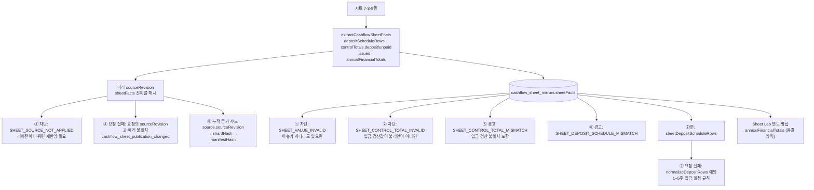

# 월결산과 시트 5~9행(입금 예정 영역) 영향 범위 조사

**날짜:** 2026-09-30
**상태:** 조사 완료 · 수정 전 (코드 변경 없음)
**관련:** [백엔드 경계 리팩토링 계획안](./2026-09-30-backend-boundary-refactoring-plan.md) · [수식 검증 계약 2026-07-28](./contracts/2026-07-28-cashflow-formula-validation-contract.md) · [월결산 스펙 2026-07-13](./cashflow-dashboard-month-close-spec-2026-07-13.md)

## 0. 요약

- 월결산이 시트 5~9행을 **불필요하게** 보는 곳은 한 군데가 아니라 **8개 경로**다. 이 중 결산을 막는 경로가 4개, 요청 자체를 실패시킬 수 있는 경로가 2개다.
- 5~9행은 좌표 계약 밖이 아니다. **7/28 수식 검증 계약 §4.6이 9행 합계(`BS9 = SUM(C9:BR9)`)를 검산 대상으로 정했다.** 이 행을 월결산에서 빼려면 계약 개정이 먼저다.
- 가장 큰 결합은 **시트 미러의 `sourceRevision`이 5~9행 값과 이슈를 포함한 `sheetFacts` 전체를 해시한다**는 점이다. 추출 방식을 바꾸면 해당 프로젝트의 리비전이 바뀌고, 결산 요청·승인 대기·누적 증거 해시와 엮인다.
- 30분 전 작업 트리에 넣었던 수정(차단 사유에서 5~9행 이슈 제외)은 이 중 **1개 경로만** 다뤘다. 되돌렸다.
- **어떤 오류가 실제로 몇 건 났는지는 확인하지 못했다.** 수정 방향은 운영 증거를 먼저 모은 뒤 정한다(§5).

## 1. 5~9행에 무엇이 있나

현재 코드 기준(주차 `E:BL`, 합계 `BS`, 미지급 `BT`)이다. 7/13 스펙은 옛 양식(주차 `D:BK`, 합계 `BO/BP`)이다. [확인]

| 시트 행 | 코드 인덱스 | 내용 | 코드가 읽는 곳 |
|---|---|---|---|
| 5 | 4 | 연도 표기(`C5` 등) | 직접 읽지 않음. 템플릿 헤더는 12·13행 사용 [확인] |
| 6 | 5 | (용도 미확인) | 직접 읽지 않음 [확인] |
| 7 | 6 | 세금계산서 발행일 | `extractCashflowSheetFacts` |
| 8 | 7 | 예정(입금)일 | 같은 함수 |
| 9 | 8 | 예정입금액, `BS9` 입금 합계, `BT9` 미지급 | 같은 함수 (`readWholeWon` 3곳) |

직접 읽는 곳은 `server/bff/cashflow-sheet-snapshot.mjs` 한 파일뿐이다. 문제는 그 결과(`sheetFacts`)가 퍼지는 경로다.

## 2. 데이터 흐름

## 3. 경로별 상세

| # | 경로 | 위치 | 결산에 미치는 영향 | 누적 결산에서 실제 필요한가 |
|---|---|---|---|---|
| ① | 이슈가 있으면 `SHEET_VALUE_INVALID` 차단 | `jvm-weekly-api.mjs` `sheetControlBlockers` | **요청 버튼 비활성, 요청 409** | 아니오. 이슈 출처를 가리지 않음. 8/18 수정(`e74bc552`)은 7·8행 날짜만 이슈에서 뺐고 9행 금액·`BS9`·`BT9`는 그대로 [확인] |
| ② | `controlTotals.deposit.matches`가 불리언이 아니면 `SHEET_CONTROL_TOTAL_INVALID` | 같은 함수 | **차단** | 아니오. JVM 누적 경로는 입금 행을 쓰지 않음(`depositScheduleRows = List.of()`) [확인] |
| ③ | `appliedSourceRevision ≠ sourceRevision`이면 `SHEET_SOURCE_NOT_APPLIED` | 같은 파일 3530행 부근 | **차단** | 리비전 자체는 필요. 다만 5~9행만 바뀌어도 리비전이 바뀐다 |
| ④ | 요청 준비 전후 공개 상태 지문 비교, 미러 리비전과 요청 리비전 비교 | `prepareCashflowMonthClose`, 3768행 부근 | **요청 실패** | 리비전 자체는 필요. 5~9행 변경도 여기에 걸린다 |
| ⑤ | 입금 검산 불일치를 `SHEET_CONTROL_TOTAL_MISMATCH` 경고에 포함 | `sheetControlWarnings` | 경고 (스펙상 "사람 확인 전 결산 불가" 문구와의 관계 확인 필요) | 아니오 |
| ⑥ | 시트 입금 일정과 요청 입금 일정 비교 경고 | 3791행 부근 | 경고. 누적 경로에서 소음일 가능성 [추정] | 아니오 |
| ⑦ | 화면이 시트 입금 행으로 요청 입력을 만들고, 주차 규칙 위반이면 예외 | `CashflowProjectSheet.tsx` 1493·1851행, `cashflow-month-close.ts` `normalizeDepositRows` | **요청을 보내기 전에 화면에서 실패** 가능 [추정: 누적 요청이 이 함수를 타는지 확인 필요] | 아니오 |
| ⑧ | 누적 증거 샤드의 `source.sourceRevision`이 샤드 해시와 매니페스트 해시에 들어감 | `stageCumulativeMonthCloseRequest`, JVM 6405행 부근 | 직접 차단은 아님. 리비전이 바뀌면 **승인 대기 중인 요청**의 근거와 현재 미러가 달라짐 | 리비전 자체는 필요 |

**JVM 쪽** [확인]
- 누적 경로(`cumulativeV2`)는 입금 행을 쓰지 않는다. 스냅샷에도 넣지 않는다.
- 비누적(월 단위) 경로는 1~5주 입금 행이 **모두** 있고 규칙을 지켜야 통과한다(`requireCompleteDepositSchedule`). 스냅샷에 `sheetFacts` 전체와 입금 행을 넣고, `draftInputHash`에도 입금 행이 들어간다. 이 경로가 아직 호출되는지는 [미확인]이다. 레거시 경로 조사(계획서 §4.2 D4)와 같은 방법으로 확인해야 한다.
- JVM의 `depositTotal` 검산(`CashflowFormulaValidator`)은 **Projection/Actual 블록의 입금 합계 행**이다. 9행 입금 예정 합계와는 다른 값이다. [확인: 이름이 같아 혼동 주의]

**표시 쪽** [확인]
- 화면은 `sheetDepositScheduleRows`, `sheetControlTotals.deposit/unpaid`를 그대로 보여 준다.
- `annualFinancialTotals.contractAmount`가 9행 예정입금액 합계로 만들어지고 Sheet Lab 연도 병합에서 쓰인다. Sheet Lab은 동결 영역이며 짝 테스트가 있다.

## 4. 바꾸기 어려운 이유

| 제약 | 내용 |
|---|---|
| 계약 | 7/28 계약 §4.6이 9행 합계 검산을, 날짜 행은 날짜 검증을 정했다. 월결산에서 빼려면 **계약 개정 문서**가 먼저다 |
| 리비전 결합 | `sourceRevision = hash(… , sheetFacts)`. 추출 결과가 바뀌는 프로젝트는 다음 불러오기 때 리비전이 바뀌고 ③④⑧에 걸린다. 승인 대기 중인 요청이 있는 프로젝트는 요청을 다시 해야 할 수 있다 |
| 양쪽 검증 | 같은 입금 행을 BFF(①②⑤⑥), 화면(⑦), JVM 비누적 경로가 각자 검증한다. 한 곳만 풀면 다른 곳에서 막힌다 |
| 동결 영역 | Sheet Lab이 `depositScheduleRows`, `annualFinancialTotals`를 병합한다. 출력 모양을 바꾸면 짝 테스트와 함께 바꿔야 한다 |
| 표시 요구 | 7/13 스펙은 세금계산서일·입금예정일·예정액을 **화면에 보여 주라**고 정했다. 읽기를 없애면 표시가 사라진다 |
| 기존 데이터 | 저장된 미러, 비누적 마감 스냅샷에 입금 행과 이슈가 들어 있다. 해시로 고정된 것은 바꾸지 않는다 |

## 5. 계획

### 5.1 원칙

- **"읽어서 보여 준다"와 "결산 판정에 쓴다"를 분리한다.** 5~9행은 표시용으로 남기고, 결산 판정 경로(①②⑤⑥⑦)에서만 뺀다.
- 리비전·해시 결합(③④⑧)은 **바꾸지 않는 쪽**을 기본으로 한다. 바꿔야 한다면 영향 프로젝트 목록과 공지를 먼저 만든다.
- 한 번에 한 경로를 바꾸고, 각 단계에서 운영 증거로 효과를 잰다.

### 5.2 단계

| 단계 | 내용 | 산출물 | 되돌리기 |
|---|---|---|---|
| **A. 증거 수집** (읽기 전용) | ① 운영 미러 중 이슈 `sourceCell`이 7~9행인 프로젝트 수 ② `controlTotals.deposit.matches`가 불리언이 아닌 수 ③ `client_error_events`와 BFF 로그에서 `SHEET_VALUE_INVALID`, `SHEET_CONTROL_TOTAL_INVALID`, `cashflow_month_close_validation_failed`, 화면 예외 문구("입금 일정은 1~5주차…") 건수 ④ 승인 대기 중인 누적 요청 수 ⑤ 비누적 JVM 경로 호출 여부 | 프로젝트별 표. **사용자가 겪은 오류가 ①~⑧ 중 무엇인지 확정** | 해당 없음 |
| **B. 계약 개정** | 7/28 계약 §4.6에 "9행 입금 예정 합계와 7·8행 날짜는 **표시용 검산**이며 월결산 차단 사유가 아니다"를 추가. 7/13 스펙의 "BO 불일치 시 결산 불가" 문구와 정리 | 계약 문서 PR, 리뷰 | 문서 되돌림 |
| **C. 판정 경로 분리** (BFF) | `sheetFacts`에 이슈 **분류**를 추가(결산용/표시용)하는 대신, 판정 함수가 **행 범위 목록**을 정책에서 읽어 거른다. ①② 제외, ⑤ 입금 검산을 표시 경고로 분리, ⑥ 누적 경로에서 비교 생략 | 코드 + 테스트: 7~9행 이슈만 있을 때 통과 / 좌표 블록 이슈는 차단 / 두 종류가 섞이면 블록 쪽만 `details`에 | 기능 플래그 |
| **D. 화면 요청 입력** | 누적 요청이 `normalizeDepositRows`를 타는지 확인 후, 타면 누적 요청에서 입금 행 구성을 생략(JVM이 쓰지 않음) | 코드 + 화면 테스트 | 플래그 |
| **E. 리비전 영향 판단** | C는 `sheetFacts` 모양을 바꾸지 않으므로 리비전이 바뀌지 않는 것이 목표. 추출 단계(이슈 생성 자체)를 바꾸는 안은 **A 결과로 영향 프로젝트 목록을 만든 뒤에만** 검토 | 영향 목록, 공지안 | – |
| **F. JVM 비누적 경로** | A-⑤에서 호출이 0이면 레거시 정리(계획서 P2A-1)와 함께 제거. 아니면 유지 | 계획서 연동 | – |

**동결 영역:** Sheet Lab(`cashflow-sheet-lab.mjs`)과 짝 테스트, 좌표 계약 파일은 이 계획에서 건드리지 않는다. C·D는 판정 경로만 바꾼다.

### 5.3 검증

| 시나리오 | 기대 결과 |
|---|---|
| 9행 예정입금액에 문자가 있음 | 월결산 요청 가능, 화면에 입금 예정 영역 확인 안내(표시) |
| `BS9` 비어 있음 / 수식 오류 | 요청 가능, 표시 경고 |
| 7·8행 날짜가 주차 라벨 | 요청 가능 (8/18 동작 유지) |
| 15행(Projection 블록)에 문자가 있음 | **여전히 차단**, `details`에 해당 셀만 |
| 7~9행과 블록 안 이슈가 함께 있음 | 차단, `details`에 블록 이슈만 |
| 승인 대기 중인 누적 요청이 있는 프로젝트 | 배포 후에도 승인 가능 (리비전 불변 확인) |
| 기존 마감의 스냅샷 해시 | 검증 통과 (저장 데이터 불변) |
| Sheet Lab 불러오기와 연도 병합 | 짝 테스트 통과, 출력 동일 |
| 화면에서 누적 요청 생성 | 입금 행 때문에 화면 예외가 나지 않음 |
| 비누적 경로(호출된다면) | 기존과 동일 |

기존 테스트는 `jvm-weekly-api.test.mjs`(31곳), `cashflow-sheet-snapshot.test.mjs`(13), `cashflow-month-close.test.ts`(7), JVM `FirestoreCashflowLeaseGuardTest`(16), `WeeklyExpenseControllerTest`(5), `e2e-month-close.local.test.ts`(4, 로컬 전용), `cashflow-sheet-lab.test.mjs`(1)가 입금 행을 참조한다. C·D 변경 시 전부 돌린다.

## 6. 결정이 필요한 것

1. **실제로 겪은 오류가 무엇인지.** 화면 문구나 오류 코드를 알려 주시면 A 단계 범위를 좁힐 수 있다.
2. 9행 입금 예정 검산을 월결산 차단 사유에서 빼는 계약 개정(B)에 동의하는지.
3. 입금 예정 영역의 문제를 사용자에게 **어떤 문구로** 보여 줄지(표시 경고만, 또는 안내 없음).

## 7. 확인하지 못한 것

- 운영 데이터 전부(§5.2 A).
- 시트 6행의 용도.
- 누적 요청이 화면의 `normalizeDepositRows`를 거치는지(⑦).
- JVM 비누적 경로의 현재 호출 여부.
- ⑤ 경고가 화면에서 결산을 실제로 막는지(스펙 문구는 막는다고 적혀 있음).
