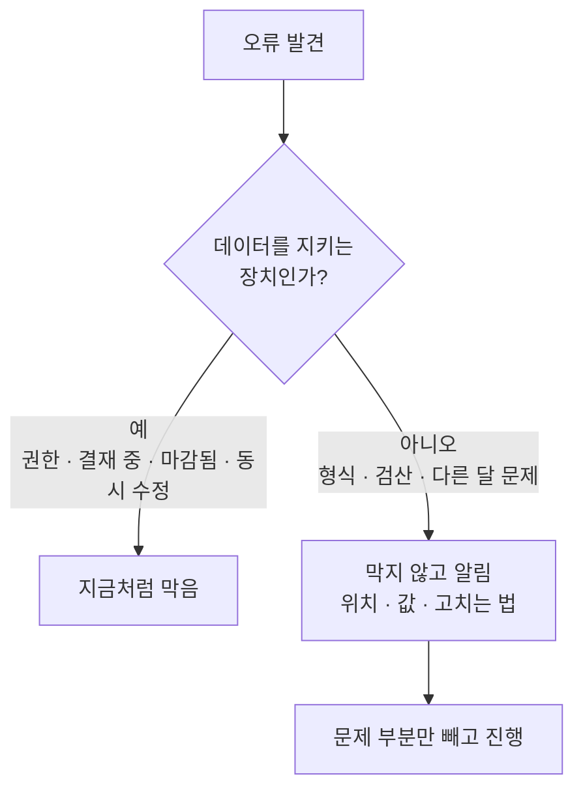
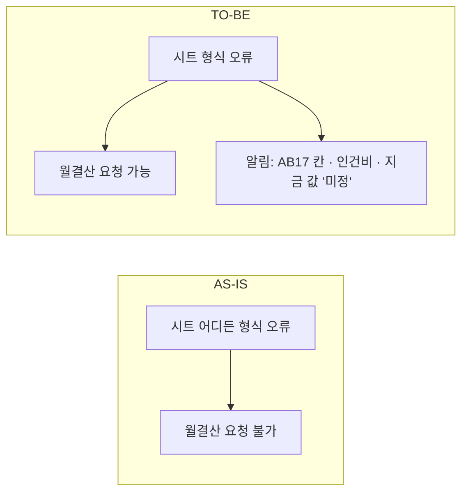
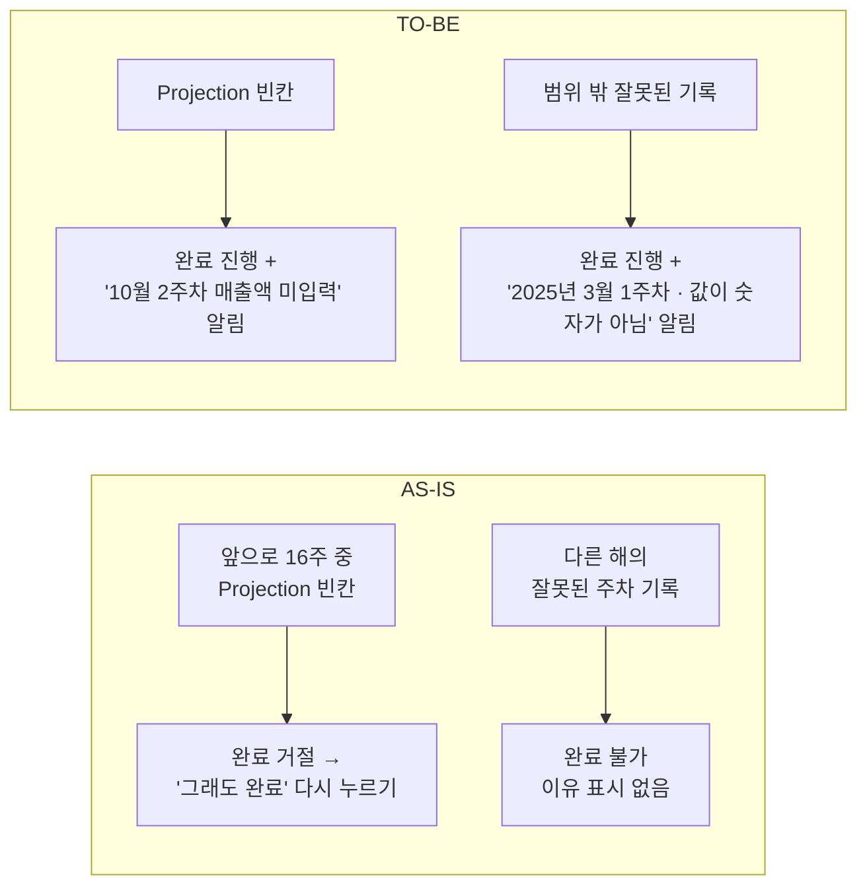
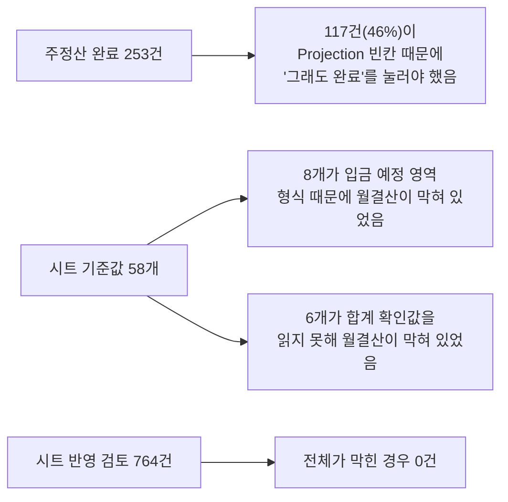
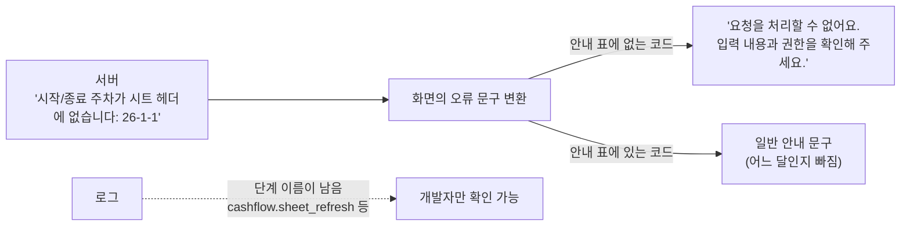
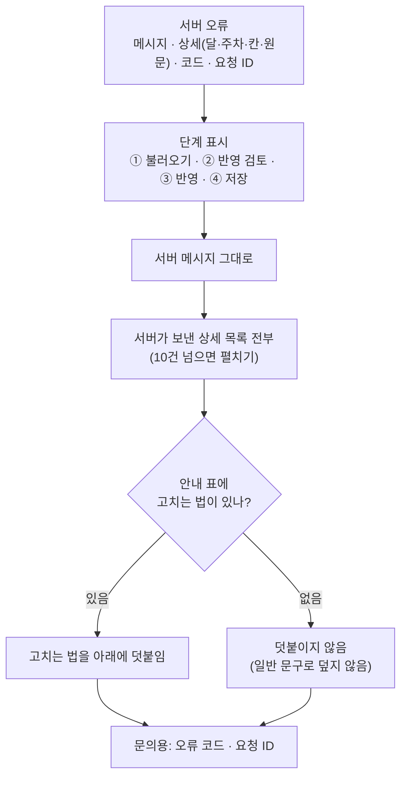
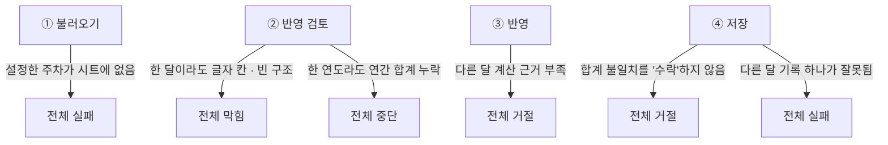
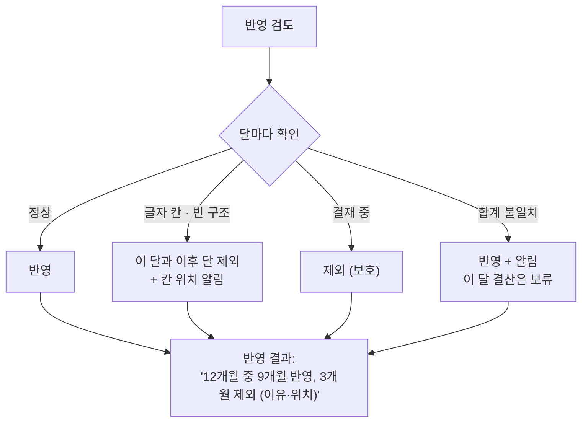
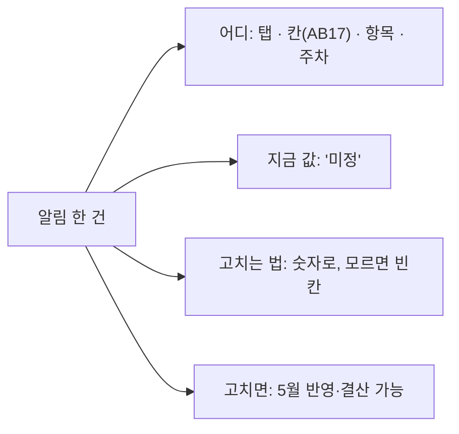

# 정산 "멈춤 → 알림" 전환 계획

**2026-09-30 · 공유용**

## 한 줄 요약

> 시트에 작은 오류 하나만 있어도 **주정산·월결산·시트 반영 전체가 멈추던 것**을, **문제 있는 부분만 빼고 진행하면서 어디를 고칠지 알려 주는** 방식으로 바꿉니다.

---

## 무엇이 문제였나

- 12월 칸 하나의 오류가 3월 결산까지 막았습니다.
- 화면에는 "진행할 수 없어요"만 나오고, **어느 칸을 고쳐야 하는지** 알기 어려웠습니다.

---

## 바꾸는 원칙

| 계속 막는 것 | 알림으로 바꾸는 것 |
|---|---|
| 권한이 없는 사람의 처리 | 금액 칸의 글자·기호 |
| 결재 중인 회차 변경 | 합계·잔액 검산 불일치 |
| 마감된 달 변경 | 지금 처리하는 범위 밖의 오류 |
| 두 사람이 동시에 고친 경우 | Projection 미입력 |
| 시트 양식 자체가 다른 경우 (그 시트만 건너뜀) | 입금 예정 영역 형식 |

**값은 만들어 내지 않습니다.** 읽을 수 없는 칸은 0으로 바꾸거나 추측하지 않고, 그 부분을 빼고 진행합니다.

---

## 1. 월결산 — 완료

| | AS-IS | TO-BE |
|---|---|---|
| 시트 형식·검산 오류 | 월결산 요청 버튼이 막힘 | 요청 가능, 확인할 칸을 알림 |
| 기록 | – | 알림 내용이 결산 기록에 함께 남음 |
| 여전히 막는 것 | – | 결산 대상 달의 값이 비어 있으면 **그 달만** 마감 보류 |

---

## 2. 주정산 — 완료

| | AS-IS | TO-BE |
|---|---|---|
| Projection 미입력 | 거절 후 "그래도 완료"로 다시 요청 | 바로 완료, 빈칸 목록을 알림 |
| 이번 주와 상관없는 기록 오류 | 이유 없이 완료 불가 | 완료 가능, 어떤 기록이 문제인지 알림 |
| 이번 주 범위(16주) 안의 기록 오류 | 완료 불가 | 그대로 막음 |

---

## 운영 데이터 확인 결과 (2026-09-30, 조회만)

| 확인한 것 | 결과 | 의미 |
|---|---|---|
| 주정산 완료 | 253건 중 117건이 Projection 빈칸을 "그래도 완료"로 넘김 | 주정산 변경의 효과가 가장 큼 |
| 월결산 시트 이슈 | 58개 중 8개, 전부 입금 예정 영역(7~9행) | 월결산 변경으로 해소 |
| 월 합계 확인값 읽기 불가 | 6개 프로젝트 | 월결산 변경으로 차단 → 알림 |
| 시트 반영 전체 막힘 | 764건 중 0건, 글자가 든 금액 칸 0건 | 시트 반영 격리는 **예방** 성격 |
| 결재 대기 중인 월결산 | 11건 | 배포 후에도 그대로 승인되는지 확인 대상 |

---

## 3. 오류 메시지 — 어느 단계에서, 무엇 때문에 멈췄는지 보이게

지금도 전체가 멈추는 경우가 남아 있습니다(양식 자체가 다른 시트, 권한, 동시 수정 등). 이때 **어느 단계에서 왜 멈췄는지**가 화면에 나와야 합니다. 지금은 그렇지 않습니다.

### AS-IS: 단계도, 구체적인 내용도 사라짐

- 시트 반영 오류 코드 **59개 중 43개가 안내 표에 없어** 일반 문구로 나갑니다.
- 안내 표에 있는 코드도 서버가 보낸 달·주차 같은 구체값이 빠집니다.
- 화면이 넘겨 주는 단계 문구("시트 값을 반영하지 못했습니다" 등)도 쓰이지 않습니다.
- **예외:** 시트 양식이 다를 때의 칸 위치 목록은 두 화면 모두 제대로 보여 줍니다.

| 단계 | 서버가 보내는 내용 | 지금 화면 |
|---|---|---|
| ① 불러오기 | "시작/종료 주차가 시트 헤더에 없습니다: 26-1-1" | "요청을 처리할 수 없어요…" |
| ② 반영 검토 | 막힌 달 목록 | "확인할 월: 2026-05, 2026-12" (이유·칸 없음) |
| ② 반영 검토 | "2026-05 시트 값이 월 전체 구조를 충족하지 않습니다" | "해당 월의 주차 값이 모두 채워지지 않았어요" (달 빠짐) |
| ③ 반영 | "2026-05 계산 근거를 확인할 수 없습니다" | "합계·잔액 확인 정보를 찾을 수 없어요" (달 빠짐) |

### TO-BE: 서버가 보낸 내용을 최대한 그대로 전달

**원칙: 서버 메시지가 주인공이고, 안내 문구는 보조입니다.** 화면이 서버 내용을 다른 문장으로 바꾸거나 줄이지 않습니다.

**화면 예시**

> **[② 반영 검토] 반영하지 못했어요**
> 2026-05 시트 값이 월 전체 구조를 충족하지 않습니다. 월 1주차부터 다시 연동해 주세요.  ← 서버 메시지 그대로
> - 2026-05 3주차 · Projection 인건비 · 지금 값 "미정"  ← 서버 상세 그대로
> - 2026-05 4주차 · Actual 매출액 · 비어 있음
>
> 고치는 법: 5월 1~5주차 값을 확인한 뒤 시트를 다시 불러와 주세요.  ← 안내 표(보조)
> <small>문의용: cashflow_sheet_month_incomplete · 요청 ID a1b2c3</small>

**표시 규칙**

| 순서 | 무엇을 | 규칙 |
|---|---|---|
| 1 | 단계 | 어느 버튼·요청에서 난 오류인지 화면이 알고 있으므로 항상 붙인다 |
| 2 | 서버 메시지 | **그대로** 보여 준다. 안내 표 문구로 바꾸지 않는다 |
| 3 | 서버 상세 | 서버가 보낸 목록(막힌 달, 칸 위치, 원문 값, 진단 목록, 누락 칸 등)을 **빠짐없이** 보여 준다. 길면 앞 10건 + 펼치기 |
| 4 | 고치는 법 | 안내 표에 있는 경우만 **덧붙인다**. 없으면 생략하고, 일반 문구("요청을 처리할 수 없어요")로 덮지 않는다 |
| 5 | 문의 정보 | 오류 코드와 요청 ID를 작게 |

**예외 (그대로 보여 주지 않는 경우)**

| 경우 | 처리 | 이유 |
|---|---|---|
| 서버 메시지가 비어 있음 | 단계 + 안내 표 문구, 없으면 "[③ 반영] 반영하지 못했어요" | 보여 줄 내용이 없음 |
| 서버 내부 오류(5xx) 중 내부 사정이 담긴 메시지 | 서버가 이미 안정된 코드로 바꿔서 보냄. 그 메시지를 그대로 표시 | 서버 쪽 정리 규칙을 유지 (화면에서 추가로 가리지 않음) |
| 영어로 된 정산 엔진 메시지, 내부 용어(JVM·Firestore 등)가 담긴 메시지 (예: "Cashflow month contains malformed…") | **가리고** 안내 표 문구를 보여 줌. 오류 코드·요청 ID는 표시 | 정산 엔진 내부 메시지를 노출하지 않는 기존 보안 규칙(테스트로 고정됨)을 유지. 원문은 요청 ID로 로그에서 대조 |

| 항목 | AS-IS | TO-BE |
|---|---|---|
| 어느 단계인지 | 안 보임 | 항상 표시 |
| 무엇 때문인지 | 일반 문구로 덮임 | **서버 메시지 그대로** |
| 어느 달·주차·칸인지 | 대부분 빠짐 | **서버 상세 전부** |
| 고치는 법 | 일부 코드만, 서버 내용 대신 | 있으면 **덧붙임** |
| 문의할 때 | 정보 없음 | 오류 코드 · 요청 ID |

- 화면의 오류 문구 함수만 고칩니다. **서버·데이터·정산 규칙은 바뀌지 않습니다.**
- **"그대로 보여 주는" 기준:** 중간 서버가 사람에게 보여 주려고 쓴 한국어 문구이고, 5xx가 아니고, 내부 용어가 없을 때.
- 프로젝트 화면에서 **시트 불러오기가 실패해도 아무 메시지가 없던 문제**도 함께 고칩니다.
- 이 원칙은 시트 반영뿐 아니라 **주정산·월결산 화면의 오류 표시에도 같이** 적용합니다. 같은 공통 함수를 쓰기 때문입니다.
- 서버가 상세를 안 보내는 오류(예: 반영 검토에서 막힌 달의 **이유**)는 서버가 이유를 함께 보내도록 작게 확장합니다.
- 차단 규칙을 바꾸기 전에도 할 수 있어서 **시트 반영 작업의 첫 단계**로 둡니다.

---

## 4. 시트 반영 — 다음 단계

시트 반영은 네 단계로 이뤄집니다.

### AS-IS: 어디서든 하나 걸리면 전체가 멈춤

### TO-BE: 문제 있는 달만 빼고 반영

| 상황 | AS-IS | TO-BE |
|---|---|---|
| 12월 칸에 "미정" | 1~12월 전부 반영 안 됨 | 1~11월 반영, 12월 제외 + 위치 알림 |
| 한 연도의 연간 합계 누락 | 주차 반영까지 전부 중단 | 주차는 반영, 그 연도 연간값만 건너뜀 |
| 합계가 항목 합과 다름 | "불일치 수락"을 눌러야 반영 | 반영 + 알림, 그 달 결산만 보류 |
| 다른 달 기록 하나가 잘못됨 | 반영 전체 실패 | 반영 진행, 잘못된 기록 알림 |
| 설정 주차가 시트에 없음 | 불러오기 실패 | 알림 후 진행 방식 검토 |
| 시트 양식 자체가 다름 | 불러오기 실패 | **그대로** 그 시트만 건너뜀. 다른 처리는 영향 없음 |
| 결재 중인 달의 변경 | 막음 | **그대로** 막음 |

**왜 "이후 달"도 빼나요?** 각 달은 앞 달의 잔액을 이어받습니다. 중간 한 달이 빠지면 그다음 달의 시작 잔액을 믿을 수 없어서, 문제 달부터 뒤는 함께 보류합니다. 정확한 규칙은 착수 전에 정산 엔진으로 확인합니다.

---

## 5. 알림은 이렇게 보입니다

- 같은 오류에는 항상 같은 문구가 나옵니다. (AI를 쓰지 않고 규칙으로 만듭니다)
- 10건이 넘으면 "외 N건"으로 줄입니다.

---

## 6. 일정과 순서

| 순서 | 내용 | 영향 |
|---|---|---|
| 오류 메시지 | 단계 표시 + **서버 메시지·상세를 그대로** 전달, 고치는 법은 덧붙임, 문의용 코드 표시 (주정산·월결산 화면 포함) | 작음. 화면 문구만 바뀜 |
| 운영 데이터 확인 | 실제로 어느 지점에서 많이 멈췄는지 집계 (조회만, 변경 없음) | 없음 |
| 시트 반영 ① | 다른 달 기록 문제로 반영이 실패하던 것 해소 | 작음 |
| 시트 반영 ② | 문제 달만 빼고 반영 | 중간. 반영 결과 화면이 바뀜 |
| 시트 반영 ③ | 합계 불일치를 수락 없이 알림, 그 달 결산 보류 | 중간 |
| 알림 문구 | 오류 종류별 안내 문구를 한 곳에서 관리 | 작음 |

각 단계는 따로 배포하고, 문제가 생기면 그 단계만 되돌립니다.

---

## 7. 바뀌지 않는 것

- 권한, 결재 중 회차, 마감된 달, 동시 수정 보호
- 시트 양식 규칙 (양식이 다르면 그 시트는 반영하지 않음)
- 저장된 결산 기록과 그 검증
- 시트에 값을 대신 써 넣지 않음 (고치는 것은 담당자가 시트에서)

## 8. 확인이 필요한 것

- 실제로 어느 지점에서 가장 많이 멈췄는지 (운영 데이터 확인 대기)
- 오류 문구 변환 함수를 쓰는 다른 화면(주정산·월결산 등)에도 단계 표시를 넓힐지
- 한 달을 뺐을 때 다음 달 잔액 규칙
- 시트 양식이 달라 불러오기가 실패해도 주정산·월결산이 기존 값으로 계속되는지

---

개발자 참고 — 코드 위치

| 그림의 항목 | ID | 위치 |
|---|---|---|
| 한 달이라도 글자 칸·빈 구조 → 전체 막힘 | S-1 | `server/bff/routes/cashflow-sheet-lab.mjs` `stagePinnedCashflowSheetLab`(status `BLOCKED`), `buildPinnedSheetChangeCandidates`(blockedMonths). 반영 거절 `cashflow_sheet_stage_run_blocked` |
| 반영 기간 중 빈 구조 → 예외 | S-2 | 같은 함수 `cashflow_sheet_month_incomplete` |
| 한 연도 연간 합계 누락 | S-3 | `buildPinnedAnnualChangeCandidates` `cashflow_sheet_annual_incomplete` |
| 다른 달 계산 근거 부족 | S-4 | `cashflowFormulaPreflightInput` `cashflow_sheet_formula_evidence_incomplete` |
| 합계 불일치 수락 요구 | S-5 | JVM `WeeklyExpenseCommandService.requireFormulaMismatchConfirmation`, BFF `acceptFormulaMismatches` |
| 다른 달 기록 하나 → 저장 실패 | S-6 | JVM `FirestoreInheritedWeeklyExpensePersistence.replaceCashflowSheetMonthsInternal`의 `resultingWeeks` 전체 검사 |
| 설정 주차가 시트에 없음 | S-7 | `assertConfiguredWeekRangeExistsInTemplate` `cashflow_week_range_not_in_sheet` |
| 오류 메시지가 단계·구체 내용을 잃음 | E-1 | `src/app/platform/api-error-message.ts` `resolveApiErrorMessage`(`cashflow_` 코드는 안내 표 문구만 반환), `src/app/features/cashflow-sheet-compare/CashflowSheetLabPage.tsx` `formatError`, `src/app/components/cashflow/CashflowProjectSheet.tsx` `sheetOperationErrorMessage`. 안내 표 `src/app/platform/api-error-messages.ts`에 Sheet Lab 코드 59개 중 43개 없음. 반영 검토 차단 표시는 두 화면의 `status === 'BLOCKED'` 분기 |
| 양식 불일치 (유지) | K-1~3 | `cashflow_sheet_template_unsupported`, `cashflow_sheet_tab_unsupported`, `cashflow_sheet_source_year_mismatch` |

- 월결산 커밋 `79f4d38e`, 주정산 커밋 `93fb1d94`.
- Sheet Lab 변경은 `cashflow-sheet-lab.test.mjs` 짝 테스트와 같은 커밋에 넣는다.
- 상세 근거: [검사 범위 격리 계획](./2026-09-30-settlement-validation-scope-plan.md)

