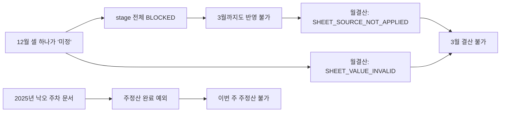
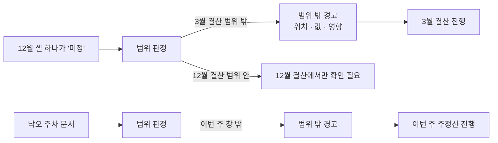

# 주정산·월결산 검사 범위 격리 계획

**날짜:** 2026-09-30
**상태:** 계획 · 결정 반영(2026-09-30) · 구현 전 (코드 변경 없음)
**핵심:** 오류가 있어도 주정산·월결산 **전체 루프가 통으로 멈추지 않게** 하고, **다른 경로에 영향을 주지 않으면서**, **지금 살펴보는 범위만** 검사한다.
**관련:** [시트 오류 확인 흐름 설계](./2026-09-30-sheet-issue-confirm-flow-design.md) · [5~9행 영향 조사](./2026-09-30-month-close-deposit-rows-impact.md) · [백엔드 경계 리팩토링 계획안](./2026-09-30-backend-boundary-refactoring-plan.md)

## 0. 확정된 결정 (2026-09-30)

| # | 결정 | 반영 |
|---|---|---|
| 1 | 월결산 범위 = **누적 기준월 ~ 대상월** | §4.1, 6-2단계 |
| 2 | 시트 전체 합계(`BS` 열) 검산은 **범위를 바꾸지 않는다.** 시트 전체를 그대로 검사하되, **차단하지 않고 경고로** 보낸다 | X2, §4.2, 6-2단계, §7 |
| 3 | 주정산 범위 = **대상 주 + Projection 16주 창** 유지 | §4.1, 6-3단계 |
| 4 | **규칙·형식 불일치로는 차단하지 않는다. 사용자에게 알림(noti)만 준다.** "그래도 반영하시겠습니까" 확인 단계도 두지 않는다 | §0.1 |

### 0.1 알림으로 바꾸는 것과 남기는 것

**알림으로 바꾼다 (처리 계속)**

| 지금 차단하는 것 | 바뀐 뒤 |
|---|---|
| 시트 이슈 `SHEET_VALUE_INVALID` (금액·날짜 형식) | 알림. 위치·원문·고치는 법 |
| `SHEET_CONTROL_TOTAL_INCOMPLETE/INVALID` (`BS` 합계) | 알림 (결정 2) |
| `SHEET_CALCULATION_CHECK_MISSING/VALUE_INVALID` (월 합계·잔액 검산) | 알림 |
| 주차 헤더 형식, 연간 헤더 표기 | 알림 |
| 입금 예정 영역(7~9행) | 알림 |
| 주정산 완료의 전체 주차 문서 형식 검사 (X4) | 알림 |
| 시트 반영의 월 단위 `BLOCKED`, 불완전 월 예외 (X5·X6) | 알림. 문제 없는 달은 반영, 읽을 수 없는 칸은 반영하지 않음 |
| 양식 불일치 | 알림 + 그 시트 반영 건너뜀 (결정 5) |
| 주정산 Projection 16주 누락 | 알림 (결정 7, 확인 단계 제거) |

**남긴다 (규칙이 아니라 데이터 보호 장치)**

| 장치 | 남기는 이유 |
|---|---|
| 권한·프로젝트 범위 | 남의 프로젝트를 처리하면 안 된다 |
| 결재 중인 회차 변경 | 승인자가 보고 있는 증거가 바뀐다 |
| 마감된 월 변경 | 마감 증거가 바뀐다. 재오픈으로 처리 |
| 동시 수정 충돌 (리비전·편집 잠금·멱등) | 두 사람의 처리가 서로를 덮어쓴다 |
| 해시 검증 (마감·누적 증거) | 저장된 증거가 위조·손상됐는지 보는 것이다 |

**값을 만들어 내지는 않는다.** 읽을 수 없는 칸(예: "미정")은 막지 않되 **그 칸은 반영하지 않고** 알림으로 알린다. 0으로 바꾸거나 추정하지 않는다(좌표 계약의 빈칸/0 구분).

**경계 결정 (2026-09-30 확정)**

| # | 경우 | 결정 | 동작 |
|---|---|---|---|
| 5 | 양식 불일치 (행·열 배치가 전사 양식과 다름) | 알림 + 그 시트 반영만 건너뜀 | 좌표를 알 수 없어 반영은 하지 않는다. 다른 프로젝트·다른 처리(주정산, 이미 반영된 값으로 하는 월결산 화면 조회)는 멈추지 않는다. 알림에 어느 행·열이 양식과 다른지 표시 |
| 6 | 월결산 범위 안에 읽을 수 없는 칸이 남음 | **(b) 그 달 마감만 보류 + 알림** | 요청 전체나 다른 달 처리를 멈추지 않는다. 보류된 달은 "이 칸을 고치면 마감 가능"과 셀 위치를 알림으로 보인다. 빈 칸이 마감 증거에 고정되지 않는다 |
| 7 | 주정산 Projection 16주 누락 | **알림만** (확인 단계 제거) | 주정산 완료는 진행한다. 누락 칸 목록과 증거 해시는 지금처럼 계산해 **완료 기록에 남긴다**(감사 근거 유지). 화면은 확인 버튼 대신 알림을 보인다 |

**7번의 영향 (구현 시 확인):**
- JVM은 지금 누락이 있고 `ignoreProjectionValidation`이 없으면 `409 cashflow_projection_window_incomplete`를 낸다. 이 거절을 없애고, 누락 증거(`missingCells`, `evidenceHash`)를 완료 기록과 응답에 항상 남긴다.
- `ignoreProjectionValidation`, `projectionValidationEvidenceHash`는 멱등 요청 해시에 들어간다(`WeeklyExpenseCommandService` 1803행 부근). 옛 화면이 보내는 값과 호환되도록 **받기는 계속 받고 판정에는 쓰지 않는** 호환 창을 둔다.
- 완료 기록의 `projectionValidationOverride` 의미가 "사용자가 넘김"에서 "누락 있음"으로 바뀐다. 기록을 읽는 화면·리포트를 함께 확인한다.

## 1. 한 줄 요약

주정산은 **그 주(와 Projection 16주 창)**, 월결산은 **기준월부터 대상월까지의 누적 범위**만 본다. 그 밖의 월·연간 열·입금 예정 영역·다른 주차 문서의 오류는 **이 처리를 막지 않고**, 범위 밖 경고로 따로 보여 준다.

## 2. 지금 범위 밖을 보는 검사 (코드 확인)

| # | 처리 | 검사 | 실제로 보는 범위 | 봐야 할 범위 | 결과 |
|---|---|---|---|---|---|
| X1 | 월결산 | `SHEET_VALUE_INVALID` (`sheetControlBlockers`) | **시트 전체 이슈** (60주 전체, 연간 열, 입금 예정 7~9행) | 누적 범위의 월 | 12월 셀 하나가 3월 결산을 막는다 |
| X2 | 월결산 | `SHEET_CONTROL_TOTAL_INCOMPLETE/INVALID` | **시트 전체 합계 열 `BS`** (Projection/Actual 19행씩, 입금 `BS9`) | 누적 범위의 월 | 전체 기간 합계가 비면 어느 달도 결산 불가 |
| X3 | 월결산 | `SHEET_SOURCE_NOT_APPLIED` | 미러 전체가 반영됐는지 | 누적 범위의 월이 반영됐는지 | 아래 X5 때문에 반영이 막히면 결산도 막힌다 |
| X4 | 주정산 완료 | `requireCanonicalCashflowMonthDocument` 루프 (JVM 3826행 부근) | **프로젝트의 모든 주차 문서** | 대상 주 (+16주 창) | 다른 연도의 낙오 문서 하나가 주정산을 막는다. `scripts/audit-cashflow-stray-weekly-docs.mjs`가 이런 문서가 실제로 있을 수 있음을 전제한다 |
| X5 | 시트 반영(stage) | `blockedMonths.length > 0` → run 전체 `BLOCKED` (`cashflow-sheet-lab.mjs` 3942행) | **모든 월** | 반영하려는 월 | 한 달의 `INVALID` 셀이 모든 달의 반영을 막는다 → X3로 결산까지 연쇄 |
| X6 | 시트 반영(stage) | 반영 기간 내 불완전 월 → 예외 (`cashflow_sheet_month_incomplete`) | 반영 기간 전체 | 반영하려는 월 | 예외로 전체 중단 |
| X7 | 시트 반영(JVM) | `replaceCashflowSheetMonthsInternal`의 결과 주차 전체 검사 (5449행 부근) | 결과 주차 전체 [확인 필요: 프로젝트 전체인지 대상 월만인지] | 대상 월 | X4와 같은 유형일 가능성 |

**이미 범위만 보는 검사 (유지할 모델)** [확인]

| 처리 | 검사 | 범위 |
|---|---|---|
| 월결산 | `monthSheetCalculationBlockers/Warnings` | 해당 월 10개 검산 (`yearMonth` 필터) |
| 월결산 | `SHEET_MONTH_INCOMPLETE` | 해당 월 160셀 |
| 주정산 완료 | Projection 누락 검사 | 대상 주부터 16주, **확인 후 진행 장치 있음** (`ignoreProjectionValidation` + 증거 해시, JVM 재계산 대조) |

주정산의 Projection 16주 검사가 이번 작업의 모델이다. 범위가 명시돼 있고, 결과를 증거 해시로 보여 주고, 사용자가 확인하면 진행하고, JVM이 다시 계산해 대조한다.

## 3. 연쇄 구조

## 4. 목표 동작

### 4.1 범위 정의 (단일 함수)

범위는 한 곳에서 정의한다. BFF와 JVM이 같은 규칙을 써야 한다.

| 처리 | 범위 |
|---|---|
| 주정산 완료 (yearMonth, weekNo) | 대상 주 + Projection 검증 창 16주 (**확정, 현행 유지**) |
| 주정산 회수·확정·재오픈 | 대상 주 |
| 월결산 (누적, 대상월 M) | **누적 기준월 ~ M** (확정). 그 기간의 주별 셀과 월별 검산. 기초 잔액용 연간 열(`C:D`) 포함 여부는 구현 전 JVM 이월 규칙으로 확인 |
| 시트 반영 | 반영 대상 월 (그리고 이월 때문에 영향받는 이후 월) |

이미 있는 `cumulativeCloseMonths`, `buildCumulativeCloseScope`, `consecutiveFinanceWeeks`를 범위 계산에 재사용한다. 새 개념을 만들지 않는다.

### 4.2 범위 밖 오류의 처리

- **막지 않는다.** 범위 밖 오류는 차단 사유(`blockers`)가 아니라 **범위 밖 경고**로 따로 담는다(예: `outOfScopeIssues`).
- **숨기지 않는다.** 위치(A1), 해당 주·월, 현재 값, "이 결산에는 영향 없음, 해당 월을 처리할 때 확인 필요"를 보여 준다.
- **예외: 시트 전체 합계(`BS` 열) 검산.** 범위를 바꾸지 않고 시트 전체를 검사한다. 대신 `SHEET_CONTROL_TOTAL_INCOMPLETE/INVALID`를 **차단 사유에서 경고로** 옮긴다. 불일치(`SHEET_CONTROL_TOTAL_MISMATCH`)는 이미 경고다.
- **범위 안 오류는 지금처럼 막는다.** 판정 기준을 느슨하게 하는 것이 아니라 **판정 대상을 좁히는 것**이다.
- 범위 안 오류 중 "확인 후 진행"이 허용되는 것은 주정산 16주 창 방식(증거 해시 + JVM 재계산)을 따른다. 어떤 것을 허용할지는 [확인 흐름 설계](./2026-09-30-sheet-issue-confirm-flow-design.md) §3.2의 분류를 따른다.

## 5. 다른 경로에 영향을 주지 않기 위한 제약

| 영향 가능 경로 | 지키는 방법 |
|---|---|
| **미러 `sourceRevision`** (`sheetFacts` 전체를 해시) | `sheetFacts`의 저장 모양을 **바꾸지 않는다.** 범위 판정은 읽을 때 계산한다. 그래서 기존 리비전, 승인 대기 요청, 누적 증거 샤드 해시에 영향이 없다 |
| **누적 증거 해시 (shard/manifest)** | 샤드에 들어가는 `cells`, `source`를 바꾸지 않는다. 범위 밖 경고는 증거에 넣지 않고 화면 응답에만 둔다 |
| **기존 마감 스냅샷** | 저장 데이터와 검증 로직 불변 |
| **Sheet Lab 단방향 파이프라인** | X5·X6을 고칠 때는 `cashflow-sheet-lab.test.mjs`를 같은 변경에 넣는다 (CLAUDE.md 제약). 추출·병합 출력은 불변 |
| **좌표 계약** | 양식 불일치는 범위와 무관하게 차단 유지 |
| **결재 중 회차·마감된 월 보호** | 범위 안이면 지금처럼 차단 |
| **JVM 권위** | X4·X7 범위 축소는 JVM에서 한다. BFF는 JVM이 돌려준 범위 밖 경고를 전달만 한다 |
| **화면** | 새 응답 필드(`outOfScopeIssues`)는 추가만 한다. 기존 `blockers` 모양은 유지해서 옛 화면이 깨지지 않게 한다 |
| **낙오 주차 문서 자체** | 지우거나 고치지 않는다. 범위 밖이면 무시하고 경고만. 정리는 감사 스크립트와 별도 절차로 |

## 6. 작업 순서

각 단계는 독립 PR이고 플래그로 되돌릴 수 있다. 앞 단계가 뒤 단계를 기다리지 않도록 순서를 잡았다.

| 단계 | 대상 | 변경 | 검증 |
|---|---|---|---|
| **0. 증거 수집** (읽기 전용) | 운영 | 차단 코드별 건수(`SHEET_VALUE_INVALID`, `SHEET_CONTROL_TOTAL_*`, `SHEET_SOURCE_NOT_APPLIED`, `cashflow_sheet_stage_run_blocked`, `cashflow_sheet_month_incomplete`, 주정산 `malformed` 예외), 그중 **범위 밖 원인인 비율**, 낙오 주차 문서 수(기존 감사 스크립트) | 범위 밖 원인 사례 목록 |
| **1. 범위 함수** | BFF, JVM | 처리별 범위를 계산하는 함수 하나씩, 같은 입력에 같은 결과를 내는 패리티 테스트 | 단위 테스트, 패리티 표 |
| **2. 월결산 X1·X2** | BFF `sheetControlBlockers` | X1: 이슈를 **누적 기준월~대상월**로 걸러 범위 안만 차단, 나머지는 `outOfScopeIssues`로. 입금 예정 7~9행은 범위 밖(참고). X2: `BS` 합계 검사는 **시트 전체 그대로**, 결과를 차단 사유 대신 경고로 | 범위 밖 이슈만 있을 때 결산 가능 / 범위 안 이슈는 차단 / 섞이면 범위 안만 차단 사유에 / 승인 대기 요청 승인 가능 / 리비전 불변 |
| **3. 주정산 X4** | JVM 주정산 완료 | 전체 주차 문서 검사를 대상 주 + 16주 창으로 축소. 범위 밖 문서 이상은 응답 경고로 | 다른 연도 낙오 문서가 있어도 이번 주 완료 가능 / 창 안 문서 이상은 여전히 거절 / 증거 해시 동작 불변 |
| **4. 시트 반영 X5·X6·X7** | Sheet Lab + 짝 테스트, JVM 반영 | run 전체 `BLOCKED`를 월 단위 격리로. 문제 월(과 이월 영향 월)만 제외하고 나머지는 반영 가능. 불완전 월은 예외 대신 제외 목록으로 | 12월 이슈가 있어도 1~11월 반영 / 짝 테스트 함께 변경 / 반영 결과 해시·리드백 검증 불변 |
| **5. X3 재평가** | BFF | 4단계 후 "미러 전체가 반영됐는가"를 "누적 범위의 월이 반영됐는가"로 바꿀 수 있는지 판단 | 리비전 규칙과 충돌 여부 검토 후 결정 |
| **6. 화면** | 프론트 | 범위 밖 경고 표시(위치·값·영향·처리 시점). 기존 차단 안내는 그대로 | 화면 테스트, 로컬 Playwright |

2·3단계는 서로 독립이다. 가장 빨리 효과가 나는 것은 **2단계(월결산)와 3단계(주정산)**이고, 4단계는 동결 영역을 건드려서 가장 신중해야 한다.

## 7. 검증 시나리오

| 시나리오 | 기대 |
|---|---|
| 12월 셀 "미정", 3월 월결산 | 3월 결산 진행, 12월 이슈는 범위 밖 경고 |
| 3월 셀 "미정", 3월 월결산 | 차단 (현행 유지), 셀 위치 표시 |
| 2월 셀 "미정", 3월 누적 월결산 | 차단 (누적 범위 안) |
| 입금 예정 9행 문자, 3월 월결산 | 진행, 참고 경고 |
| 12월 `BS` 합계 비어 있음, 3월 월결산 | 진행, **시트 전체 합계 경고**(위치·항목 표시) |
| `BS` 합계가 주차 합과 다름, 3월 월결산 | 진행, 합계 불일치 경고 (현행과 같은 경고) |
| 2025년 낙오 주차 문서, 2026년 3월 2주 주정산 | 완료 가능, 범위 밖 경고 |
| 16주 창 안 주차 문서가 깨짐 | 거절 (현행 유지) |
| Projection 창 누락, 확인 후 진행 | 현행 동작 그대로 |
| 12월 `INVALID` 셀, 시트 반영 | 1~11월 반영, 12월 제외 안내 |
| 승인 대기 중 누적 요청이 있는 프로젝트, 배포 후 | 승인 가능, 해시 검증 통과 |
| 기존 마감의 스냅샷 해시 | 통과 |
| 이슈 없는 프로젝트 | 모든 응답이 지금과 동일, 리비전 불변 |

회귀 확인 대상: `jvm-weekly-api.test.mjs`, `cashflow-sheet-snapshot.test.mjs`, `cashflow-sheet-lab.test.mjs`(짝), `cashflow-month-close*.test.ts`, JVM 전체(`mvn test`), `bff:test:integration`, `test:settlement:integration`, 로컬 `e2e-month-close.local.test.ts`, Playwright.

## 8. 남은 결정

1. 범위 밖 경고를 어디까지 보여 줄지 (전부 / 요약 + 펼치기).
2. 기초 잔액용 연간 열(`C:D`)의 이슈를 누적 범위 안으로 볼지 (JVM 이월 규칙 확인 후).

## 9. 확인하지 못한 것

- 사용자가 실제로 겪은 멈춤이 X1~X7 중 어디였는지 (0단계).
- X7이 프로젝트 전체 주차를 검사하는지.
- 누적 월결산의 정확한 시작 월과 기초 잔액 규칙.
- 한 달을 반영에서 제외할 때 이후 달 이월 계산이 어떻게 되는지 (4단계 전 JVM 계산 커널 확인).
