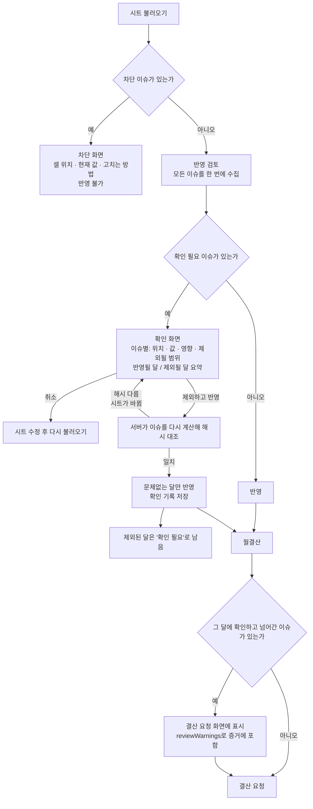
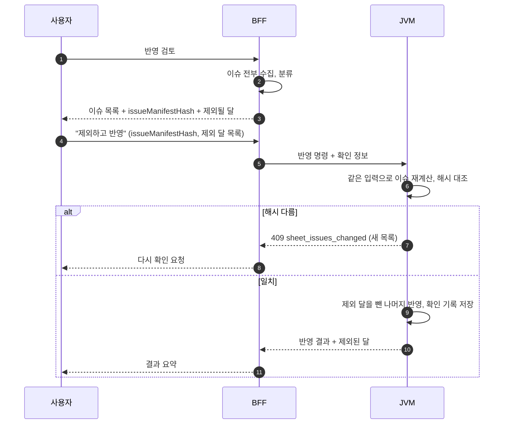

# 시트 오류 처리 설계 — "멈춤"에서 "확인하고 반영"으로

**날짜:** 2026-09-30
**상태:** 설계 제안 · 구현 전
**관련:** [월결산과 시트 5~9행 영향 조사](./2026-09-30-month-close-deposit-rows-impact.md) · [백엔드 경계 리팩토링 계획안](./2026-09-30-backend-boundary-refactoring-plan.md) · [좌표 계약](../../server/bff/cashflow-coordinates.mjs) · [수식 검증 계약 2026-07-28](./contracts/2026-07-28-cashflow-formula-validation-contract.md)

> **변경 (2026-09-30 결정):** 규칙·형식 불일치는 차단하지도, "그래도 반영하시겠습니까" 확인을 받지도 않고 **알림만** 준다. 이 문서의 '확인 필요' 단계와 확인 토큰(§3~§5)은 보류한다. 기준은 [범위 격리 계획 §0.1](./2026-09-30-settlement-validation-scope-plan.md)을 따른다.
>
> **우선순위:** 이번 작업의 핵심은 [주정산·월결산 검사 범위 격리 계획](./2026-09-30-settlement-validation-scope-plan.md)이다. 이 문서의 "확인하고 반영" 흐름은 범위를 좁힌 **뒤에**, 범위 안 오류에만 적용한다.

## 1. 문제

시트에 오류가 하나 있으면 **경고 없이 처리 전체가 멈춘다.** 사용자는 무엇이, 어디서, 왜 문제인지 모른 채 "반영 불가"만 본다.

코드에서 확인한 멈춤 지점이다. [확인]

| # | 단계 | 멈추는 조건 | 멈추는 범위 | 사용자에게 보이는 것 |
|---|---|---|---|---|
| S1 | 시트 불러오기 | 양식이 좌표 계약과 다름 (`CashflowTemplateMismatchError`) | 프로젝트 전체 | "양식이 다릅니다." |
| S2 | 반영 검토(stage) | **어느 한 달**에 `INVALID` 셀이 있거나 월 구조가 불완전 (`blockedMonths`) | **반영 전체** (`status: 'BLOCKED'`) | 반영 버튼 불가, 달 목록 정도 |
| S3 | 반영 검토(stage) | 반영 기간 중 한 달이라도 구조 불완전 | **예외로 중단** (`cashflow_sheet_month_incomplete`) | 오류 한 줄 |
| S4 | 반영 실행(apply) | S2의 결과가 `BLOCKED` | 반영 전체 (`cashflow_sheet_stage_run_blocked`) | "반영 가능한 상태의 시트 검토 run이 아닙니다." |
| S5 | 월결산 | 시트 이슈가 **하나라도** 있음 (`SHEET_VALUE_INVALID`), 입금 검산값 이상 등 | 월결산 요청 | "시트의 날짜 또는 금액 형식을 확인해 주세요." |
| S6 | 결재 중 회차 | 결재 중인 월에 변경분 있음 | 해당 월 또는 전체(`blockAllCandidates`) | 결재 중 안내 |

공통 원인은 두 가지다.
1. **심각도 구분이 없다.** 반영하면 장부가 틀어지는 오류와 표시용 값의 형식 문제가 같은 취급을 받는다.
2. **범위가 번진다.** 셀의 문제가 월로, 월의 문제가 반영 전체로 번진다.

## 2. 원칙

1. **한 번에 다 보여 준다.** 첫 오류에서 멈추지 않고 전부 수집해서 한 화면에 보인다.
2. **심각도를 셋으로 나눈다.** 차단 / 확인 필요 / 참고.
3. **범위를 좁힌다.** 문제는 그 셀, 그 월, 그 연도에만 머문다. 문제없는 달은 반영할 수 있다.
4. **확인은 증거에 묶인다.** "그래도 반영"은 서버가 발급한 이슈 목록의 해시에 묶이고, 시트가 바뀌면 다시 확인해야 한다.
5. **판정은 서버가 한다.** 화면의 확인 버튼은 요청일 뿐이고, JVM이 이슈를 다시 계산해 해시를 대조한다.
6. **값을 만들어 내지 않는다.** "그래도 반영"은 문제 셀의 값을 추정하거나 0으로 바꾸는 것이 아니다. 문제 범위를 **제외하고** 나머지를 반영한다. `EMPTY`와 `ZERO`는 계속 구분한다(좌표 계약).
7. **확인 기록은 감사 증거가 된다.** 누가, 언제, 어떤 이슈를 보고 진행했는지 남고, 월결산 증거(`reviewWarnings`)로 이어진다.

## 3. 심각도 분류

### 3.1 기준

| 심각도 | 의미 | 사용자 선택 | 예 |
|---|---|---|---|
| **차단** | 반영하면 장부나 증거가 틀어진다. 확인으로 넘어갈 수 없다 | 없음. 고치는 방법을 안내 | 양식 불일치, 결재 중 회차 변경, 마감된 월 변경 |
| **확인 필요** | 반영할 수 있지만 결과에 영향이 있다. 사람이 보고 판단한다 | "제외하고 반영" / "취소" | 한 달의 금액 셀이 숫자가 아님, 수식 결과와 시트 합계 불일치 |
| **참고** | 결과에 영향 없음. 알려만 준다 | 없음 (자동 진행) | 입금 예정 영역의 날짜 형식, 표시용 검산값 누락 |

### 3.2 현재 오류의 재분류 (초안, 팀 검토 필요)

| 오류 | 지금 | 제안 | 범위 | 근거 |
|---|---|---|---|---|
| 양식이 좌표 계약과 다름 | 멈춤 | **차단 유지** | 프로젝트 | 좌표 계약 원칙 5 "양식이 다르면 적응하지 않고 거부" |
| 결재 중 회차에 변경분 | 멈춤 | **차단 유지** | 해당 월 (전체 차단은 계약상 필요한 경우만) | 결재 중 증거가 바뀌면 안 된다 |
| 마감된 월에 변경분 | 경고성 목록 | **차단 유지**, 재오픈 안내 | 해당 월 | 마감 증거 불변 |
| 좌표 블록 셀이 `INVALID`(문자, 오류값) | 반영 전체 멈춤 | **확인 필요**: 해당 월 제외 후 나머지 반영 | 월 | 값을 추정하지 않고 월 단위로 제외 |
| 월 구조 불완전 (`validateCompletePinnedMonth` 실패) | 예외로 중단 | **확인 필요**: 해당 월과 **그 이후 월** 제외 | 월 이후 | 이월 잔액이 이어지므로 뒤 달도 영향 [추정: 계산 의존 확인 필요] |
| 수식 결과와 시트 합계 불일치 | 계약상 반영 허용·결산 차단 | 반영은 **확인 필요**, 월결산은 **차단 유지** | 월 | 7/28 계약 §7 |
| 입금 예정 영역(7~9행) 형식·검산 | 월결산 차단 | **참고** (월결산 차단 해제) | 표시 | 누적 결산이 쓰지 않음. 계약 §4.6 개정 필요 |
| 연간 열 헤더 불일치 | 멈춤 [확인 필요] | 검토 후 결정 | 연도 | 좌표 계약 대상이라 차단일 가능성 |

**차단을 줄이는 것이 목표가 아니다.** 목표는 차단이 **정말 차단이어야 할 것만** 남고, 나머지는 **보고 판단할 수 있게** 되는 것이다.

## 4. 사용자 흐름



### 4.1 확인 화면에 보여야 할 것

이슈 하나마다 다음을 보여 준다.

| 항목 | 예 |
|---|---|
| 위치 | `AB17` (2026년 5월 2주차, Projection · 인건비) |
| 현재 값 | `"미정"` |
| 기대 형식 | 원 단위 정수, 또는 빈칸 |
| 영향 | 이 칸이 포함된 **2026년 5월**은 이번에 반영되지 않습니다. 5월 잔액을 이어받는 6월 이후도 제외됩니다 |
| 고치는 방법 | 시트에서 숫자로 바꾸거나 비운 뒤 다시 불러오기 |

화면 상단에는 요약을 둔다: **"12개월 중 9개월 반영, 3개월 제외 (5월 이슈 2건, 이월 영향 6·7월)"**. 버튼 문구는 결과를 말한다: **"5~7월 제외하고 9개월 반영"**.

### 4.2 월결산 쪽

- 반영 때 확인하고 넘어간 이슈가 그 달에 남아 있으면, 결산 요청 화면에 같은 형식으로 다시 보인다.
- 제외된 달은 반영되지 않았으므로 **결산할 수 없다.** 결산 요청 화면은 "이 달은 시트 이슈로 반영되지 않았다"는 이유와 위치를 보여 준다.
- 참고 이슈(입금 예정 영역 등)는 결산을 막지 않고, 결산 화면에 참고로만 보인다.

## 5. 서버 설계

### 5.1 이슈 모델

지금은 이슈가 `code`, `field`, `sourceCell` 정도이고 심각도와 범위가 없다. 다음 필드를 추가한다.

```text
SheetIssue {
  id           // 결정적 식별자: hash(code, sourceCell, rawValue)
  severity     // BLOCK | CONFIRM | INFO
  code         // 기존 코드 유지
  sourceCell   // A1
  location     // { mode, yearMonth, weekNo, lineId } 또는 { area: 'deposit-schedule' }
  rawValue
  expected     // 사람이 읽는 기대 형식
  scope        // CELL | MONTH | MONTH_AND_AFTER | YEAR | PROJECT
  excludes     // 이 이슈 때문에 제외되는 yearMonth 목록
  fix          // 고치는 방법 (사용자 문구)
}
```

**분류표는 정책 파일 하나에 둔다**(예: `policies/cashflow-sheet-issue-policy.json`). 코드 곳곳의 `if`가 아니라 표 하나가 심각도와 범위를 정하고, BFF와 JVM이 같은 표를 읽는다. RBAC 정책처럼 `policy:verify`에서 양쪽 일치를 검사한다.

### 5.2 확인 토큰

기존 패턴을 그대로 쓴다. [확인]
- 주간 정산 완료의 `ignoreProjectionValidation` + `projectionValidationEvidenceHash` + `projectionValidationIssueCount`: 화면이 해시와 개수를 보내면 JVM이 다시 계산해 대조하고 완료 기록에 남긴다.
- 확정 주차 변경의 `CashflowSettledWeekChangeConfirmation`: 서버가 발급한 상태 확인값을 되돌려 받는다.

적용:



- `issueManifestHash = hash(정렬된 CONFIRM 이슈 id 목록, sourceRevision)`
- 확인 기록: `{ actorUid, confirmedAt, issueManifestHash, issueIds, excludedMonths, sourceRevision }`. 반영 run 문서와 JVM 감사 이벤트 양쪽에 남긴다.
- **차단 이슈가 하나라도 있으면 확인 토큰을 받지 않는다.**

### 5.3 범위 격리

| 지금 | 제안 |
|---|---|
| `blockedMonths.length > 0` → run 전체 `BLOCKED` | run 상태를 셋으로: `READY` / `READY_WITH_EXCLUSIONS`(확인 필요) / `BLOCKED`(차단 이슈 있을 때만) |
| 불완전 월 → 예외 | 불완전 월과 이후 월을 `excludedMonths`로 돌려주고 계속 |
| apply는 `BLOCKED`면 전체 거절 | apply는 확인 토큰이 있으면 `READY_WITH_EXCLUSIONS`를 받아 제외 달을 뺀다 |

**이월 잔액 의존:** 한 달을 빼면 그 다음 달의 기초 잔액 근거가 없어진다. 그래서 기본 범위는 "그 달과 이후 달"로 잡는다. 연간 열(`C:D`, `BM:BR`)은 주별 블록과 독립인지 확인 후 연도 단위로 격리한다. [미확인: 계산 커널의 이월 규칙으로 확정 필요]

## 6. 제약과 영향

| 제약 | 내용 | 대응 |
|---|---|---|
| **Sheet Lab 짝 테스트** | `cashflow-sheet-lab.mjs` 동작 변경은 `cashflow-sheet-lab.test.mjs`와 같은 변경에 들어가야 한다 (CLAUDE.md 제약 2) | S2~S4 변경은 짝으로 |
| **단방향 파이프라인** | 플랫폼이 시트에 쓰지 않는다 | 고치는 것은 사용자가 시트에서. 화면은 위치만 안내 |
| **좌표 계약** | 양식 불일치는 거부 | 차단 유지 |
| **리비전 결합** | `sourceRevision`이 `sheetFacts`를 해시한다 | 이슈 모델에 필드를 추가하면 리비전이 바뀐다. **분류는 `sheetFacts`에 저장하지 않고 조회 시 정책으로 계산**해서 리비전 불변을 목표로 한다. 저장이 필요하면 영향 프로젝트 목록과 공지를 먼저 만든다 (영향 조사 문서 §4) |
| **JVM 권위** | 반영 판정은 JVM | 이슈 재계산과 해시 대조를 JVM에 둔다. 리팩토링 계획의 "판정은 한 곳" 원칙과 같은 방향 |
| **결재 중 회차** | 증거 불변 | 차단 유지 |
| **CI 밖 검증** | Playwright는 CI에 없다 | 확인 화면 시나리오는 릴리스 전 로컬 게이트 |

## 7. 단계

| 단계 | 내용 | 되돌리기 |
|---|---|---|
| 0 | **실제 멈춤 사례 수집 (읽기 전용)**: 최근 stage run 중 `BLOCKED` 건과 사유, `cashflow_sheet_month_incomplete` 발생 건, 월결산 차단 코드별 건수 | 해당 없음 |
| 1 | 분류 정책 파일과 검증(`policy:verify`)만 추가. 동작 변경 없음. 현재 이슈에 심각도를 붙여 **화면에 보이기만** | 파일 제거 |
| 2 | 반영 검토가 모든 이슈를 수집해 반환(S3 예외 제거, S2 전체 차단 → 월 단위 격리). apply는 아직 `BLOCKED` 유지 | 플래그 |
| 3 | 확인 화면과 확인 토큰, JVM 해시 대조, 제외 반영. 확인 기록 저장 | 플래그 |
| 4 | 월결산: 참고 이슈는 차단 해제(입금 예정 영역, 계약 §4.6 개정 후), 확인 이슈는 `reviewWarnings`로 증거에 포함, 제외 달은 이유와 함께 결산 불가 | 플래그 |
| 5 | 정리: 옛 차단 경로 제거 (별도 PR) | – |

각 단계는 Sheet Lab 짝 테스트, 월결산 테스트, JVM 테스트를 함께 돌린다.

## 8. 검증 시나리오

| 시나리오 | 기대 |
|---|---|
| 5월 한 셀에 "미정" | 1~4월 반영, 5월 이후 제외 확인 화면. 확인 후 1~4월만 반영, 확인 기록 남음 |
| 확인 화면을 띄운 사이 시트 수정 | "이슈 목록이 바뀌었다"며 다시 확인 |
| 양식 불일치 | 차단. 확인 버튼 없음 |
| 결재 중 회차에 변경분 | 해당 월 차단, 나머지 월은 이슈 수준에 따라 진행 |
| 입금 예정 날짜가 "1주" | 참고 표시만, 반영·결산 진행 |
| 확인하고 반영한 달의 결산 요청 | 결산 화면에 같은 이슈 표시, 결산 증거 `reviewWarnings`에 포함 |
| 제외된 달의 결산 요청 | 결산 불가, 이유와 셀 위치 표시 |
| 권한 없는 사용자가 확인 토큰 위조 | JVM 해시 대조 실패 또는 권한 거절 |
| 같은 확인으로 두 번 반영 | 멱등, 한 번만 반영 |
| 이슈 없는 프로젝트 | 지금과 동일, 리비전 불변 |

## 9. 결정이 필요한 것

1. §3.2 재분류표 확정. 특히 **좌표 블록 `INVALID` 셀을 "확인 필요(월 제외)"로 내리는 것**에 동의하는지.
2. 제외 범위 기본값: "그 달만" 또는 "그 달과 이후 달".
3. "확인하고 반영"을 할 수 있는 역할 (PM, 재무, 관리자 중).
4. 입금 예정 영역을 참고로 내리는 계약 개정(§4.6).

## 10. 확인하지 못한 것

- 사용자가 실제로 겪은 멈춤이 S1~S6 중 어디인지 (0단계에서 확정).
- 한 달을 제외했을 때 이후 달 계산이 어떻게 영향을 받는지 (JVM 계산 커널의 이월 규칙).
- 연간 열 헤더 불일치의 현재 처리.
- 화면에 지금 `blockedMonths`가 어떻게 표시되는지.
