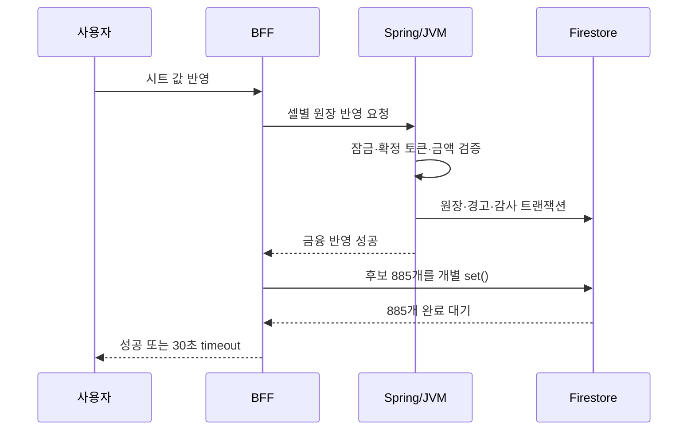
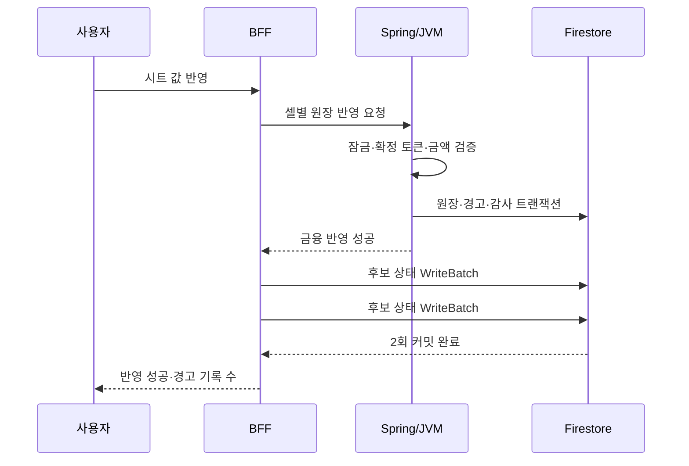
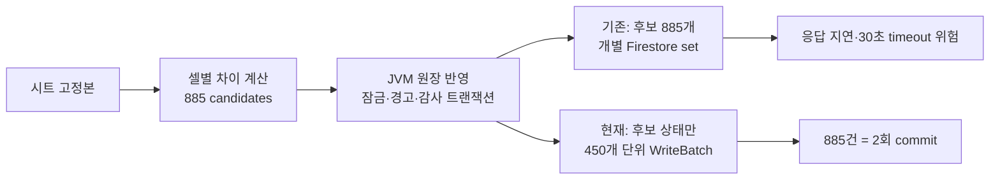

# 캐시플로우 시트 반영 후보 885건과 후처리 성능 기록

- 상태: 적용됨
- 기준 커밋: `cc591324` (2026-07-23, Stage 전용)
- 범위: `cashflow(사용내역 연동)`의 명시적 불러오기 → 반영

## 결론

`885건`은 원장 행 또는 API 호출 수가 아니다. 시트 고정본과 현재 캐시플로우 원장이 다른 **셀 단위 변경 후보** 수다.

당시 화면의 실제 분해는 다음과 같다.

| 구분 | 변경 후보 |
|---|---:|
| Projection | 59건 |
| Actual | 826건 |
| 연간 합계 | 0개년 |
| 합계 | **885건** |

12개월 × 5주차 × 16개 현금흐름 항목 × Projection/Actual 2영역 = 최대 1,920개 월별 셀이다. 그중 시트와 원장이 같거나 둘 다 미입력인 1,035개는 후보에서 제외되고, 다른 885개만 후보가 됐다.

`0`은 명시값이고 빈 셀은 미입력이다. 따라서 Actual 826건에는 신규 값, 기존 시트 출처 Actual의 제거, 명시적 0의 반영이 함께 포함될 수 있다. 다른 출처의 Actual은 유지한다.

## AS-IS: 단순 매핑 뒤에 숨어 있던 885번의 후처리

겉으로 보면 이 기능은 단순하다. 사용자가 버튼을 눌러 Google Sheet의 값을 고정하고, 그 값을 플랫폼 원장에 반영한다. 하지만 Finance에서 “그대로 가져온다”는 말은 금액만 복사한다는 뜻이 아니다.

각 셀은 다음을 함께 보존해야 한다.

- 어느 주차·어느 항목·Projection/Actual 중 무엇인지
- 값이 `0`인지, 사람이 아직 입력하지 않은 빈 값인지
- Actual이 시트 출처인지 다른 원천에서 온 값인지
- 주간 정산이 끝난 값과 달라졌는지

그래서 BFF는 시트 전체를 무조건 덮어쓰지 않고, 현재 원장과 다른 셀만 후보로 만든다. 이번 사례에서 그 후보가 885개였다.

문제는 후보의 역할이 두 개였다는 점이다. 후보는 JVM에 전달할 값의 목록인 동시에, 반영 완료 후 `pending_review → applied`로 바뀌는 감사 기록이었다. 기존 구현은 JVM이 이미 금융 원장을 안전하게 반영한 뒤에도 이 감사 기록 885개를 문서별 `set()`으로 기다렸다.

`Promise.all`로 동시에 시작했지만, Firestore 입장에서는 885개의 독립적인 쓰기였다. 즉 사용자는 “반영” 버튼을 누른 뒤 금융 원장 처리가 끝났어도, 표시용 후보 상태 기록이 끝날 때까지 응답을 받지 못할 수 있었다.

따라서 이번 30초 timeout 경로에는 “시트 수식 계산”과 별개로, 금융 원장 반영과 관계없는 885개 상태 변경이 남아 있었다. 이 후처리는 측정 전에도 제거 가능한 확정 비용이었고, 실제 JVM 시간이 남는지는 배포 후 요청 로그로 별도 확인한다.

## TO-BE: 금융 트랜잭션은 유지하고, 표시용 후처리만 배치화

수정의 기준은 단순했다. 금액·잠금·경고는 절대 가볍게 만들지 않는다. 대신 이미 성공한 반영 결과를 표시하는 후보 상태 변경은 Firestore의 배치 쓰기를 사용한다.

기존 코드에도 450개 단위 묶음 규칙이 있었으므로 새 큐나 Redis, 별도 worker는 추가하지 않았다. Firestore 한 배치의 쓰기 한계보다 여유를 두면서도, 885건은 두 번의 커밋으로 끝난다.

| 구간 | AS-IS | TO-BE |
|---|---|---|
| 금융 원장 | JVM canonical transaction | 동일 |
| 정산 후 변경 경고 | JVM이 검증·누적 | 동일 |
| 409 확인 팝업 | 유지 | 유지 |
| 885개 후보 상태 | 개별 Firestore 쓰기 | 450개 단위 배치 2회 |
| timeout 해결 방식 | 대기시간 확대 검토 | 불필요한 쓰기 횟수 축소 |

## 왜 409는 성공(200)으로 바꾸지 않았나

`cashflow_settled_week_change_confirmation_required`의 409은 서버 오류가 아니다. “정산이 끝난 주차가 바뀌므로, 사용자에게 변경 사실을 보여주고 명시적 확인을 받아야 한다”는 도메인 신호다.

첫 요청은 값을 바꾸지 않고, JVM이 어떤 주차가 잠겨 있는지와 확인 토큰을 반환한다. 프론트는 이를 받아 작은 경고 팝업을 연다. 사용자가 반영을 다시 누르면 JVM은 토큰의 만료·프로젝트·주차·결산 revision을 다시 검증하고, 그때만 경고 누적과 원장 변경을 하나의 금융 트랜잭션으로 확정한다.

따라서 409을 200으로 위장하면 브라우저 로그는 조용해질 수 있지만, “확인 전에는 변경하지 않는다”는 계약이 약해진다. 이 문제의 답은 상태 코드를 숨기는 것이 아니라, 확인 뒤의 불필요한 후처리를 줄이는 것이었다.

## 남은 관찰 지점

이번 최적화가 줄인 것은 **확인 후 반영**의 후보 상태 업데이트다. 시트를 처음 고정하는 단계는 후보 문서 자체를 생성하므로 별도의 비용이 있다. 다만 확인 팝업 뒤의 요청은 이미 고정된 후보를 사용하므로, 이번 요청에서 확정적으로 줄일 수 있던 비용은 후처리였다.

다음 QA에서 개발자 도구로 확인할 값은 세 가지면 충분하다.

1. 첫 반영 요청이 409으로 끝나고 경고 팝업이 열리는가
2. 확인 후 반영 요청이 30초 이내에 성공하는가
3. 여전히 느리다면 BFF의 후보 상태 후처리가 아니라 JVM의 전체 원장 snapshot·잠금 검증 시간인지

## 왜 30초를 넘겼는가

주간 정산 경고를 확인한 뒤의 반영은 JVM 원장 트랜잭션이 성공한 다음, 후보 885개의 상태를 `applied`로 바꾸는 부수 작업을 기다렸다. 기존 BFF는 이 상태 변경을 개별 Firestore `set()` 호출로 실행했다. `Promise.all`은 동시 시작일 뿐, 885개 쓰기를 하나의 Firestore 요청으로 만들지는 않는다.

## 결정

후보 상태 변경만 Firestore `WriteBatch`로 450건씩 커밋한다.

- 885건이면 `ceil(885 / 450) = 2`회 커밋
- JVM의 금액 반영, 주간 정산 잠금 검증, 사후 변경 경고 누적, 감사 로그는 변경하지 않는다.
- `409 cashflow_settled_week_change_confirmation_required`는 오류가 아니라 사용자의 명시적 확인 팝업을 여는 계약으로 유지한다.
- timeout을 늘리거나 409를 200으로 바꾸지 않는다. 둘 다 병목 또는 금융 경고 계약을 숨길 뿐이다.

## 시행착오와 교정

1. 처음에는 409를 성공 응답으로 바꾸는 방안을 검토했다.
   - 교정: 팝업이 정상 동작하는 409 계약을 유지했다. HTTP 상태를 바꾸면 다른 호출자와 오류 처리의 의미가 흐려진다.
2. 30초 timeout을 늘리는 방안은 채택하지 않았다.
   - 교정: 실제로 불필요한 885건 개별 상태 쓰기가 존재했다. 제한 시간을 늘리면 같은 비용을 더 오래 기다릴 뿐이다.
3. 후보 자체를 없애지는 않았다.
   - 교정: 후보는 시트 셀·원장 값·주간 정산 경고를 연결하는 감사 단위다. Finance에서 필요한 원인 추적을 잃게 된다.

## 검증

- `server/bff/routes/cashflow-sheet-lab.test.mjs`: 59개 테스트 통과
- 49개 후보 fixture에서 후보 상태 변경이 49회 개별 쓰기가 아닌 1회 배치 커밋임을 확인
- Stage 배포 성공: GitHub Actions run `29989604490`

## 남긴 경계

이번 변경은 **확인 후 반영**의 병목만 줄인다. 시트 고정 단계에서 후보를 처음 저장하는 작업도 후보별 문서를 만든다. 그 단계가 별도로 느려진다는 측정값이 나오면, 같은 `WriteBatch` 패턴으로 바꾸되 후보 문서의 셀 단위 감사 계약은 유지한다.

관련 코드:

- `server/bff/routes/cashflow-sheet-lab.mjs` — 후보 생성·반영 상태 변경
- `server/jvm-weekly-api/.../FirestoreInheritedWeeklyExpensePersistence.java` — 금융 원장·주간 정산 잠금의 권위 있는 트랜잭션
