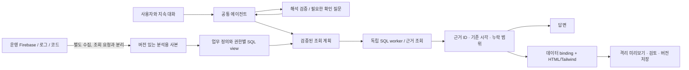

# S14: 질문별 개발을 없애는 조회·대화·화면 구조

작성: 2026-09-22. GitHub 공식 저장소·고정 커밋 소스·공식 문서를 대조한 설계 결정이다. 운영 연결 또는 배포 완료 보고가 아니다. Jev의 실제 API 호출은 하지 않았다.

## 결정

질문마다 API·SQL 템플릿·워크플로를 추가하지 않는다. 데이터 출처를 한 번 연결하고 업무 의미를 모델로 정의한 뒤, 하나의 에이전트가 조회·근거 확인·HTML 구성을 조합한다. SQL 집계 엔진이나 범용 질의 언어 실행기를 직접 만들지 않는다.

운영 Firebase를 교체할 필요도 없다. 분석용 사본을 관계형 테이블로 제공하면 SQL을 사용할 수 있다. 첫 실행기 후보는 독립 프로세스의 DuckDB다. 데이터량·갱신 주기·동시 사용량을 측정한 뒤 확정하며, BigQuery를 동시에 도입하지 않는다. 업무 지표는 Wren/Cube처럼 버전 있는 정의로 관리하고, 대화 상태는 LangGraph의 thread/checkpoint 분리를 참고한다.

Jev는 이 구조의 선택적 판단 도구다. 조회 엔진·텍스트 생성기·HTML 생성기·인증 서버를 대신하지 않는다. 모호한 질문에서 허용된 도구를 고르거나 근거 부족을 감지하는 데 평가한다. 명시적 도구 선택·단순 화면 수정·저장마다 원격 판단을 필수로 추가하지 않는다.

## 조사 대상과 실제 백엔드

관련 분야에서 별 수가 많은 프로젝트를 선정했다. GitHub 전체 순위 또는 Gitstar 공식 순위가 아니다. 별 수는 2026-09-22 GitHub REST API 실조회이며 변동된다. [조회 기록](evidence/2026-09-22-github-research.json)에 보관했다. 모든 프로젝트를 실행하거나 성능 측정한 것은 아니다.

| 프로젝트 | Stars | 백엔드 / 핵심 경계 | 적용 판단 |
| --- | ---: | --- | --- |
| [Dify](https://github.com/langgenius/dify) | 156,850 | Python Flask·Celery·Redis, 대화 변수와 범용 도구 실행 | 대화 상태·도구 경계 참고. 전체 플랫폼 도입과 별도 라이선스 조건은 현재 범위보다 큼 |
| [Apache Superset](https://github.com/apache/superset) | 74,881 | Python Flask·SQLAlchemy·Celery, 공통 QueryContext | 화면 요구를 공통 질의 객체로 처리하는 패턴 참고 |
| [Flowise](https://github.com/FlowiseAI/Flowise) | 55,477 | 현재 archived | 별 수만으로 신규 핵심 의존성을 선택하지 않음 |
| [Metabase](https://github.com/metabase/metabase) | 49,367 | Clojure/JVM·JDBC, query DSL→공통 processor | 질의와 메타데이터의 경계 참고. 기존 MYSCube JVM에 도입하지 않음 |
| [LangGraph](https://github.com/langchain-ai/langgraph) | 42,128 | Python 상태 실행 라이브러리; JS/TS는 별도 저장소 | 대화 내용과 실행 상태·복구 시점을 분리. 설치만으로 권한/업무 정의가 해결되지는 않음 |
| [DuckDB](https://github.com/duckdb/duckdb) | 41,632 | C++ 분석 SQL 엔진, 공식 Node API 제공 | 사본의 필터·집계·정렬·관계 연산을 실제 엔진에 맡기는 첫 후보 |
| [Appsmith](https://github.com/appsmithorg/appsmith) | 40,921 | Java Spring WebFlux·MongoDB, action/app DSL·Git 저장 | 생성 원문·질의 정의·버전의 분리 참고. 위젯 DSL로 HTML 요구를 축소하지 않음 |
| [Vanna](https://github.com/vanna-ai/vanna) | 23,813 | Python Agent·FastAPI/Flask, 교체 가능한 대화 저장소 | 현재 archived. 기본 SQL 도구는 쓰기도 지원하므로 그대로 채택하지 않음 |
| [Cube](https://github.com/cube-js/cube) | 20,887 | Node/TypeScript 의미 모델 컴파일러·질의 조정기, Rust 엔진 | 지표 정의·단위·관계·캐시 기준을 한 곳에서 관리하는 패턴 참고 |
| [DB-GPT](https://github.com/eosphoros-ai/DB-GPT) | 20,032 | Python FastAPI·SQLAlchemy, 공통 분석 agent/action space | 도구 조합·영속 대화 참고. 전체 모델/RAG 운영 플랫폼 교체는 하지 않음 |
| [WrenAI](https://github.com/Canner/WrenAI) | 17,718 | 현재 Rust/DataFusion 의미 계층·Python CLI/SDK/MCP | 업무 정의·예제·관계를 Git에서 검토하고 공통 query/dry-plan으로 실행하는 패턴 참고 |
| [Google MCP Toolbox](https://github.com/googleapis/mcp-toolbox) | 16,476 | Go DB 도구 서버 | BigQuery를 선택할 때 연결·제한된 SQL 실행 재사용 후보 |
| [Evidence](https://github.com/evidence-dev/evidence) | 6,956 | TypeScript/Svelte 기반 보고서, SQL 질의 서비스 | 질의 결과와 표현 소스를 분리하는 참고 사례 |

LangGraph 42,128은 Python 저장소의 수치이며 JS 저장소는 3,304다. Wren의 현재 `main`은 예전 채팅 앱과 다르다. 기존 UI는 `legacy/v1`로 남아 있어 옛 소개 화면만 보고 현행 제품을 평가하면 안 된다. 공식 [구조 변경 안내](https://github.com/Canner/WrenAI/discussions/2205)도 대조했다.

## README 밖에서 확인한 소스

- Wren `dcc964ef`: [공통 질의 실행기](https://github.com/Canner/WrenAI/blob/dcc964efe0bc8693ebabf087c587062bda79bfa1/core/wren/src/wren/engine.py#L97), [기억 저장소](https://github.com/Canner/WrenAI/blob/dcc964efe0bc8693ebabf087c587062bda79bfa1/core/wren/src/wren/memory/store.py). MDL을 이용한 계획 검증과 커넥터 실행이 분리되어 있다. `wren ask`를 실행까지 끝내는 완성형 대화 엔진으로 해석하지 않는다.
- Cube `218d4a06`: [CompilerApi](https://github.com/cube-js/cube/blob/218d4a0689b5a146d7146ce6794cf5be718fd32e/packages/cubejs-server-core/src/core/CompilerApi.ts#L355), [QueryOrchestrator](https://github.com/cube-js/cube/blob/218d4a0689b5a146d7146ce6794cf5be718fd32e/packages/cubejs-query-orchestrator/src/orchestrator/QueryOrchestrator.ts#L212). 공통 모델을 SQL과 실행·캐시 정보로 변환한다. OSS Core와 상용 채팅 제품은 구분한다.
- Metabase `fff70175`: [질의 변환](https://github.com/metabase/metabase/blob/fff70175e0b5f82dc0eb267593c717c4a6130206/frontend/src/metabase-lib/query/query.ts), [공통 processor](https://github.com/metabase/metabase/blob/fff70175e0b5f82dc0eb267593c717c4a6130206/src/metabase/query_processor/core.clj). 질문별 endpoint보다 같은 질의 표현을 공통 처리한다.
- Superset `1c803d92`: [QueryContext](https://github.com/apache/superset/blob/1c803d923f3b940b39fcbeea063a55f52bb0d901/superset/common/query_context.py), [SQLAlchemy 데이터 모델](https://github.com/apache/superset/blob/1c803d923f3b940b39fcbeea063a55f52bb0d901/superset/connectors/sqla/models.py).
- Appsmith `a72a95b7`: [action collection](https://github.com/appsmithorg/appsmith/blob/a72a95b73a996485d3bc786ba6f63e3121f6849d/app/server/appsmith-server/src/main/java/com/appsmith/server/actioncollections/base/ActionCollectionServiceCEImpl.java), [버전 저장용 DSL 변환](https://github.com/appsmithorg/appsmith/blob/a72a95b73a996485d3bc786ba6f63e3121f6849d/app/server/appsmith-git/src/main/java/com/appsmith/git/helpers/DSLTransformerHelper.java).
- Vanna `365d0617`: [Agent](https://github.com/vanna-ai/vanna/blob/365d0617c1a4567ffee1b19b40c27feb4206bfcf/src/vanna/core/agent/agent.py), [SQL 실행](https://github.com/vanna-ai/vanna/blob/365d0617c1a4567ffee1b19b40c27feb4206bfcf/src/vanna/tools/run_sql.py#L56). SELECT 여부 분기가 실행 뒤에 있어 읽기 전용 보안 경계로 재사용할 수 없다.
- DB-GPT `ca9f014c`: [분석 agent](https://github.com/eosphoros-ai/DB-GPT/blob/ca9f014cb3ead157ca2ee6ce645658f5fb55138c/packages/dbgpt-core/src/dbgpt/agent/expand/data_agent.py), [대화 저장](https://github.com/eosphoros-ai/DB-GPT/blob/ca9f014cb3ead157ca2ee6ce645658f5fb55138c/packages/dbgpt-core/src/dbgpt/storage/chat_history/chat_history_db.py).
- LangGraph.js `f5b63cda`: [checkpoint 계약](https://github.com/langchain-ai/langgraphjs/blob/f5b63cdabcb4d803a0304a8a9d2b6e3def243684/libs/checkpoint/src/base.ts). 메시지 목록만이 아니라 실행 상태와 중간 쓰기를 보존한다. [공식 영속성 문서](https://docs.langchain.com/oss/javascript/langgraph/persistence)는 thread와 장기 store를 구분한다.
- Dify `3a017e8c`: [실제 백엔드 의존성](https://github.com/langgenius/dify/blob/3a017e8cccb316f23f601af65d2e8ce92e68f788/api/pyproject.toml), [대화 변수 저장](https://github.com/langgenius/dify/blob/3a017e8cccb316f23f601af65d2e8ce92e68f788/api/core/app/layers/conversation_variable_persist_layer.py).
- Evidence `35457c66`: [질의 서비스 실행](https://github.com/evidence-dev/evidence/blob/35457c663a8e6cf436c150b7aa1b8e43ffb0f0e1/cli/src/lib/server/run-query.ts). 현재 소스는 설정된 연결 또는 관리형 엔진을 사용한다. 과거 DuckDB-WASM 소개를 현행 구현으로 단정하지 않는다.

## MYSCube에 적용할 공통 구조

1. **수집은 데이터 종류별로 한 번 만든다.** 사업, 실제 주정산 제출 상태, 캐시플로 관측값, 오류 기록, 배포 버전·코드 자료를 연결한다. 질문이 바뀌었다고 원본을 다시 전수 수집하거나 새 endpoint를 만들지 않는다. 초기 적재·변경·삭제·재수집을 같은 사본 계약으로 처리한다.
2. **공식 업무 정의를 따로 둔다.** 계약금액, 부가세, 원가, 미제출, 승인대기, 마감 등은 이름·단위·계산 기준·한 행의 의미·허용 관계·버전을 명시한다. 연간/주간 좌표, EMPTY와 ZERO 등 기존 SSoT를 그대로 사용한다. 문서 부재를 미제출로 바꾸지 않는다.
3. **에이전트는 공통 능력을 조합한다.** 자료 목록 확인, 분석 질의, 근거 검색, 화면 제안과 검토한 버전 저장을 재사용한다. 기간·CIC·비교 기준·현재 근거 ID·제안 버전은 대화 상태로 보존한다. 새 turn에서 오래된 답변을 현재 사실로 취급하지 않는다.
4. **SQL 계산은 성숙한 엔진에 맡긴다.** 서버가 권한 범위를 먼저 적용한 view만 제공한다. 얇은 요청 계약과 검증된 query builder/SQL parser를 사용하며 자체 조인·집계 엔진을 만들지 않는다. 새로운 분석은 같은 허용 view 위의 필터·집계·비교 조합으로 표현한다. 아직 정의되지 않은 공식 지표를 임의 수식으로 바꾸지 않는다. 탐색용 계산을 지원할 때는 수식을 표시하고 공식 지표와 구별한다.
5. **사실과 표현은 같은 결과를 참조한다.** 결과에 query hash, 사본 버전, 정의 버전, 권한 범위, 기준 시각, 누락·제외 사유를 붙인다. 답변과 HTML의 데이터 영역은 같은 근거 ID를 사용한다. 모델이 수치를 재작성하지 않도록 결과 binding으로 값을 채운다. 생성 원문·binding·표시된 HTML을 함께 버전 보존한다.

새로운 데이터 출처나 새 업무 정의는 연결 작업이 필요하다. 존재하지 않는 데이터를 에이전트가 만들어 낼 수는 없다. 그러나 “9월 미제출”, “그중 CIC4”, “지난달과 비교”, “표 대신 카드”, “이 화면 저장”은 같은 자료·실행기·대화 상태 위에서 처리해야 한다.

## Jev 연구 기록 — 사용자 지시로 이번 구현에서 제외

사용자가 제공한 2026-09-15 TypeSafe 발표와 [공식 소개](https://docs.typesafe.ai/introduction), [API 계약](https://docs.typesafe.ai/api), [공식 JS SDK](https://github.com/typesafe-ai/typesafe-sdk-js)를 대조했다. Choice는 후보 중 선택과 분포, Noul은 명제의 yes 확률, Score는 주어진 등급에 대한 평가다. 문자열·SQL·HTML을 작성하는 모델이 아니다.

| 책임 | 담당 | Jev의 역할 |
| --- | --- | --- |
| 모호한 질문에 필요한 다음 도구 | 공통 에이전트 + 허용 capability 목록 | 후보 선택 보조, 낮은 확신이면 유보 |
| 답변 근거와 요청의 의미상 적합성 | 근거 검증 + 필요할 때 보조 평가 | 부족 가능성을 알리는 신호. 정확성 인증으로 쓰지 않음 |
| 실제 금액·비율·제출 상태 | 업무 정의 + 실제 사본 + SQL | 계산하거나 승인 상태를 추정하지 않음 |
| 인증·사업 권한·쓰기 허용 | 서버의 결정적 정책 | 모델 점수로 허용 범위를 넓히지 않음 |
| 설명·SQL 계획·HTML/Tailwind 원문 | 생성 모델 + 실행·구조 검증 | 주 생성 모델을 대체하지 않음 |

출력 타입을 지킨다는 보장과 의미상 정답은 별개다. 제공한 후보 중 틀린 후보를 선택할 수 있다. confidence를 우리 서비스의 실측 정확도라고 표시하지 않는다. 질문을 작은 판단으로 나누되, 그것을 질문별 업무 파이프라인을 늘리는 근거로 삼지 않는다.

SDK v0.6.0의 [응답 처리](https://github.com/typesafe-ai/typesafe-sdk-js/blob/66880ccded6cb642dc1809620c2b108c33730214/src/client.ts#L342)는 파싱 후 TypeScript 타입으로 반환하며, 우리 실행 경계의 런타임 검증을 대체하지 않는다. [공식 confidence 설명](https://docs.typesafe.ai/confidence)도 분포의 집중도와 판단의 정확도를 구별한다. [모델 한계](https://docs.typesafe.ai/model-jaggedness/jev-1.13)는 산술·날짜 비교·공격적인 입력·무관한 긴 문맥에서의 오류를 명시한다. [모델 문서](https://docs.typesafe.ai/models)를 기준으로 검증한 버전을 고정하고 한국어 정확도를 별도로 평가해야 한다.

Jev 호출이 필요할 때만 허용 후보 설명과 승인된 최소 상황 요약을 한 요청에 보낸다. 질문 원문·로그·금융 수치·개인정보 전체를 자동 전송하지 않는다. TypeSafe는 새 외부 수신자이므로 실제 연결 전 전송 필드·보존·별도 키·비용 범위를 확정해야 한다. 그 전에는 비활성 기본값과 주입한 합성 응답으로 계약을 시험한다.

판단 실패·timeout·유보는 기존 허용 범위의 생성 모델에 재검토를 맡기거나 사용자에게 필요한 맥락을 설명하는 경로로 이어진다. 자료가 없다는 결정적 검증은 모델이 뒤집을 수 없다. Jev의 판단이 실패했다고 운영 DB 직접 조회나 쓰기를 허용하지 않는다.

## 토스 TOI와의 정확한 관계

[TOI 글](https://toss.tech/article/52885)은 등록 API의 정책과 화면 생성을 분리하고, 번들을 미리 준비하며, 실패한 화면이 마지막 정상 화면을 덮지 않는 구조를 설명한다. 이 패턴은 유지한다. 다만 이 글이 Firestore 사본의 질의 의미·업무 지표 정의·멀티턴 기억·데이터 격리를 자동으로 해결해 주는 것은 아니다.

HTML/Tailwind 원문은 자유롭게 생성하되 데이터 binding만 검증한다. 정해진 위젯 JSON으로 요구를 축소하지 않는다. 초기 정적 HTML의 상호작용 범위도 명시하며, 임의 JavaScript 실행은 별도의 보안·성능 검증 없이는 추가하지 않는다. TOI의 1.3초와 Jev 발표의 70~500ms를 MYSCube 실측치로 사용하지 않는다.

## 격리·복제의 한계

- SQL 프로세스·DB·서비스 계정·모델 할당량은 기존 서비스와 분리한다. DuckDB 읽기 전용 모드만으로 파일·네트워크·CPU 격리가 완성되지 않는다. [공식 보안 모델](https://duckdb.org/docs/current/operations_manual/securing_duckdb/overview)을 따른 프로세스 자원 제한과 접근 차단이 필요하다.
- 사본 생성에는 원본 read 비용과 권한이 필요하다. 분석 질의가 운영 서비스에 의존하지 않는 것과 수집 비용이 0인 것은 다르다. 승인 전 새 유료 수집·인프라를 만들지 않는다.
- 사본의 완전성은 예정된 사업/기간/자료 종류와 실제 수집 결과를 대조한다. 서로 다른 시각의 문서를 같은 시각의 스냅샷처럼 표시하지 않는다.
- 권한 사본의 TTL은 즉시 권한 회수를 보장하지 않는다. 허용 지연·만료 차단·권한 회수 전달 방식을 정하고, 결과 조회와 저장 화면 재열기에서도 적용한다.
- Firestore→BigQuery 공식 extension은 복제 패턴의 참고 자료다. 초기 자료·subcollection까지 자동 완전 복제되는 것은 아니다. 또한 [Firebase Extensions 관리 서비스 종료 공지](https://firebase.google.com/docs/extensions/faq-and-troubleshooting)가 있어 신규 장기 기반을 extension 설치 자체에 고정하지 않는다.

## 현재 코드에 대한 적용 순서

| 단계 | 바꿀 경계 | 통과 증거 |
| --- | --- | --- |
| 1 | `snapshot-reader`의 반환을 provenance/coverage가 유지되는 사본 계약으로 확장 | 누락·다른 revision·늦은 자료를 주입해 unknown/partial 표시 |
| 2 | 업무별 report/조회 확장 대신 공통 SQL runner와 업무 view 연결 | 새로운 기간/CIC/집계/비교 질문이 endpoint 추가 없이 동작 |
| 3 | 대화 메시지와 typed 실행 맥락·근거 버전 연결 | 재접속·동시 turn·기간 변경·권한 회수 검증 |
| 4 | 선택적 typed decision provider를 같은 capability 실행 경계에 연결 | OFF call 0, 후보 밖 실행 0, 유보/timeout에서 호출 차단, metadata trace |
| 5 | 같은 evidence를 답변과 실제 HTML binding에 연결 | 수치 오염·다른 버전·권한 밖 근거를 넣으면 저장/표시 차단 |
| 6 | 실제 모델·전용 인프라·승인된 사본으로 사용자 흐름 검증 | fixture와 구분한 API 응답·화면·실행 추적·운영 무영향 증거 |

현재 HTML 원문/Tailwind 실행·불변 버전 저장·격리 미리보기와 대화 저장 기반은 재사용한다. 범용 SQL runner, 운영 사본 갱신, 실제 모델 연결, 대화에서 조회 후 화면까지 이어지는 전체 흐름은 아직 완료되지 않았다. 새 판단 도구를 추가한 것만으로 이를 완료 처리하지 않는다.

## 이번 코드 반영 범위

- `server/workbench/decision-policy.mjs`: 주입한 판단 함수에 정해진 선택지와 보류 선택지만 제공한다. 공식 Choice 응답의 모델 버전·타입·선택지·확률 분포를 검사한다. 기본 비활성이고, 외부 SDK·키·네트워크 연결은 없다. 임계값 0.8은 계약 시험을 위한 초기 값으로 한국어 정확도를 검증한 운영 기준이 아니다.
- `server/workbench/capability-executor.mjs`: 서버가 허용한 읽기/미리보기 기능을 선택 전과 실행 전후의 권한 범위와 함께 검사한다. 후보 하나가 남았다는 이유로 자동 실행하지 않는다. 명시 선택만 원격 판단을 건너뛴다. 판단과 실행 결과를 별도로 기록한다.
- 통합 시험에서는 합성 모델 응답으로 실제 에뮬레이터의 복제 로그 조회 기능을 호출하고, 결정 이력의 저장·권한 회수 차단·다른 업무 DB 불변을 확인한다. 모델 응답 자체는 실제 Jev가 아니다.
- 이 실행기는 프로덕션 HTTP 라우트나 대화 에이전트에 아직 연결하지 않았다. 업무 전체 흐름, 실제 Jev 품질·비용·속도, 운영 사본 수집·권한 동기화는 미검증이다. `effect: read` 같은 등록 메타데이터만으로 읽기 전용을 보증하지 않으며, 연결할 함수의 검토와 인프라 권한 제한이 별도로 필요하다.
- `evidenceReady`와 권한 fingerprint는 서버가 검증한 입력을 받는 계약이다. 지금 모델이 자료의 충분성을 검증하거나 운영 권한 fingerprint를 자동 생성하는 기능이 구현된 것은 아니다. 같은 turn의 중복 실행 방지는 대화 저장의 begin/complete 계약에 연결할 때 검증한다.
- 판단 대기의 timeout과 AbortSignal 전달은 signal을 무시하는 provider의 실제 작업·비용 종료를 보장하지 않는다. HTTP 연결 전 인증·판단·실행·기록 전체 deadline과 실제 provider 취소 동작을 검증한다.

2026-09-22 로컬 검증: 독립 Workbench 관련 10개 파일 117개 테스트 통과. 합성 판단 응답, 실제 Firestore 에뮬레이터 저장/조회, HTML·대화·격리 경계 회귀를 포함한다. 별도 QA가 판단 정책/실행기 21개를 독립 재실행해 통과했다. 판정은 외부 미연결 내부 계약의 제한적 PASS이며, 실제 Jev 응답이나 운영 서비스의 종합 PASS가 아니다.

## 성과 검증

직접 생성 모델 경로와 Jev 보조 경로를 같은 고정 한국어 질문 세트로 비교한다. 질문 표현·후속 지시·모호한 기간·권한 밖 요청·부족한 자료·복합 요청을 포함하고, 프롬프트를 조정할 때 보지 않은 별도 검증 세트를 둔다.

측정 대상은 업무 답변 정확도, 근거 없는 단정률, 잘못된 도구 호출률, 불필요한 유보율, 실제 전체 응답 지연 p50/p95, 외부 호출·토큰 비용이다. 타입 오류율만으로 제품 품질을 판정하지 않는다. 화면은 조회 완료→미리보기 완료 시간과 수정 후 미리보기 시간을 따로 측정한다. 안전성·정확도가 유지되면서 총 지연이나 비용이 개선될 때만 Jev를 활성화한다.

2026-09-22 후속 결정: Jev 연결·활성화는 제외한다. 모호한 요청 확인과 지속 대화는 생성 모델 + 결정적 실행 경계로 처리한다. 실제 소스 아키텍처 검토와 현재 코드 반영/남은 제약은 [S15](s15-router-architecture-decision.md)에 갱신했다. 기존 decision-policy/capability-executor 실험 코드는 HTTP/실제 대화 경로에 연결하지 않았다.
