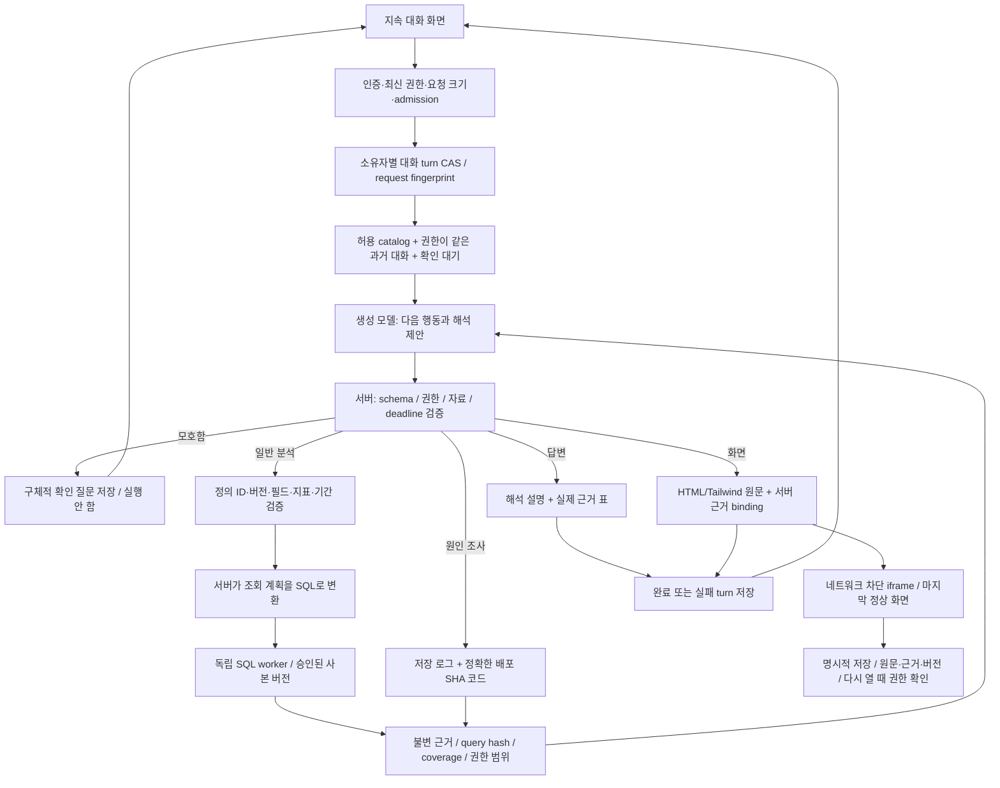

# S15 — 소스 비교 후 AXR 라우터 설계 결정

2026-09-23 보완. Jev 제외. 벡터 검색을 도입하지 않는다. 이번 결정은 기존 업무 BFF/JVM/주정산·월결산을 변경하지 않는 독립 Workbench에 한정한다.

## 조사 방식과 결론

저장소 인기도는 후보 선정에만 사용했다. 실제 채택 여부는 진입점 → 인증 → 분기 → 상태 저장 → 실행 → 오류/복원 경로와 테스트 assertion을 기준으로 판단했다.

| 참고 구현 | 추적한 범위 | 결론 |
| --- | --- | --- |
| [LangGraph 소스 검토](s15-langgraph-router-source-review.md) | StateGraph compile, branch, Pregel loop/runner, ToolNode, interrupt/resume, checkpoint, timeout/retry | 공통 실행 상태 분리와 명시적인 중단/재개를 참고한다. checkpoint를 권한이나 exactly-once 보증으로 취급하지 않는다. |
| [Dify + Graphon 소스 검토](s15-dify-router-source-review.md) | HTTP controller, 대화 소유권, workflow 조립, 실제 Graphon classifier·queue·pause/resume | typed routing과 대화 영속화를 참고한다. 분류 실패 시 첫 후보를 고르는 fallback은 가져오지 않는다. |
| [WrenAI 소스 검토](s15-wren-query-source-review.md) | MCP/SDK, 의미 정의, SQL 계획/정책/전개, connector, 결과 envelope, cache, 관련 테스트 | 질의 계산과 업무 정의를 모델 밖에 둔다. strict-mode 완화, 운영 connector, 공개 데이터 배포는 적용하지 않는다. |

세 프로젝트의 모든 파일이나 운영 배포를 감사했다는 뜻은 아니다. 각 문서에 고정 SHA, 읽은 실제 파일, 확인하지 않은 범위를 적었다. 외부 저장소 스크립트·모델·유료 서비스는 실행하지 않았다.

## 하나의 요청이 흐르는 경로

이 설계는 질문 종류별 endpoint를 추가하지 않는다. `query / investigate / clarify / answer / render`라는 제한된 행동과 dataset catalog를 조합한다. 모델은 등록된 정의의 필드·지표·기간을 typed plan으로 선택한다. 원시 SQL, 임의 수식과 JOIN은 대화 도구 형식에서 거부한다. 권한·tenant·서비스 주소·운영 쓰기 권한은 선택하지 못한다. 저장은 대화 모델의 도구가 아닌 명시적 화면 명령이다.

## 모호한 요청의 정책

[AmbiQT](https://aclanthology.org/2023.emnlp-main.436/)는 동일 질문이 여러 SQL 의미로 해석될 수 있음을 다룬다. [LangGraph의 interrupt와 persistence](https://docs.langchain.com/oss/javascript/langgraph/interrupts)는 확인 대기 상태를 저장하고 재개하는 실행 패턴이다. 둘을 구별해서 적용한다. 의미 판정은 모델+업무 정의의 책임이고, 확인 상태 보존은 실행기의 책임이다. 논문 성능을 우리 한국어 데이터 정확도로 인용하지 않는다.

- 이전 대화에서 2026년 9월이 확정된 뒤 “CIC4만”이라고 하면 기간을 유지하고 조직 조건만 바꾼다.
- 연도가 없는 “9월”, 여러 자료가 가능한 “그거”, 정의되지 않은 “미제출”처럼 결과가 바뀔 수 있으면 이유와 구체적인 질문을 제시한다.
- 선택지로 답하거나 자유문장으로 답할 수 있다. 원래 질문과 답을 함께 저장하고 후속 해석에 제공한다.
- 확인 대기 중에는 SQL을 실행하거나 현재 화면/근거를 교체하지 않는다. 예전 확인 질문의 선택지는 새 turn이 생기면 비활성화한다.
- 모델 응답의 형식/행동이 잘못되면 첫 후보로 진행하지 않는다. 확률 점수를 임의로 정답 확률처럼 표시하지 않는다.
- 오늘/이번 달은 서버의 Asia/Seoul 달력으로 제공한다. 미제출·승인 대기·자료 미수집을 합치지 않는다.

## 구현에 반영한 경계

1. `conversation-routes.mjs`는 admin/actor 범위, 원문 해시를 포함한 중복 요청, 버전 충돌, 일일 한도, 전용 모델의 전체 deadline을 처리한다. HTML 직접 편집은 모델 장애와 분리한다.
2. `conversations.mjs`는 사용자/대화/turn/request를 영속화하고 확인 질문과 typed context를 보존한다. 각 과거 turn의 scope fingerprint를 검사하므로 권한 A→B→B 이후 A 자료가 다시 모델에 들어가지 않는다.
3. `conversation-agent.mjs`는 공통 행동 schema와 설명한 자료/기간이 plan과 같은지 검증한다. 필수 기간·주차 누락은 구체적인 확인 질문으로 돌아간다. 최대 8 step, SQL 3회, 원인 조사 2회, HTML 수정 재시도 1회다. 무한 재시도나 Jev 호출은 없다.
4. `analytics-service.mjs`는 버전 있는 사본과 근거를 저장한다. catalog에는 grain/열 의미/단위/누락과 명시된 0의 수/기준시각을 넣는다. SQL과 실제 사용된 dataset 버전·실행 SQL·완전성을 결과에 남긴다. `queryPlan`은 고정된 사본의 정의를 확인하고 계산 근거에 적용 계획·정의 버전/해시·원본 근거·해석 한계를 같이 저장한다.
5. `analytics-worker.mjs`는 동일 DuckDB 파서의 AST를 검사한 뒤 실행한다. 외부 접근·extension·디스크 spill을 막고 독립 subprocess에 시간/행/바이트/메모리 한도를 둔다. native 전체 RSS 상한은 OS/컨테이너에서 추가 확인해야 한다.
6. `html-bindings.mjs`와 `html-data.mjs`는 실제 근거의 값만 DOM text/table로 삽입한다. 원문·template·binding·evidence ID를 보존하며, 저장하거나 다시 열 때 권한과 같은 값인지 확인한다. 원문 직접 편집은 검증된 근거 연결과 구별한다.
7. DuckDB native 의존성을 `server/workbench/package.json`과 전용 lock으로 분리한다. CI 테스트에서만 전용 설치를 실행하며 운영 Vercel 업로드에서 `server/workbench`, `workbench`, `dist-workbench`를 제외한다. 실제 배포 함수 크기/IAM/resource 격리 검증을 대체하는 조치는 아니다.

8. `semantic-catalog.mjs`는 첫 주정산 상태 정의를 관리한다. `semantic-query.mjs`는 등록된 항목/집계를 조합해 SQL을 만든다. 자료/필드 타입 불일치, 중복 사업×월×주차, 미등록 지표/관계는 거부한다. 비정상 조회 상태를 완료·미제출로 추정하지 않는다. 기존 정의 없는 사본은 보관하되 모델 질의에는 사용하지 않는다.

## 현재 구현의 한계와 활성화 조건

- **SQL 문법·권한 검증은 자연어 뜻의 정확성 보장이 아니다.** 기간·dataset과 계획의 일치, 허용 필드·상태·계산식은 서버에서 검사한다. 그러나 모델이 사용자의 자연어를 처음부터 올바르게 이해했는지는 별도 문제다. 실제 모델 한국어 평가가 필요하다.
- **공식 지표·관계 계약이 더 필요하다.** 주정산 상태 1개 정의와 공통 plan compiler가 연결되었다. 아직 모든 업무의 공식 지표·조직 관계·JOIN cardinality가 정의된 것은 아니다. 현재 미등록 JOIN은 허용하지 않는다. 승인된 사본 adapter와 기존 SSoT에서 정의를 확정하기 전 공식 경영 지표 서비스로 활성화하지 않는다.
- **HTML의 binding 위치는 검증하지만 전체 생성 문장의 사실성을 증명하지 않는다.** 모델이 정적 문구에 적은 주장까지 binding만으로 사실 보증할 수 없다. 자료 영역·출처를 분리하고 검토한 결과만 저장한다. 실제 모델의 근거 없는 수치/주장 평가를 별도로 수행한다.
- **중간 단계 자동 복구는 아직 아니다.** 최종 turn, 확인 상태, 각 조회의 근거는 저장하지만 프로세스 중단 후 graph checkpoint에서 모델 호출을 이어서 재개하는 기능은 없다. 만료 요청은 실패로 표시하고 새 요청으로 진행한다. LangGraph 도입 시 turn과 checkpoint의 SSoT 관계부터 정한다.
- **복제 수집은 미연결이다.** 등록 CLI는 승인된 로컬 JSON 사본을 독립 저장소에 등록한다. 운영 Firebase를 자동으로 읽거나 스캔하는 작업은 만들지 않았다. 삭제·권한 변경·완전성 watermark가 포함된 수집 계약과 비용/격리 범위를 확정해야 한다.
- **실 모델/전용 인프라/운영 QA는 별도 gate다.** 테스트 planner 응답을 실제 AI 정확도나 운영 데이터 검증으로 보고하지 않는다. 기존 키 재사용으로 격리를 우회하지 않는다.

라우터 라이브러리를 바꾸는 것만으로 위 데이터·권한·의미 문제가 해결되지는 않는다. 현재 공통 행동 계약 뒤에서 검증을 완성하고, 중간 재개·관측 요구가 커질 때 LangGraph adapter를 비교한다. 전사 업무 서비스에 새 프레임워크나 분석 엔진을 직접 넣지 않는다.

업무 개념을 조합한다는 사용자 의도와 벡터 도입 예시의 정정은 [S16](s16-semantic-retrieval-composition.md)에 기록했다. SQL은 계산 엔진이며 벡터 검색은 구현·활성화하지 않았다.
