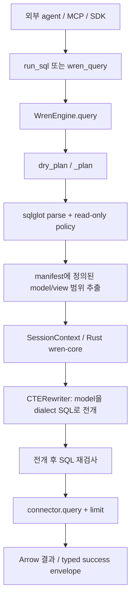

# S15 — WrenAI 요청·정책·SQL 실행 소스 추적

검토일: 2026-09-22. 고정 revision: `dcc964efe0bc8693ebabf087c587062bda79bfa1`.

README를 전체 아키텍처의 증거로 사용하지 않았다. Git tree를 확인하고 Python backend, LangChain SDK, 관련 테스트 185개 파일을 내려받았다. 이 숫자는 다운로드 범위이며 185개 모두 정독했다는 뜻이 아니다. 아래 요청 경로의 구현과 테스트를 집중해서 읽었다. Rust 전체, 모든 DB connector, 전체 UI를 감사하거나 해당 프로젝트 테스트를 실행하지 않았다. 공개 코드는 이 문서의 근거로 읽었으며 저장소에 복사하지 않았다.

## 1. 실제 진입점과 라우터의 책임

현재 WrenAI는 외부 agent가 사용하는 의미 정의·질의 엔진 성격이 강하다. `wren ask`는 자연어 질문을 실행하지 않는다. `ask.render()`가 guided/direct 템플릿에 질문을 넣어 반환할 뿐이다. 따라서 이것을 지속 대화, 재개 가능한 agent router, 모호함 판별 모델이 이미 구현된 제품이라고 해석하면 안 된다.

- [ask.py](https://github.com/Canner/WrenAI/blob/dcc964efe0bc8693ebabf087c587062bda79bfa1/core/wren/src/wren/ask.py#L1)
- [guided template](https://github.com/Canner/WrenAI/blob/dcc964efe0bc8693ebabf087c587062bda79bfa1/core/wren/src/wren/ask_templates/guided.md.tmpl#L1)

MCP 진입점은 `build_server(ServeContext)`이다. query/context/knowledge/resources/prompts를 등록하고 `allow_write`일 때만 `store_query`를 등록한다. `no_connect`에서는 실행 도구를 등록하지 않는다. 프롬프트의 단계도 실제 등록된 도구에 맞춰 바뀐다. readOnlyHint는 부가 설명이며 SQL 정책 검사와 별개다.

- [도구 등록](https://github.com/Canner/WrenAI/blob/dcc964efe0bc8693ebabf087c587062bda79bfa1/core/wren/src/wren/mcp_server.py#L115)
- [프롬프트와 서버 조립](https://github.com/Canner/WrenAI/blob/dcc964efe0bc8693ebabf087c587062bda79bfa1/core/wren/src/wren/mcp_server.py#L637)

MYSCube 적용: 대화 router는 질문 종류마다 HTTP endpoint를 만들지 않는다. 일반 조회, 로그·코드 조사, 확인 질문, 답변, HTML 제작이라는 공통 능력을 고른다. 도구 등록 여부·허용 자료는 서버가 결정한다. 사용자/모델이 도구 이름을 선택했다고 권한을 얻는 구조로 만들지 않는다.

## 2. SQL이 실제 DB에 도달하기까지

`WrenEngine.query()`는 `dry_plan()`을 먼저 거친다. `_plan()`은 원본 SQL을 파싱하고 정책을 검사한 뒤 참조 model/view에 필요한 manifest를 추린다. `CTERewriter`가 의미 정의를 실제 SQL로 전개한다. 실행할 최종 SQL을 다시 검사한다. connector는 DB별 연결·실행·LIMIT 처리를 맡는다.

- [Engine의 전체 경로](https://github.com/Canner/WrenAI/blob/dcc964efe0bc8693ebabf087c587062bda79bfa1/core/wren/src/wren/engine.py#L97)
- [입력/전개 SQL 정책](https://github.com/Canner/WrenAI/blob/dcc964efe0bc8693ebabf087c587062bda79bfa1/core/wren/src/wren/policy.py#L252)
- [DuckDB connector](https://github.com/Canner/WrenAI/blob/dcc964efe0bc8693ebabf087c587062bda79bfa1/core/wren/src/wren/connector/duckdb.py#L81)

이 구조가 중요한 이유는 `SELECT`로 시작하는지 보는 것만으로 충분하지 않기 때문이다. SELECT 안의 변경 CTE, SELECT INTO, 잠금 요청, 외부 파일 읽기 함수를 별도로 다룬다. 테스트에도 해당 우회가 들어 있다.

주의할 차이도 있다. model 바깥 테이블 차단과 data reader 차단은 `strict_mode`에 의존한다. 최종 전개 SQL 재파싱 오류는 호환성을 위해 통과시키는 코드가 있다. MYSCube는 고정 DuckDB dialect만 사용하므로 이 완화 정책을 가져오지 않는다. 파싱 불가·알 수 없는 노드·허용되지 않은 함수는 거절하고, 외부 자료/운영 DB fallback을 두지 않는다.

- [테스트: strict mode와 unknown table](https://github.com/Canner/WrenAI/blob/dcc964efe0bc8693ebabf087c587062bda79bfa1/core/wren/tests/unit/test_engine.py#L118)
- [테스트: 변경 CTE·여러 문장·최종 SQL](https://github.com/Canner/WrenAI/blob/dcc964efe0bc8693ebabf087c587062bda79bfa1/core/wren/tests/unit/test_policy.py#L623)

## 3. 업무 정의와 요청 의미

MCP에는 `query_cube`가 있어 승인된 measure/dimension/time/filter에서 SQL을 만든다. 일반 SQL과 공식 지표를 구별하고, 공식 지표에는 cube 경로를 권한다. `get_instructions`, `describe_model`, `recall_queries`는 질문 해석에 필요한 정의·예시를 제공한다. 이것은 단순 table 이름 목록과 다르다.

MYSCube의 dataset manifest에도 grain, column 의미·단위, sourceRevision, coverage를 함께 둔다. 현재 자유 설명만으로 공식 지표의 수식을 강제할 수는 없다. 현금흐름 좌표·EMPTY/ZERO·제출 상태 정의는 기존 SSoT에서 만들어진 사본을 받아야 한다. 임의 SQL이 문법적으로 맞는 것과 사용자의 뜻에 맞는 것은 별도 검증이다. 계산식/적용 SQL/자료 버전을 근거로 남겨 검토 가능하게 한다.

## 4. 상태·캐시·동시성

SDK는 connector를 재사용하지만 engine/manifest는 매번 새로 읽는다. 의미 정의가 바뀌었는데 오래된 engine을 계속 쓰는 문제를 피하는 구조다. `get_session_context`는 manifest, function path, properties, datasource를 키로 하는 32개 LRU다. 무한 캐시가 아니다.

- [Toolkit: engine 재생성과 connector 재사용](https://github.com/Canner/WrenAI/blob/dcc964efe0bc8693ebabf087c587062bda79bfa1/sdk/wren-langchain/src/wren_langchain/_toolkit.py#L154)
- [manifest context cache](https://github.com/Canner/WrenAI/blob/dcc964efe0bc8693ebabf087c587062bda79bfa1/core/wren/src/wren/mdl/__init__.py#L8)
- [cache 제한 테스트](https://github.com/Canner/WrenAI/blob/dcc964efe0bc8693ebabf087c587062bda79bfa1/core/wren/tests/unit/test_session_context_cache.py#L39)

MYSCube에서는 운영 연결 자체를 재사용하지 않는다. 모델/쿼리 요청은 독립 서비스에서 실행하고, 불변 dataset version을 한 질의의 입력으로 고정한다. HTML/답변은 같은 evidence ID를 쓴다. 멀티턴 상태는 Wren이 대신 저장해 주지 않으므로 소유자별 conversation CAS와 명확화 상태로 별도 관리한다.

## 5. 오류와 결과 경계

SDK의 결과는 `ok/content/data/warnings` 또는 `ok=false/error{code,phase,message,metadata}`다. SQL parsing, planning, policy, execution 오류를 구별한다. Decimal은 문자열로 전달하여 정밀도를 보존하고, metadata의 비밀값 키를 가리고 크기를 제한한다. 도구 행 수 상한과 출력 preview 상한은 서로 별도다.

- [envelope](https://github.com/Canner/WrenAI/blob/dcc964efe0bc8693ebabf087c587062bda79bfa1/sdk/wren-langchain/src/wren_langchain/_envelope.py#L1)
- [tool 크기와 실행 경계](https://github.com/Canner/WrenAI/blob/dcc964efe0bc8693ebabf087c587062bda79bfa1/sdk/wren-langchain/src/wren_langchain/_tools.py#L24)
- [오류 단계](https://github.com/Canner/WrenAI/blob/dcc964efe0bc8693ebabf087c587062bda79bfa1/core/wren/src/wren/model/error.py#L37)

MYSCube에도 동일한 숫자 보존·행/바이트 제한·실제 실행 SQL·사본 완전성·단계별 실패를 적용한다. 잘못된 SQL을 무한 재시도하지 않는다. 권한/격리 오류는 재해석으로 우회하지 않는다.

## 6. 권한·화면에 관한 적용 한계

Wren MCP의 프로젝트 context와 `allow_write`는 MYSCube 사용자별 tenant/RBAC 검증을 대체하지 않는다. SDK 직접 API의 properties는 MDL row access에 전달되지만, 모델이 해당 값을 정하도록 두면 안 된다. 우리 권한은 인증된 사용자와 최신 권한 사본에서 결정한다. 전용 프로젝트라는 환경 변수 비교만으로 IAM 격리가 완료된 것도 아니다.

GenBI `verify_app`는 구조·비밀값·data asset 확인이며 브라우저 실행 검증은 아니다. 코드 자체에도 그 한계를 적었다. MYSCube의 HTML는 네트워크 차단 iframe에서 브라우저 검증하고 마지막 정상 화면을 유지해야 한다. 검토 없이 공개 정적 호스팅하는 흐름은 적용하지 않는다.

- [GenBI 검증 범위](https://github.com/Canner/WrenAI/blob/dcc964efe0bc8693ebabf087c587062bda79bfa1/core/wren/src/wren/genbi/verify.py#L1)
- [LangGraph integration test는 합성 모델 호출임을 명시](https://github.com/Canner/WrenAI/blob/dcc964efe0bc8693ebabf087c587062bda79bfa1/sdk/wren-langchain/tests/integration/test_langgraph_toolnode.py#L1)

## 결정

WrenAI를 통째로 붙이는 결론이 아니다. 채택할 것은 등록된 의미 정의, 계획/정책/실행 분리, 실행 결과 envelope, 버전 있는 근거다. 채택하지 않을 것은 운영 DB connector 직접 연결, 공개 정적 데이터 배포, strict 검사 완화, 성공한 구조 테스트를 실제 모델 품질로 간주하는 방식이다. 대화 router/재개는 LangGraph·Dify 소스 분석과 함께 결정한다.
