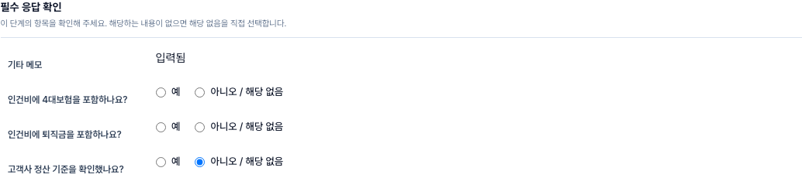
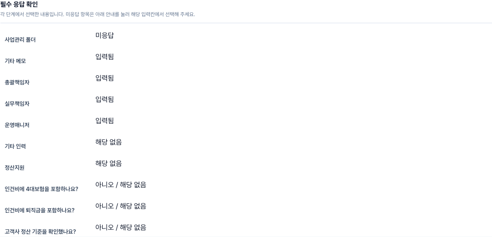

# 프로젝트 필수 응답 입력 위치 hotfix

## 원인과 조치

- 4대보험·퇴직금 포함 여부와 인력의 해당 없음 응답이 최종 검토 단계에만 있었으나 오류 안내는 계약/재무·팀/인력 단계로 이동했다.
- 정산지원의 빈 값도 해당 없음으로 표시했지만 해당 없음 응답은 저장되지 않아 제출 검증에서 미응답으로 판단했다.
- 응답 컨트롤을 각 검증 단계로 이동하고, 오류의 필드 식별자로 실제 입력칸을 찾아 포커스한다. 마지막 단계는 응답 결과를 읽기 전용으로 표시한다.
- 정산지원 미응답과 해당 없음 선택을 구분한다. 담당자 선택 및 기타 인력 추가 시 해당 항목의 이전 해당 없음 응답을 해제한다.

## 검증 경로

26 다자간협력의 실제 저장본을 격리 브라우저에서 재현했다. 운영 계정으로 최종 제출하지 않았으며 운영 데이터는 변경하지 않았다.

1. 수정 전: 최종 검토의 4대보험 오류를 클릭하면 입력 라디오가 없는 계약/재무 단계로 이동함을 재현했다.
2. 수정 후: 네 오류의 링크가 각 단계의 라디오·정산지원 선택·기타 인력 해당 없음 체크박스로 이동하고 포커스한다.
3. 두 항목에 아니오, 정산지원과 기타 인력에 해당 없음을 선택하면 관련 네 오류가 사라진다. 기존 저장본의 다른 미입력 사항까지 통과했다는 의미는 아니다.
4. 브라우저의 격리 저장 콜백에 전달된 응답으로 다시 열어 네 응답 유지 확인. 공용 초안 직렬화→복원→제출 페이로드 회귀 테스트에서도 false와 NOT_APPLICABLE 유지 및 모순 응답 차단을 검증했다.
5. PC 및 390px 모바일에서 입력칸 노출과 이동 확인. JavaScript 오류 0건.
6. 마지막 검토 화면에서 네 응답을 읽기 전용으로 확인한다.

## 배포 분류 결함

이전 PR808 배포 실패(run 35592234137)는 웹 기준 f53f2562, JVM 기준 1c6d0817를 사용했다. 웹 기준 변경 31개에는 정산 전환 파일이 없지만 JVM 기준 변경 286개 전체를 합치면서 이미 웹에 배포된 BFF 파일 2개까지 미배포 전환으로 오인했다.

웹/BFF는 실제 웹 배포본 기준, JVM 소유 파일은 실제 JVM 배포본 기준으로 비교하도록 분류를 수정했다. 실제 BFF 전환 및 혼합 변경에 기존 검사가 계속 적용되는 회귀 테스트를 추가했다. 정산 런타임·운영 데이터·주정산/월결산 처리 및 배포 검사 자체는 변경하지 않았다.
