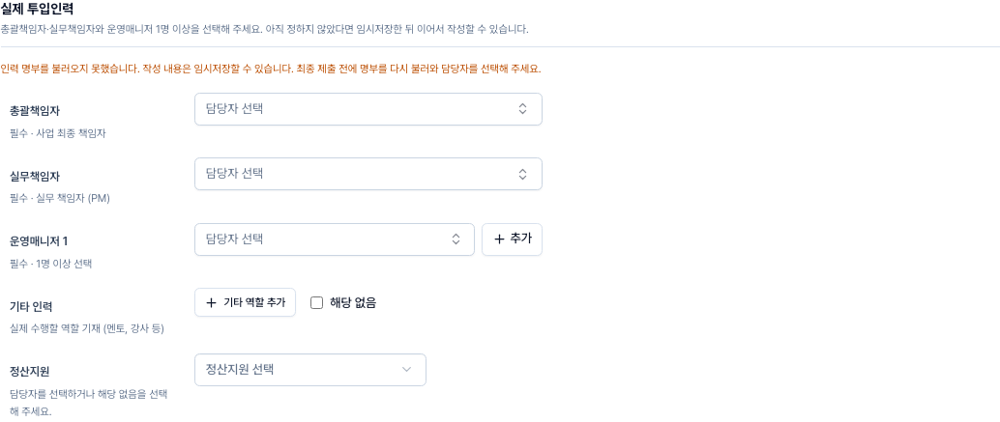
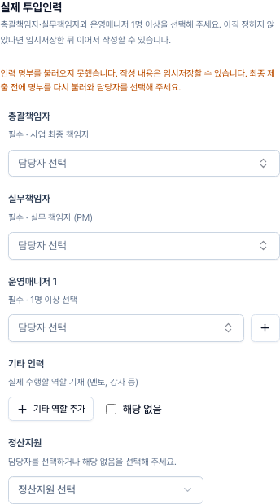

# 프로젝트 필수 인력 및 인접 입력 UX 검증

총괄책임자·실무책임자·운영매니저 1명 이상은 최종 제출 시 필수다. 필수 인력에는 해당 없음 선택을 제공하지 않는다. 아직 결정하지 않은 인력은 임시저장 후 작성할 수 있다.

## 변경 경로

- 인력 입력 → 편집 초안 → 공유 제출 검증 → BFF 최종 제출 검증에 같은 필수 기준을 적용했다.
- 기존 초안을 불러올 때 필수 인력에 남아 있던 해당 없음 응답만 편집 상태에서 제거한다. 저장된 원본과 이미 선택된 담당자는 수정하지 않는다.
- 운영매니저 추가는 선택 상자 옆, 기타 인력 해당 없음은 역할 추가 옆에 배치했다. 폴더·메모의 해당 없음과 계약/재무 확인 응답도 해당 입력 위치에 배치했다.
- 최종 단계는 입력 결과를 확인하며, 오류 안내에서 해당 입력칸으로 이동한다.
- 운영 데이터 이관이나 주정산·월결산 파이프라인 변경은 없다.

## 독립 QA 결과

- 신규 회귀 검증은 구현 전 3건 실패, 구현 후 관련 203건 통과. 기존 초안 원본 보존, 인력 미입력 제출 차단, 기존 인력과 옛 해당 없음 응답의 충돌 해소를 검증했다.
- 전체 단위 테스트 4,498건 통과. Firestore 통합 268건, Storage 통합 3건 통과.
- 타입 검사: 신규 오류 없음. 프로덕션 빌드 통과.
- 1280px·390px 브라우저에서 필수 인력 해당 없음 선택 미노출, 추가 버튼과 선택 상자의 같은 행 배치, 기타 인력 선택의 인접 배치를 확인했다.
- 운영매니저 추가/삭제, 기타 인력 추가 시 해당 없음 해제, 임시저장 후 다시 열기, 오류 링크의 입력칸 이동을 확인했다. JS 오류 없음.
- 실제 26 다자간협력의 읽기 전용 저장 자료를 격리 화면에서 확인했다. 담당자가 있는 자료에는 새 필수 인력 오류가 생기지 않았고, 인력을 제거한 시험 자료에는 정확히 3개 필수 오류가 표시됐다.

브라우저 검증은 격리된 실제 컴포넌트와 저장 자료 기반으로 수행했다. 운영 제출·결재를 실행하지 않았다. 스크린샷의 명부 로드 실패는 외부 API를 차단한 오류 상태 검증 화면이다.

